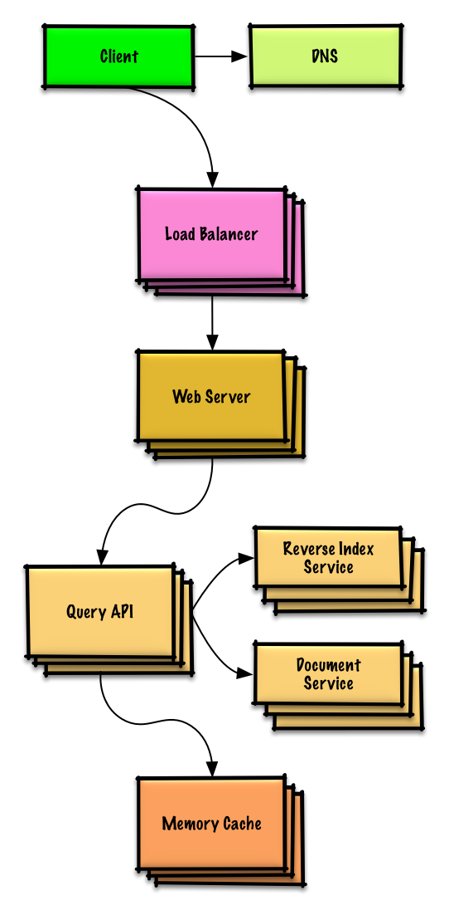

# تصميم الأنظمة

<p align="center">
  
  <br/>
</p>

## الأهداف

> تعلم تصميم الأنظمة الضخمة
>
> التحضير لمقابلة تصميم الأنظمة.

### تعلم تصميم الأنظمة الضخمة

تعلم كيفية تصميم الأنظمة الضخمة يمكنك من أن تصبح مهندسا أفضل.

تصميم الأنظمة موضوع واسع. هناك **عدد هائل من المصادر المنتشرة على الانترنت** لمبادئ تصميم الأنظمة.

هذا المشروع هو **مجموعة منظمة** من المصادر التي تساعدك على تعلم كيفية بناء نظام ضخم.

### تعلم من مجتمع المصادر المفتوحة 

هذا مشروع مفتوح المصدر دائم التحديث.

[المساهمات](#المساهمة) مرحب بها!

### التحضير لمقابلة تصميم الأنظمة

بالإضافة لمقابلات البرمجة، تصميم الأنظمة **عنصر أساسي** من أي **مقابلة تقنية** في الكثير من شركات التكنولوجيا.

**تمرن على الأسئلة الشائعة لتصميم الأنظمة** و **قارن** إجاباتك **بالإجابات المقترحة**: نقاشات، شيفرات ومخططات.

مواضيع التحضير للمقابلة:

* [دليل الدراسة](#study-guide)
* [كيف تتعامل مع سؤال تصميم الأنظمة في المقابلات](#how-to-approach-a-system-design-interview-question)
* [أسئلة تصميم أنظمة في المقابلات، **مع الإجابات**](#system-design-interview-questions-with-solutions)
* [Object-oriented أسئلة مقابلات في الـ **مع الإجابات**](#object-oriented-design-interview-questions-with-solutions)
* [أسئلة إضافية لمقابلات تصميم الأنظمة](#additional-system-design-interview-questions)

## بطاقات استذكار Anki

<p align="center">
  
  <br/>
</p>

[بطاقات استذكار Anki] التالية تساعدك في حفظ مفاهيم أساسية في تصميم الأنظمة

* [تصميم الأنظمة](resources/flash_cards/System%20Design.apkg)
* [تدريبات تصميم الأنظمة](resources/flash_cards/System%20Design%20Exercises.apkg)
* [تدريبات تصميم الـ Object-oriented](resources/flash_cards/OO%20Design.apkg)

مفيدة للإستذكار السريع.


## المساهمة

> تعلم من المجتمع.

يمكنك المساعدة بـ:

* تصحيح الأخطاء
* تحسين الأقسام
* اضافة أقسام جديدة

المحتوى الذي يحتاج بعض المراجعة يوضع [قيد التطوير](#under-development).

انظر [إرشادات المساهمة](CONTRIBUTING.md).

## فهرسة مواضيع تصميم الأنظمة

> ملخص مواضيع متعددة في تصميم الأنظمة، تتضمن ايجابيات وسلبيات.  **تنازل عن ميزة من أجل الحصول على أخرى**.
>
> كل قسم يحتوي على روابط لمصادر متعمقة.

<p align="center">
  
  <br/>
</p>

* [مواضيع تصميم الأنظمة: ابدأ من هنا](#system-design-topics-start-here)
    * [خطوة 1: راجع مفهوم القدرة على التوسع في هذه المحاضرة](#step-1-review-the-scalability-video-lecture)
    * [خطوة 2: مقالة تشرح معنى القدرة على التوسع](#step-2-review-the-scalability-article)
    * [الخطوات التالية](#next-steps)
* [الأداء مقابل القدرة على التوسع](#performance-vs-scalability)
* [وقت الاستجابة مقابل الإنتاجية](#latency-vs-throughput)
* [التوفر مقابل التطابق](#availability-vs-consistency)
    * [نظرية CAP](#cap-theorem)
        * [مدى قبول المطابقة والتجزئة-CP](#cp---consistency-and-partition-tolerance)
        * [مدى قبول التوفر والتجزئة-AP](#ap---availability-and-partition-tolerance)
* [أنماط التطابق](#consistency-patterns)
    * [تطابق ضعيف](#weak-consistency)
    * [التطابق اللاحق](#eventual-consistency)
    * [التطابق القوي](#strong-consistency)
* [أنماط التوفر](#availability-patterns)
    * [الدعم الإحتياطي](#fail-over)
    * [التكرار](#replication)
* [نظام اسم النطاق](#domain-name-system)
* [شبكة توصيل المحتوى](#content-delivery-network)
    * [شبكة توفير المحتوى (CDN) المعتمدة تدفع بالتحديثات عند حدوث أي تغيير](#push-cdns)
    * [شبكة توفير المحتوى (CDN) تحدث المحتوى عند الطلب](#pull-cdns)
* [موازن الأحمال](#load-balancer)
    * [نشط-خامل](#active-passive)
    * [نشط-نشط](#active-active)
    * [موازنة أحمال الطبقة 4](#layer-4-load-balancing)
    * [موازنة أحمال الطبقة 7](#layer-7-load-balancing)
    * [التمدد الأفقي](#horizontal-scaling)
* [وكيل عكسي (خادوم الشبكة)](#reverse-proxy-web-server)
    * [موزع الأحمال مقابل وكيل عكسي](#load-balancer-vs-reverse-proxy)
* [طبقة التطبيق](#application-layer)
    * [ميكروسيرفس](#microservices)
    * [اكتشاف الخدمة](#service-discovery)
* [قواعد بيانات](#database)
    * [نظام إدارة قواعد البيانات العلائقية (RDBMS)](#relational-database-management-system-rdbms)
        * [مضاعفة الخادوم والتابع](#master-slave-replication)
        * [مضاعفة الخادوم](#master-master-replication)
        * [اتحاد](#federation)
        * [تجزئة](#sharding)
        * [التخلص من العلاقات المعقدة](#denormalization)
        * [ضبط وتحسين الإستعلامات](#sql-tuning)
    * [قاعدة بيانات غير علائقية](#nosql)
        * [التخزين بالمفتاح والقيمة](#key-value-store)
        * [تخزين المستندات](#document-store)
        * [تخزين عمود واسع](#wide-column-store)
        * [قاعدة بيانات رسومية](#graph-database)
    * [قاعدة بيانات علائقية أو غير علائقية](#sql-or-nosql)
* [تخزين مؤقت](#cache)
    * [تخزين مؤقت عند المستخدم](#client-caching)
    * [تخزين مؤقت في (CDN) شبكة توفير المحتوى](#cdn-caching)
    * [التخزين المؤقت في خادوم الشبكة](#web-server-caching)
    * [التخزين المؤقت في قواعد البيانات](#database-caching)
    * [التخزين المؤقت في التطبيق](#application-caching)
    * [التخزين المؤقت على مستوى الاستعلامات](#caching-at-the-database-query-level)
    * [التخزين المؤقت على مستوى الـ object](#caching-at-the-object-level)
    * [متى تحدث التخزين المؤقت](#when-to-update-the-cache)
        * [التخزين المؤقت الجانبي](#cache-aside)
        * [الكتابة المباشرة](#write-through)
        * [الكتابة في الخلفية](#write-behind-write-back)
        * [التحديث الإستباقي](#refresh-ahead)
* [التزامن](#asynchronism)
    * [صفوف الرسائل](#message-queues)
    * [صفوف المهام](#task-queues)
    * [الضغط الخلفي](#back-pressure)
* [التواصل](#communication)
    * [بروتوكول التحكم بالإرسال (TCP)](#transmission-control-protocol-tcp)
    * [بروتوكول مخطط المستخدم (UDP)](#user-datagram-protocol-udp)
    * [إجراء اتصال عن بعد (RPC)](#remote-procedure-call-rpc)
    * [نقل الحالة التمثيلي (REST)](#representational-state-transfer-rest)
* [الأمن](#security)
* [الملحق](#appendix)
    * [جدول مضاعفات ال2](#powers-of-two-table)
    * [أرقام لأوقات الاستجابة يجب على كل مبرمج معرفتها](#latency-numbers-every-programmer-should-know)
    * [أسئلة تصميم أنظمة إضافية](#additional-system-design-interview-questions)
    * [أمثلة تصاميم هيكلية واقعية](#real-world-architectures)
    * [هيكلة الشركات](#company-architectures)
    * [مدونات الشركات التقنية](#company-engineering-blogs)
* [تحت التطوير](#under-development)
* [شُكر وتقدير](#credits)
* [بيانات التواصل](#contact-info)
* [الترخيص](#license)

## إرشادات الدراسة

> مواضيع مقترحة للمراجعة بناء على الجدول الزمني للمقابلة (قصير، متوسط، طويل).


**س: هل يجب علي معرفة كل شيء هنا لاجتياز المقابلات ?**

**ج: لا، ليس عليك معرفة كل شيء هنا للتحضير لمقابلة**.

ما يتم سؤالك عنه في المقابلات يعتمد على:

* الخبرة التي لديك
* خلفيتك التقنية
* طبيعة الوظيفة 
* جهة العمل التي تقابلك
* الحظ

يتوقع من المرشحين الأكثر خبرة بشكل عام أن تكون لديهم دراية أكبر عن تصميم الأنظمة. ربما يكون متوقعا من المهندسين أو رؤساء الفرق أن تكون لديهم معرفة أكبر عن باقي أفراد الفريق. في الشركات التقنية الرائدة غالبا ما يكون هناك جولة أو أكثر من مقابلات تصميم النظام.

ابدأ بشكل موسع وعام ثم تعمق في بعض المواضيع. معرفة سطحية عن بعض المواضيع المتنوعة لتصميم الأنظمة قد تساعدك كثيرا. عدل الدليل الإرشادي التالي بما يتناسب مع جدولك الزمني وخبرتك والوظيفة التي تقدم عليها بالإضافة لجهة العمل التي تقابلك.

* **جدول زمني قصير** - التركيز على **التوسع** في مواضيع تصميم الأنظمة. بالتدريب على حل **بعض** أسئلة المقابلات.
* **جدول زمني متوسط** - التركيز على **التوسع** و**بعض التعمق** في مواضيع تصميم الأنظمة. والتدريب على حل **العديد** من أسئلة المقابلات.
* **جدول زمني طويل** - التركيز على **التوسع** و**تعمق أكثر** في مواضيع تصميم الأنظمة. تدرب على حل **معظم** أسئلة المقابلات.

| قصير | متوسط | طويل |              |
|------|------|-----|--------------|
| :+1: | :+1: | :+1: | اقرأ [مواضيع تصميم الأنظمة](#index-of-system-design-topics) لتأخذ نظرة عامة على كيفية عمل الأنظمة |
| :+1: | :+1: | :+1: | اقرأ بعض المقالات في [المدونة الهندسية للشركة](#company-engineering-blogs) التي ستجري لك المقابلة |
| :+1: | :+1: | :+1: | اقرأ بعض المقالات عن [تصاميم هندسية من الواقع](#real-world-architectures) |
| :+1: | :+1: | :+1: | استعرض [كيف تتعامل مع السؤال في مقابلة تصميم الأنظمة](#how-to-approach-a-system-design-interview-question) |
| البعض | العديد | معظم | ادرس [أسئلة مقابلات تصميم الأنظمة مع الحلول](#system-design-interview-questions-with-solutions) |
| البعض | العديد | معظم | ادرس [أسئلة مقابلات في تصميم Object-oriented مع الحلول](#object-oriented-design-interview-questions-with-solutions) |
| البعض | العديد | معظم | راجع [أسئلة مقابلات اضافية في تصميم الأنظمة](#additional-system-design-interview-questions) |

## كيف تتعامل مع سؤال في مقابلة تصميم الأنظمة

> كيفية معالجة السؤال

تكون مقابلة تصميم الأنظمة **محادثة مفتوحة**. يتوقع منك أن تقودها.

يمكنك اتخاذ الخطوات التالية لتوجيه النقاش. للمساعدة في ترسيخ هذه العملية، ادرس قسم [أسئلة مقابلة تصميم الأنظمة مع الحلول](#system-design-interview-questions-with-solutions) باستخدام الخطوات التالية.

### الخطوة 1: تحديد حالات الاستخدام، القيود والافتراضات

اجمع المتطلبات واحصر المشكلة. اسأل عن توضيح حالات الاستخدام والقيود وناقش الفرضيات.

* من سيستخدم النظام؟
* كيف سيتم استخدامه؟
* كم عدد المستخدمين؟
* ماذا يقدم النظام؟
* ماهي مدخلات ومخرجات النظام؟
* كم عدد البيانات المتوقع معالجتها؟
* كم عدد الطلبات المتوقع لكل ثانية؟
* ماهو معدل المتوقع للقراءة مقابل الكتابة؟

### خطوة 2: أنشئ تصميم عام

لخص التصميم العام مع كل المكونات الأساسية.

* ارسم مسودة للمكونات الأساسية والعلاقة فيما بينها
* برر أفكارك

### خطوة 3: صمم المكونات الأساسية

تعمق في تفاصيل كل مكون. مثلا، إذا طلب منك [تصميم خدمة اختصار روابط](solutions/system_design/pastebin/README.md), ناقش:

* انتاج وتخزين ترميز hash لرابط كامل
    * [MD5](solutions/system_design/pastebin/README.md) و [Base62](solutions/system_design/pastebin/README.md)
    * تصادم الترميز
    * قاعدة بيانات علائقية أو غير علائقية
    * مخطط قاعدة البيانات
* إعادة ترجمة رابط مرمز
    * البحث في قواعد البينات
* تصميم واجهة برمجة التطبيقات و object-oriented


### خطوة 4: اجعل النظام قابل للتوسع

قم بتحديد وتعريف مراكز عنق الزجاجة، مع أخذ القيود بعين الإعتبار. مثلا هل تحتاج أحد هذه الأمور لزيادة قابلية التوسع؟

* موزع أحمال
* توسع أفقي
* تخزين مؤقت
* تقسيم قاعدة البيانات

ادرس احتمالات الحلول وآثارها. كل شيء عبارة عن مقايضة. حدد مراكز عنق الزجاجة بواسطة [مبادئ تصميم الأنظمة القابلة للتوسع](#index-of-system-design-topics).

### حسابات تقريبية

ربما يطلب منك أن تقوم ببعض التقييمات اليدوية [ملحق](#appendix) لبعض هذه المصادر:

* [استخدام تقييمات تقريبية](http://highscalability.com/blog/2011/1/26/google-pro-tip-use-back-of-the-envelope-calculations-to-choo.html)
* [جدول مضاعفات ال2](#powers-of-two-table)
* [أرقام لأوقات الاستجابة يجب على كل مبرمج ان يعلمها](#latency-numbers-every-programmer-should-know)

### مصادر وقراءة أكثر


تحقق من الروابط التالية للحصول على فكرة أفضل عما يمكن توقعه:

* [كيف تحسم مقابلة تصميم الأنظكة](https://www.palantir.com/2011/10/how-to-rock-a-systems-design-interview/)
* [مقابلة تصميم الأنظمة](http://www.hiredintech.com/system-design)
* [مقدمة لمقابلات تصميم العمارة والنظم](https://www.youtube.com/watch?v=ZgdS0EUmn70)

## أسئلة مقابلة تصميم الأنظمة مع الحلول

> أسئلة مقابلة تصميم النظام الشائعة مع نماذج المناقشات ، والأكواد ، والمخططات.
>
> تجد الحلول مرتبطة بالمحتوى في مجلد `solutions/`.

| أسئلة | |
|---|---|
| صمم Pastebin.com (or Bit.ly) | [الحل](solutions/system_design/pastebin/README.md) |
| صمم حائط تويتر (او تحديثات فيسبوك)<br/>صمم بحث تويتر (أو بحث فيسبوك) | [الحل](solutions/system_design/twitter/README.md) |
| صمم عناكب الشبكة | [الحل](solutions/system_design/web_crawler/README.md) |
| صمم Mint.com | [الحل](solutions/system_design/mint/README.md) |
| صمم تراكيب بيانات منصة اجتماعية | [الحل](solutions/system_design/social_graph/README.md) |
| صمم مخزن مفتاح-قيمة لمحرك بحث | [الحل](solutions/system_design/query_cache/README.md) |
| تصميم ترتيب مبيعات أمازون حسب الفئة | [الحل](solutions/system_design/sales_rank/README.md) |
| صمم نظامًا يتسع لملايين المستخدمين على AWS | [الحل](solutions/system_design/scaling_aws/README.md) |
| أضف سؤال لتصميم نظام | [شارك](#contributing) |

### تصميم Pastebin.com (أو Bit.ly)

[عرض التمرين والحل](solutions/system_design/pastebin/README.md)


### تصميم الجدول الزمني Twitter والبحث (أو موجز Facebook والبحث)

[عرض التمرين والحل](solutions/system_design/twitter/README.md)


### تصميم زاحف الويب

[عرض التمرين والحل](solutions/system_design/web_crawler/README.md)


### صمم Mint.com

[عرض التمرين والحل](solutions/system_design/mint/README.md)


### صمم تراكيب البيانات لشبكة اجتماعية

[عرض التمرين والحل](solutions/system_design/social_graph/README.md)


### تصميم مخزن مفتاح-قيمة لمحرك بحث

[عرض التمرين والحل](solutions/system_design/query_cache/README.md)



### تصميم ترتيب مبيعات أمازون حسب الفئة

[عرض التمرين والحل](solutions/system_design/sales_rank/README.md)


### صمم نظامًا يتسع لملايين المستخدمين على AWS

[عرض التمرين والحل](solutions/system_design/scaling_aws/README.md)


## أسئلة مقابلة تصميم object-oriented مع الحلول

> أسئلة مقابة تصميم object-oriented مع نماذج مناقشات، أكواد، ومخططات.
>
> الحلول مرتبطة بالمحتوى في مجلد `solutions/`.

>**ملاحظة: هذا القسم قيد التطوير**

| الحل | سؤال |
|---|---|
| [الحل](solutions/object_oriented_design/hash_table/hash_map.ipynb) | تصميم hash map |
| [الحل](solutions/object_oriented_design/lru_cache/lru_cache.ipynb) | تصميم ذاكرة التخزين المؤقت الأقل استخدامًا مؤخرًا |
| [الحل](solutions/object_oriented_design/call_center/call_center.ipynb) | تصميم مركز اتصال |
| [الحل](solutions/object_oriented_design/deck_of_cards/deck_of_cards.ipynb) | صمم مجموعة من البطاقات |
| [الحل](solutions/object_oriented_design/parking_lot/parking_lot.ipynb) | تصميم موقف للسيارات |
| [الحل](solutions/object_oriented_design/online_chat/online_chat.ipynb) | صمم خادم دردشة |
| [شارك](#contributing) | تصميم مصفوفة دائرية |
| [شارك](#contributing) | أضف سؤال تصميم object-oriented |

## مواضيع تصميم الأنظمة:إبدا من هنا

هل انت جديد على تصميم الأنظمة?

أولاً ، ستحتاج إلى فهم أساسي للمبادئ المشتركة ، والتعرف على ماهيتها ، وكيفية استخدامها ، ومزاياها وعيوبها.

### الخطوة 1: راجع محاضرة فيديو قابلية التوسع

[محاضرة التوسع في جامعة هارفارد](https://www.youtube.com/watch?v=-W9F__D3oY4)

* المواضيع التي تمت تغطيتها:
    * التوسع العمودي
    * التوسع الأفقي
    * التخزين المؤقت
    * توزيع الأحمال
    * تكرار قواعد البيانات
    * تقسيم قواعد البيانات

### الخطوة 2: راجع مقالة قابلية التوسع

[قابلية التوسع](http://www.lecloud.net/tagged/scalability)

* المواضيع التي تمت تغطيتها:
    * [نسخ](http://www.lecloud.net/post/7295452622/scalability-for-dummies-part-1-clones)
    * [قواعد البيانات](http://www.lecloud.net/post/7994751381/scalability-for-dummies-part-2-database)
    * [تخزين مؤقت](http://www.lecloud.net/post/9246290032/scalability-for-dummies-part-3-cache)
    * [المزامنة](http://www.lecloud.net/post/9699762917/scalability-for-dummies-part-4-asynchronism)

### خطوات تالية

بعد ذلك ، سنلقي نظرة على المقايضات العامة:

* **الأداء** vs **التوسع**
* **وقت الإستجابة** vs **الإنتاجية**
* **التوافر** vs **التطابق والثبات**

تذكر **كل شيء مقايضة**.

ثم سنتعمق في مواضيع أكثر تحديدًا مثل DNS و CDNs وموازنة الأحمال.

## الأداء مقابل قابلية التوسع

تكون الخدمة **قابلة للتطوير** إذا أدت إلى زيادة **الأداء** بطريقة تتناسب مع الموارد المضافة. بشكل عام ، تعني زيادة الأداء خدمة المزيد من وحدات العمل ، ولكن يمكن أيضًا التعامل مع وحدات عمل أكبر ، كما هو الحال عندما تنمو مجموعات البيانات.<sup><a href=http://www.allthingsdistributed.com/2006/03/a_word_on_scalability.html>1</a></sup>

طريقة أخرى للنظر إلى الأداء مقابل قابلية التوسع:

* إذا كانت لديك مشكلة **في الأداء** ، فهذا يعني أن نظامك بطيء لمستخدم واحد.
* إذا كانت لديك مشكلة **قابلية التوسع** ، فإن نظامك سريع لمستخدم واحد ولكنه بطيء في ظل الحمل الثقيل.

### المصادر ومزيد من القراءة

* [كلمة عن قابلية التوسع](http://www.allthingsdistributed.com/2006/03/a_word_on_scalability.html)
* [قابلية التوسع والتوافر والاستقرار والأنماط](http://www.slideshare.net/jboner/scalability-availability-stability-patterns/)

## زمن الإستجابة مقابل الإنتاجية

**زمن الإستجابة** هو الوقت المناسب لأداء بعض الإجراءات أو لإنتاج بعض النتائج.

**الإنتاجية** هو عدد هذه الإجراءات أو النتائج لكل وحدة زمنية.

بشكل عام ، يجب أن تهدف إلى تحقيق **أقصى قدر من الإنتاجية** مع **زمن استجابة مقبول**.

### Source(s) and further reading

* [فهم الإنتاجية مقابل زمن الإستجابة](https://community.cadence.com/cadence_blogs_8/b/sd/archive/2010/09/13/understanding-latency-vs-throughput)

## التوافر مقابل ضبط التطابق

### CAP نظرية

<p align="center">
  
  <br/>
  <i><a href=http://robertgreiner.com/2014/08/cap-theorem-revisited>المصدر: إعادة النظر في نظرية CAP</a></i>
</p>

في نظام الكمبيوتر الموزع ، يمكنك فقط دعم اثنين من الضمانات التالية:

* **الثبات والتطابق** - كل قراءة تتلقى أحدث كتابة أو خطأ
* **التوافر** - يتلقى كل طلب ردًا ، دون ضمان احتوائه على أحدث نسخة من المعلومات
* **مسامحة التقسيم** - النظام يبقى متوفر على الرغم من التوزيعات العشوائية الحاصلة بسبب خطأ في الشبكة

*الشبكات ليست موثوقة ، لذا ستحتاج إلى دعم تسامح التقسيم. ستحتاج إلى إجراء مقايضة برمجية بين التطابق والتوافر.*

#### CP - تفاوت التطابق والتقسيم

قد يؤدي انتظار استجابة من العقدة المقسمة إلى حدوث خطأ انتهاء المهلة. CP خيار جيد إذا كانت احتياجات عملك تتطلب قراءة وكتابة محتّمة.

#### AP - تفاوت التوافر والتقسيم

تعرض الردود أحدث إصدار من البيانات المتاحة على العقدة ، والتي قد لا تكون الأحدث. قد تستغرق عمليات الكتابة بعض الوقت للنشر عند الإنتهاء من التجزئة.

AP يعد اختيارًا جيدًا إذا كانت احتياجات العمل تسمح [التطابق اللاحق] (#eventual-consistency) أو عندما يحتاج النظام إلى مواصلة العمل على الرغم من الأخطاء الخارجية.

### مصادر ومزيد من القراءة

* [CAP إعادة النظر في نظرية](http://robertgreiner.com/2014/08/cap-theorem-revisited/)
* [مقدمة بسيطة باللغة الإنجليزية لنظرية CAP](http://ksat.me/a-plain-english-introduction-to-cap-theorem/)
* [CAP اسئلة شائعة](https://github.com/henryr/cap-faq)

## أنماط التسلسل

مع وجود عدة نسخ من نفس البيانات، نواجه خيارات حول كيفية مزامنتها حتى يكون للعملاء رؤية ثابتة للبيانات. تذكر تعريف التسلسل من [نظرية CAP](#cap-theorem) - كل قراءة تستلم آخر كتابة أو خطأ.

### التسلسل الضعيف

بعد كتابة البيانات، قد تكون القراءات قادرة على رؤيتها أو لا. تُتبع نهج المحاولة الأفضل.

تُستخدم هذه النهج في أنظمة مثل memcached. يعمل التسلسل الضعيف بشكل جيد في حالات الاستخدام في الوقت الحقيقي مثل VoIP، والمكالمات الفيديو، وألعاب اللاعبين في الوقت الحقيقي. على سبيل المثال، إذا كنت في مكالمة هاتفية وفقدت الإشارة لبضع ثوانٍ، عندما تستعيد الاتصال لن تسمع ما تم قوله أثناء فقدان الاتصال.

### التسلسل النهائي

بعد كتابة البيانات، سترى القراءات تلك البيانات في نهاية المطاف (عادة خلال بضع جزيئات زمنية). يتم تكريب البيانات بشكل غير متزامن.

يتم استخدام هذا النهج في أنظمة مثل DNS والبريد الإلكتروني. يعمل التسلسل النهائي بشكل جيد في أنظمة ذات التوفرية العالية.

### التسلسل القوي

بعد كتابة البيانات، سترى القراءات هذه البيانات. يتم تكريب البيانات بشكل متزامن.

يتم استخدام هذا النهج في أنظمة ملفات ونظم إدارة قواعد البيانات العلائقية. يعمل التسلسل القوي بشكل جيد في الأنظمة التي تحتاج إلى المعاملات.

### المصادر والقراءة المستقبلية

* [المعاملات عبر مراكز البيانات](http://snarfed.org/transactions_across_datacenters_io.html)

## أنماط التوافر

هناك نمطان رئيسيان لدعم التوفر العالي: الفشل الزائد والتكرار.

### الفشل الزائد

#### النشط الغير نشط

في حالة الفشل الزائد النشط الغير نشط، يتم إرسال نبضات قلب بين الخادم النشط والخادم الغير نشط في الاستعداد. إذا تم قطع نبض القلب، يتولى الخادم الغير نشط عنوان IP النشط ويستأنف الخدمة.

يتم تحديد طول التوقف عن العمل عند ما إذا كان الخادم الغير نشط يعمل بالفعل في الاستعداد الساخن أم إذا كان يحتاج للبدء من الاستعداد البارد. يتعامل فقط الخادم النشط مع حركة المرور.

يمكن أيضًا الإشارة إلى الفشل الزائد النشط الغير نشط بالفشل الزائد الماستر الرقيق.

#### النشط النشط

في حالة الفشل الزائد النشط النشط، يدير كل من الخوادم حركة المرور ويقوم بتوزيع الحمل بينهما.

إذا كانت الخوادم تواجه الجمهور، يحتاج نظام DNS إلى معرفة عناوين IP العامة لكل من الخوادم. إذا كانت الخوادم تواجه النظام الداخلي، يحتاج منطق التطبيق إلى معرفة كل من الخوادم.

يمكن أيضًا الإشارة إلى الفشل الزائد النشط النشط بالفشل الزائد الماستر الماستر.

### عيوب الفشل الزائد:

- يزيد الفشل الزائد من الأجهزة والتعقيد الإضافي.
- يمكن أن يتسبب في فقدان البيانات إذا فشل النظام النشط قبل أن يتم تكرار أي بيانات مكتوبة حديثًا على النظام الغير نشط.

### التكرار

#### الماستر الرقيق والماستر الماستر

يتم مناقشة هذا الموضوع بالتفصيل في قسم [قاعدة البيانات](#قاعدة-البيانات):

- [التكرار الماستر الرقيق](#التكرار-الماستر-الرقيق)
- [التكرار الماستر الماستر](#التكرار-الماستر-الماستر)

## نظام اسم المجال (Domain Name System)

<p align="center">
  
  <br/>
  <i><a href=http://www.slideshare.net/srikrupa5/dns-security-presentation-issa>المصدر: عرض أمان نظام اسم المجال (DNS)</a></i>
</p>

يقوم نظام اسم المجال (DNS) بترجمة اسم المجال مثل www.example.com إلى عنوان IP.

يعتبر DNS هرميًا، حيث يحتوي على عدد قليل من الخوادم الأساسية على المستوى العلوي. يقدم جهاز التوجيه الخاص بك أو مزود خدمة الإنترنت معلومات حول الخادم(ات) DNS الذي يجب الاتصال به عند البحث. تحتوي خوادم DNS على مختصرات للتخزين المؤقت للتحويلات، والتي يمكن أن تصبح غير صحيحة بسبب تأخيرات انتشار DNS. يمكن أن تحتوي نتائج DNS أيضًا على تخزين مؤقت من قبل المستعرض أو نظام التشغيل الخاص بك لفترة زمنية معينة تُحدد بواسطة [وقت العيش (TTL)](https://en.wikipedia.org/wiki/Time_to_live).

* **سجل NS (خادم الاسم)** - يحدد خوادم DNS لنطاقك الرئيسي/الفرعي.
* **سجل MX (تبادل البريد)** - يحدد خوادم البريد لقبول الرسائل.
* **سجل A (عنوان)** - يعيد اسمًا إلى عنوان IP.
* **سجل CNAME (القيمة القياسية)** - يعيد اسمًا إلى اسم آخر أو سجل `CNAME` (مثال.com إلى www.مثال.com) أو إلى سجل `A`.

تقدم خدمات مثل [كلاود فلير](https://www.cloudflare.com/dns/) و [Route 53](https://aws.amazon.com/route53/) خدمات DNS المُدارة. يمكن لبعض خدمات DNS توجيه حركة المرور عبر طرق مختلفة:

* [Weighted round robin](http://g33kinfo.com/info/archives/2657)
    * منع حركة المرور من الذهاب إلى الخوادم قيد التنفيذ الصيانة
    * توازن بين أحجام المجموعة المتغيرة
    * اختبار A/B
* مُبني على الإمكانية
* مُبني على الجغرافيا

### العيب (العيوب): DNS

* الوصول إلى خادم DNS يتسبب في تأخير طفيف، على الرغم من التخفيف الذي يتم عبر التخزين المؤقت الوارد أعلاه.
* إدارة خادم DNS قد تكون معقدة وعادة ما تتم إدارتها من قِبَل [الحكومات ومزودي خدمة الإنترنت والشركات الكبيرة](http://superuser.com/questions/472695/who-controls-the-dns-servers/472729).
* خدمات DNS تعرضت مؤخرًا لهجمات [DDoS](http://dyn.com/blog/dyn-analysis-summary-of-friday-october-21-attack/)، مما يمنع المستخدمين من الوصول إلى مواقع الويب مثل Twitter دون معرفة عناوين IP الخاصة بها.

### المصدر (المصادر) والقراءة المستقبلية

* [هندسة DNS](https://technet.microsoft.com/en-us/library/dd197427(v=ws.10).aspx)
* [ويكيبيديا](https://en.wikipedia.org/wiki/Domain_Name_System)
* [مقالات DNS](https://support.dnsimple.com/categories/dns/)

## شبكة تسليم المحتوى (Content Delivery Network - CDN)

<p align="center">
  
  <br/>
  <i><a href=https://www.creative-artworks.eu/why-use-a-content-delivery-network-cdn/>المصدر: لماذا استخدام شبكة تسليم المحتوى (CDN)</a></i>
</p>

شبكة تسليم المحتوى (CDN) هي شبكة موزعة على نطاق عالمي تتألف من خوادم وكيل تخدم المحتوى من مواقع أقرب إلى المستخدم. بشكل عام، يتم تقديم الملفات الثابتة مثل HTML/CSS/JS والصور ومقاطع الفيديو من خلال شبكة CDN، على الرغم من أن بعض CDN مثل Amazon's CloudFront تدعم المحتوى الديناميكي أيضًا. يقوم قرار DNS للموقع بإخبار العملاء بالخادم الذي يجب عليهم التواصل معه.

تسليم المحتوى من خلال CDN يمكن أن يحسن الأداء بشكل كبير بطريقتين:

* يتلقى المستخدمون المحتوى من مراكز البيانات القريبة منهم.
* لا يتعين على خوادمك تلبية الطلبات التي يلبيها CDN.

### CDN الدفع

تتلقى CDN الدفع محتوى جديد كلما حدث تغيير على الخادم الخاص بك. أنت مسؤول تمامًا عن توفير المحتوى، حيث يتم تحميله مباشرة على CDN وإعادة كتابة عناوين URL لتشير إلى CDN. يمكنك تكوين انتهاء صلاحية المحتوى ومتى يتم تحديثه. يتم تحميل المحتوى فقط عندما يكون جديدًا أو تغير، مما يقلل من حركة المرور ولكن يزيد من التخزين.

تعمل CDN الدفع بشكل جيد مع المواقع التي تتمتع بحركة مرور قليلة أو المواقع التي لا يتم تحديث محتواها بانتظام. يتم وضع المحتوى على CDN مرة واحدة، بدلاً من استرجاعه بفترات منتظمة.

### CDN الاستحضار

تقوم CDN الاستحضار بجلب محتوى جديد من الخادم الخاص بك عندما يطلب المستخدم الأول المحتوى. تترك المحتوى على الخادم الخاص بك وتعيد كتابة عناوين URL لتشير إلى CDN. يؤدي ذلك إلى طلب أبطأ حتى يتم تخزين المحتوى على CDN.

يحدد [زمن العيش (TTL)](https://en.wikipedia.org/wiki/Time_to_live) مدة الاستحضار للمحتوى. تقلل CDN الاستحضار من مساحة التخزين على CDN، ولكن يمكن أن تسبب حركة مرور متكررة إذا انتهت صلاحية الملفات واستعيدت قبل أن تتغير فعليًا.

تعمل CDN الاستحضار بشكل جيد مع المواقع

 التي تتمتع بحركة مرور كثيفة، حيث يتم توزيع حركة المرور بشكل أكثر تناسبًا مع وجود المحتوى الذي طلب مؤخرًا فقط على CDN.

### سلبية(s): CDN

* يمكن أن تكون تكاليف CDN كبيرة اعتمادًا على حجم المرور، على الرغم من أنه يجب وزن ذلك مقابل التكاليف الإضافية التي قد تتكبدها في حالة عدم استخدام CDN.
* يمكن أن يكون المحتوى غير محدث إذا تم تحديثه قبل انتهاء صلاحية TTL.
* تتطلب CDN تغيير عناوين URL للمحتوى الثابت للإشارة إلى CDN.

### المصادر وقراءة إضافية

* [توزيع المحتوى على نطاق عالمي](http://repository.cmu.edu/cgi/viewcontent.cgi?article=2112&context=compsci)
* [الاختلافات بين CDN الدفع وCDN الاستحضار](http://www.travelblogadvice.com/technical/the-differences-between-push-and-pull-cdns/)
* [ويكيبيديا](https://en.wikipedia.org/wiki/Content_delivery_network)


## موازنة الحمولة (Load Balancer)

<p align="center">
  
  <br/>
  <i><a href=http://horicky.blogspot.com/2010/10/scalable-system-design-patterns.html>المصدر: أنماط تصميم الأنظمة القابلة للتوسع</a></i>
</p>

موازنة الحمولة (Load Balancer) هي نظام يقوم بتوزيع طلبات العملاء الواردة على مصادر الحوسبة مثل خوادم التطبيقات وقواعد البيانات. في كل حالة، تعيد موازنة الحمولة الاستجابة من مصدر الحوسبة المناسب إلى العميل المناسب. تكون موازنات الحمولة فعّالة في:

* منع الطلبات من الذهاب إلى خوادم غير صحيحة.
* منع تحميل المصادر بشكل زائد.
* المساعدة في القضاء على نقاط الفشل الفردية.

يمكن تنفيذ موازنات الحمولة بواسطة أجهزة (تكلفة عالية) أو ببرمجيات مثل HAProxy.

الفوائد الإضافية تشمل:

* **إنهاء SSL** - فك تشفير الطلبات الواردة وتشفير استجابات الخادم بحيث لا يتعين على خوادم النظام الخلفية إجراء هذه العمليات المكلفة بالطاقة
    * يزيل الحاجة إلى تثبيت شهادات X.509 على كل خادم
* **استمرارية الجلسة** - إصدار ملفات تعريف الارتباط وتوجيه طلبات العميل المحددة إلى نفس النسخة إذا لم تتتبع تطبيقات الويب الجلسات

لحماية النظام من الفشل، من المشترك إعداد عدة موازنات حمولة، سواء في الوضع النشط السلبي أو النشط النشط.

يمكن لموازنات الحمولة توجيه حركة المرور بناءً على مقاييس مختلفة، بما في ذلك:

* عشوائي
* الأقل تحميلًا
* الجلسات/الكوكيز
* [التوزيع التسلسلي أو التوزيع التسلسلي المزوَّد بأوزان](http://g33kinfo.com/info/archives/2657)
* [الطبقة 4](#توازن-حمولة-الطبقة-4)
* [الطبقة 7](#توازن-حمولة-الطبقة-7)

### توازن حمولة الطبقة 4

تتطلع موازنات حمولة الطبقة 4 إلى المعلومات في [الطبقة النقلية](#الاتصال) لتحديد كيفية توزيع الطلبات. يتضمن ذلك عادة المصدر وعناوين IP الوجهة والمنافذ في الهيدر، ولكن ليس محتويات الحزمة. تقوم موازنات حمولة الطبقة 4 بتوج

يه حزم الشبكة إلى الخادم الرئيسي والخادم العلوي، مع أداء [ترجمة عنوان الشبكة (NAT)](https://www.nginx.com/resources/glossary/layer-4-load-balancing/).

### توازن حمولة الطبقة 7

تنظر موازنات حمولة الطبقة 7 في [الطبقة التطبيقية](#الاتصال) لتحديد كيفية توزيع الطلبات. يمكن أن يتضمن ذلك محتويات الهيدر والرسالة والكوكيز. ينهي موازنات حمولة الطبقة 7 حركة المرور الشبكية، وتقرأ الرسالة، وتتخذ قرارًا بتوزيع الحمولة، ثم تفتح اتصالًا بالخادم المحدد. على سبيل المثال، يمكن لموازن حمولة الطبقة 7 توجيه حركة الفيديو إلى الخوادم التي تستضيف الفيديوهات بينما يتم توجيه حركة التسوية الأكثر حساسية لمستخدمي الفوتر المحمية أمانًا إلى الخوادم.

على حساب المرونة، يتطلب توازن حمولة الطبقة 4 وقتًا وموارد حساب أقل من الطبقة 7، على الرغم من أن التأثير على الأداء يمكن أن يكون ضئيلًا على الأجهزة القابلة للتداول الحديثة.

### التوسع الأفقي

يمكن لموازنات الحمولة أن تساعد أيضًا في التوسع الأفقي، وتحسين الأداء والتوافر. يعد التوسع الأفقي باستخدام أجهزة معيارية أكثر كفاءة من التوسع العمودي لخادم واحد على أجهزة أكثر تكلفة، والذي يُسمى التوسع الرأسي. من السهل أيضًا توظيف المواهب العاملة على أجهزة معيارية بدلاً من أنظمة المؤسسات المتخصصة.

#### سلبية(s): التوسع الأفقي

* يُضيف التوسع الأفقي تعقيدًا ويشمل استنساخ الخوادم
    * يجب أن تكون الخوادم بلا حالة: لا يجب أن تحتوي على أي بيانات مرتبطة بالمستخدم مثل الجلسات أو صور الملف الشخصي
    * يمكن تخزين الجلسات في مخزن بيانات مركزي مثل [قاعدة البيانات](#قاعدة-البيانات) (SQL، NoSQL) أو [الذاكرة المؤقتة الدائمة](#الذاكرة-المؤقتة) (Redis، Memcached)
* يحتاج الخوادم الأمامية مثل الذواكر المؤقتة وقواعد البيانات إلى التعامل مع المزيد من الاتصالات المتزامنة مع توسع الخوادم الخلفية

### سلبية(s): موازنة ال

حمولة

* يمكن أن تصبح موازنة الحمولة عبءًا على الأداء إذا لم تكن لديها موارد كافية أو إذا لم يتم تكوينها بشكل صحيح.
* يتسبب إدخال موازنة الحمولة للمساعدة في القضاء على نقاط الفشل الفردية في زيادة التعقيد.
* تعد موازنة الحمولة الفردية نقطة فشل واحدة، ويزيد تكوين موازنات الحمولة المتعددة من التعقيد بشكل أكبر.

### المصادر وقراءة إضافية

* [هندسة NGINX](https://www.nginx.com/blog/inside-nginx-how-we-designed-for-performance-scale/)
* [دليل هندسة HAProxy](http://www.haproxy.org/download/1.2/doc/architecture.txt)
* [القابلية للتوسع](http://www.lecloud.net/post/7295452622/scalability-for-dummies-part-1-clones)
* [ويكيبيديا](https://en.wikipedia.org/wiki/Load_balancing_(computing))
* [توازن حمولة الطبقة 4](https://www.nginx.com/resources/glossary/layer-4-load-balancing/)
* [توازن حمولة الطبقة 7](https://www.nginx.com/resources/glossary/layer-7-load-balancing/)
* [تكوين مستمع ELB](http://docs.aws.amazon.com/elasticloadbalancing/latest/classic/elb-listener-config.html)

## البروكسي العكسي (خادم الويب)

<p align="center">
  
  <br/>
  <i><a href=https://upload.wikimedia.org/wikipedia/commons/6/67/Reverse_proxy_h2g2bob.svg>المصدر: ويكيبيديا</a></i>
  <br/>
</p>

البروكسي العكسي هو خادم ويب يُركِّز الخدمات الداخلية ويوفر واجهات موحدة للجمهور. يتم تحويل طلبات العملاء إلى خادم يمكنه تنفيذها قبل أن يعيد البروكسي العكسي استجابة الخادم إلى العميل.

الفوائد الإضافية تشمل:

* **زيادة الأمان** - إخفاء معلومات الخوادم الخلفية، وإضافة عناوين IP إلى القائمة السوداء، وتحديد الحد الأقصى لعدد الاتصالات لكل عميل.
* **زيادة القابلية للتوسع والمرونة** - يرى العملاء فقط عنوان IP للبروكسي العكسي، مما يتيح لك توسيع الخوادم أو تغيير تكوينها.
* **إنهاء SSL** - فك تشفير الطلبات الواردة وتشفير استجابات الخادم بحيث لا يتعين على خوادم النظام الخلفية إجراء هذه العمليات المكلفة بالطاقة
    * يزيل الحاجة إلى تثبيت شهادات X.509 على كل خادم
* **الضغط** - ضغط استجابات الخادم
* **التخزين المؤقت** - إعادة الاستجابة للطلبات المخزنة مسبقًا
* **المحتوى الثابت** - تقديم المحتوى الثابت مباشرة
    * HTML/CSS/JS
    * الصور
    * مقاطع الفيديو
    * وغيرها

### الموازنة الحمل (Load Balancer) مقابل البروكسي العكسي

* إن نشر موازنة الحمل مفيد عندما يكون لديك خوادم متعددة. في كثير من الأحيان، تقوم موازنات الحمل بتوجيه حركة المرور إلى مجموعة من الخوادم التي تقدم نفس الوظيفة.
* يمكن أن يكون البروكسي العكسي مفيدًا حتى مع خادم واحد فقط أو خادم التطبيق واحد، مما يفتح الفوائد المذكورة في القسم السابق.
* يمكن أن تدعم حلول مثل NGINX و HAProxy كل من توجيه البروكسي العكسي في الطبقة 7 وموازنة الحمل.

### سلبية(s): البروكسي العكسي

* يتسبب إدخال البروكسي العكسي في زيادة التعقيد.
* يعتبر البروكسي العكسي الفردي نقطة فشل واحدة، ويزيد تكوين عدة بروكسيات عكسية (أي [التبديل التلقائي](https://en.wikipedia.org/wiki/Failover)) من زيادة التعقيد بشكل أكبر.

### المصادر وقراءة إضافية

* [البروكسي العكسي مقابل موازنة الحمل](https://www.nginx.com/resources/glossary/reverse-proxy-vs-load-balancer/)
* [هندسة NGINX](https://www.nginx.com/blog/inside-nginx-how-we-designed-for-performance-scale/)
* [دليل هندسة HAProxy](http://www.haproxy.org/download/1.2/doc/architecture.txt)
* [ويكيبيديا](https://en.wikipedia.org/wiki/Reverse_proxy)

## Application layer

<p align="center">
  
  <br/>
  <i><a href=http://lethain.com/introduction-to-architecting-systems-for-scale/#platform_layer>Source: Intro to architecting systems for scale</a></i>
</p>

Separating out the web layer from the application layer (also known as platform layer) allows you to scale and configure both layers independently.  Adding a new API results in adding application servers without necessarily adding additional web servers.  The **single responsibility principle** advocates for small and autonomous services that work together.  Small teams with small services can plan more aggressively for rapid growth.

Workers in the application layer also help enable [asynchronism](#asynchronism).

### Microservices

Related to this discussion are [microservices](https://en.wikipedia.org/wiki/Microservices), which can be described as a suite of independently deployable, small, modular services.  Each service runs a unique process and communicates through a well-defined, lightweight mechanism to serve a business goal. <sup><a href=https://smartbear.com/learn/api-design/what-are-microservices>1</a></sup>

Pinterest, for example, could have the following microservices: user profile, follower, feed, search, photo upload, etc.

### Service Discovery

Systems such as [Consul](https://www.consul.io/docs/index.html), [Etcd](https://coreos.com/etcd/docs/latest), and [Zookeeper](http://www.slideshare.net/sauravhaloi/introduction-to-apache-zookeeper) can help services find each other by keeping track of registered names, addresses, and ports.  [Health checks](https://www.consul.io/intro/getting-started/checks.html) help verify service integrity and are often done using an [HTTP](#hypertext-transfer-protocol-http) endpoint.  Both Consul and Etcd have a built in [key-value store](#key-value-store) that can be useful for storing config values and other shared data.

### Disadvantage(s): application layer

* Adding an application layer with loosely coupled services requires a different approach from an architectural, operations, and process viewpoint (vs a monolithic system).
* Microservices can add complexity in terms of deployments and operations.

### Source(s) and further reading

* [Intro to architecting systems for scale](http://lethain.com/introduction-to-architecting-systems-for-scale)
* [Crack the system design interview](http://www.puncsky.com/blog/2016/02/14/crack-the-system-design-interview/)
* [Service oriented architecture](https://en.wikipedia.org/wiki/Service-oriented_architecture)
* [Introduction to Zookeeper](http://www.slideshare.net/sauravhaloi/introduction-to-apache-zookeeper)
* [Here's what you need to know about building microservices](https://cloudncode.wordpress.com/2016/07/22/msa-getting-started/)

## Database

<p align="center">
  
  <br/>
  <i><a href=https://www.youtube.com/watch?v=w95murBkYmU>Source: Scaling up to your first 10 million users</a></i>
</p>

### Relational database management system (RDBMS)

A relational database like SQL is a collection of data items organized in tables.

**ACID** is a set of properties of relational database [transactions](https://en.wikipedia.org/wiki/Database_transaction).

* **Atomicity** - Each transaction is all or nothing
* **Consistency** - Any transaction will bring the database from one valid state to another
* **Isolation** - Executing transactions concurrently has the same results as if the transactions were executed serially
* **Durability** - Once a transaction has been committed, it will remain so

There are many techniques to scale a relational database: **master-slave replication**, **master-master replication**, **federation**, **sharding**, **denormalization**, and **SQL tuning**.

#### Master-slave replication

The master serves reads and writes, replicating writes to one or more slaves, which serve only reads.  Slaves can also replicate to additional slaves in a tree-like fashion.  If the master goes offline, the system can continue to operate in read-only mode until a slave is promoted to a master or a new master is provisioned.

<p align="center">
  
  <br/>
  <i><a href=http://www.slideshare.net/jboner/scalability-availability-stability-patterns/>Source: Scalability, availability, stability, patterns</a></i>
</p>

##### Disadvantage(s): master-slave replication

* Additional logic is needed to promote a slave to a master.
* See [Disadvantage(s): replication](#disadvantages-replication) for points related to **both** master-slave and master-master.

#### Master-master replication

Both masters serve reads and writes and coordinate with each other on writes.  If either master goes down, the system can continue to operate with both reads and writes.

<p align="center">
  
  <br/>
  <i><a href=http://www.slideshare.net/jboner/scalability-availability-stability-patterns/>Source: Scalability, availability, stability, patterns</a></i>
</p>

##### Disadvantage(s): master-master replication

* You'll need a load balancer or you'll need to make changes to your application logic to determine where to write.
* Most master-master systems are either loosely consistent (violating ACID) or have increased write latency due to synchronization.
* Conflict resolution comes more into play as more write nodes are added and as latency increases.
* See [Disadvantage(s): replication](#disadvantages-replication) for points related to **both** master-slave and master-master.

##### Disadvantage(s): replication

* There is a potential for loss of data if the master fails before any newly written data can be replicated to other nodes.
* Writes are replayed to the read replicas.  If there are a lot of writes, the read replicas can get bogged down with replaying writes and can't do as many reads.
* The more read slaves, the more you have to replicate, which leads to greater replication lag.
* On some systems, writing to the master can spawn multiple threads to write in parallel, whereas read replicas only support writing sequentially with a single thread.
* Replication adds more hardware and additional complexity.

##### Source(s) and further reading: replication

* [Scalability, availability, stability, patterns](http://www.slideshare.net/jboner/scalability-availability-stability-patterns/)
* [Multi-master replication](https://en.wikipedia.org/wiki/Multi-master_replication)

#### Federation

<p align="center">
  
  <br/>
  <i><a href=https://www.youtube.com/watch?v=w95murBkYmU>Source: Scaling up to your first 10 million users</a></i>
</p>

Federation (or functional partitioning) splits up databases by function.  For example, instead of a single, monolithic database, you could have three databases: **forums**, **users**, and **products**, resulting in less read and write traffic to each database and therefore less replication lag.  Smaller databases result in more data that can fit in memory, which in turn results in more cache hits due to improved cache locality.  With no single central master serializing writes you can write in parallel, increasing throughput.

##### Disadvantage(s): federation

* Federation is not effective if your schema requires huge functions or tables.
* You'll need to update your application logic to determine which database to read and write.
* Joining data from two databases is more complex with a [server link](http://stackoverflow.com/questions/5145637/querying-data-by-joining-two-tables-in-two-database-on-different-servers).
* Federation adds more hardware and additional complexity.

##### Source(s) and further reading: federation

* [Scaling up to your first 10 million users](https://www.youtube.com/watch?v=w95murBkYmU)

#### Sharding

<p align="center">
  
  <br/>
  <i><a href=http://www.slideshare.net/jboner/scalability-availability-stability-patterns/>Source: Scalability, availability, stability, patterns</a></i>
</p>

Sharding distributes data across different databases such that each database can only manage a subset of the data.  Taking a users database as an example, as the number of users increases, more shards are added to the cluster.

Similar to the advantages of [federation](#federation), sharding results in less read and write traffic, less replication, and more cache hits.  Index size is also reduced, which generally improves performance with faster queries.  If one shard goes down, the other shards are still operational, although you'll want to add some form of replication to avoid data loss.  Like federation, there is no single central master serializing writes, allowing you to write in parallel with increased throughput.

Common ways to shard a table of users is either through the user's last name initial or the user's geographic location.

##### Disadvantage(s): sharding

* You'll need to update your application logic to work with shards, which could result in complex SQL queries.
* Data distribution can become lopsided in a shard.  For example, a set of power users on a shard could result in increased load to that shard compared to others.
    * Rebalancing adds additional complexity.  A sharding function based on [consistent hashing](http://www.paperplanes.de/2011/12/9/the-magic-of-consistent-hashing.html) can reduce the amount of transferred data.
* Joining data from multiple shards is more complex.
* Sharding adds more hardware and additional complexity.

##### Source(s) and further reading: sharding

* [The coming of the shard](http://highscalability.com/blog/2009/8/6/an-unorthodox-approach-to-database-design-the-coming-of-the.html)
* [Shard database architecture](https://en.wikipedia.org/wiki/Shard_(database_architecture))
* [Consistent hashing](http://www.paperplanes.de/2011/12/9/the-magic-of-consistent-hashing.html)

#### Denormalization

Denormalization attempts to improve read performance at the expense of some write performance.  Redundant copies of the data are written in multiple tables to avoid expensive joins.  Some RDBMS such as [PostgreSQL](https://en.wikipedia.org/wiki/PostgreSQL) and Oracle support [materialized views](https://en.wikipedia.org/wiki/Materialized_view) which handle the work of storing redundant information and keeping redundant copies consistent.

Once data becomes distributed with techniques such as [federation](#federation) and [sharding](#sharding), managing joins across data centers further increases complexity.  Denormalization might circumvent the need for such complex joins.

In most systems, reads can heavily outnumber writes 100:1 or even 1000:1.  A read resulting in a complex database join can be very expensive, spending a significant amount of time on disk operations.

##### Disadvantage(s): denormalization

* Data is duplicated.
* Constraints can help redundant copies of information stay in sync, which increases complexity of the database design.
* A denormalized database under heavy write load might perform worse than its normalized counterpart.

###### Source(s) and further reading: denormalization

* [Denormalization](https://en.wikipedia.org/wiki/Denormalization)

#### SQL tuning

SQL tuning is a broad topic and many [books](https://www.amazon.com/s/ref=nb_sb_noss_2?url=search-alias%3Daps&field-keywords=sql+tuning) have been written as reference.

It's important to **benchmark** and **profile** to simulate and uncover bottlenecks.

* **Benchmark** - Simulate high-load situations with tools such as [ab](http://httpd.apache.org/docs/2.2/programs/ab.html).
* **Profile** - Enable tools such as the [slow query log](http://dev.mysql.com/doc/refman/5.7/en/slow-query-log.html) to help track performance issues.

Benchmarking and profiling might point you to the following optimizations.

##### Tighten up the schema

* MySQL dumps to disk in contiguous blocks for fast access.
* Use `CHAR` instead of `VARCHAR` for fixed-length fields.
    * `CHAR` effectively allows for fast, random access, whereas with `VARCHAR`, you must find the end of a string before moving onto the next one.
* Use `TEXT` for large blocks of text such as blog posts.  `TEXT` also allows for boolean searches.  Using a `TEXT` field results in storing a pointer on disk that is used to locate the text block.
* Use `INT` for larger numbers up to 2^32 or 4 billion.
* Use `DECIMAL` for currency to avoid floating point representation errors.
* Avoid storing large `BLOBS`, store the location of where to get the object instead.
* `VARCHAR(255)` is the largest number of characters that can be counted in an 8 bit number, often maximizing the use of a byte in some RDBMS.
* Set the `NOT NULL` constraint where applicable to [improve search performance](http://stackoverflow.com/questions/1017239/how-do-null-values-affect-performance-in-a-database-search).

##### Use good indices

* Columns that you are querying (`SELECT`, `GROUP BY`, `ORDER BY`, `JOIN`) could be faster with indices.
* Indices are usually represented as self-balancing [B-tree](https://en.wikipedia.org/wiki/B-tree) that keeps data sorted and allows searches, sequential access, insertions, and deletions in logarithmic time.
* Placing an index can keep the data in memory, requiring more space.
* Writes could also be slower since the index also needs to be updated.
* When loading large amounts of data, it might be faster to disable indices, load the data, then rebuild the indices.

##### Avoid expensive joins

* [Denormalize](#denormalization) where performance demands it.

##### Partition tables

* Break up a table by putting hot spots in a separate table to help keep it in memory.

##### Tune the query cache

* In some cases, the [query cache](https://dev.mysql.com/doc/refman/5.7/en/query-cache.html) could lead to [performance issues](https://www.percona.com/blog/2016/10/12/mysql-5-7-performance-tuning-immediately-after-installation/).

##### Source(s) and further reading: SQL tuning

* [Tips for optimizing MySQL queries](http://aiddroid.com/10-tips-optimizing-mysql-queries-dont-suck/)
* [Is there a good reason i see VARCHAR(255) used so often?](http://stackoverflow.com/questions/1217466/is-there-a-good-reason-i-see-varchar255-used-so-often-as-opposed-to-another-l)
* [How do null values affect performance?](http://stackoverflow.com/questions/1017239/how-do-null-values-affect-performance-in-a-database-search)
* [Slow query log](http://dev.mysql.com/doc/refman/5.7/en/slow-query-log.html)

### NoSQL

NoSQL is a collection of data items represented in a **key-value store**, **document-store**, **wide column store**, or a **graph database**.  Data is denormalized, and joins are generally done in the application code.  Most NoSQL stores lack true ACID transactions and favor [eventual consistency](#eventual-consistency).

**BASE** is often used to describe the properties of NoSQL databases.  In comparison with the [CAP Theorem](#cap-theorem), BASE chooses availability over consistency.

* **Basically available** - the system guarantees availability.
* **Soft state** - the state of the system may change over time, even without input.
* **Eventual consistency** - the system will become consistent over a period of time, given that the system doesn't receive input during that period.

In addition to choosing between [SQL or NoSQL](#sql-or-nosql), it is helpful to understand which type of NoSQL database best fits your use case(s).  We'll review **key-value stores**, **document-stores**, **wide column stores**, and **graph databases** in the next section.

#### Key-value store

> Abstraction: hash table

A key-value store generally allows for O(1) reads and writes and is often backed by memory or SSD.  Data stores can maintain keys in [lexicographic order](https://en.wikipedia.org/wiki/Lexicographical_order), allowing efficient retrieval of key ranges.  Key-value stores can allow for storing of metadata with a value.

Key-value stores provide high performance and are often used for simple data models or for rapidly-changing data, such as an in-memory cache layer.  Since they offer only a limited set of operations, complexity is shifted to the application layer if additional operations are needed.

A key-value store is the basis for more complex systems such as a document store, and in some cases, a graph database.

##### Source(s) and further reading: key-value store

* [Key-value database](https://en.wikipedia.org/wiki/Key-value_database)
* [Disadvantages of key-value stores](http://stackoverflow.com/questions/4056093/what-are-the-disadvantages-of-using-a-key-value-table-over-nullable-columns-or)
* [Redis architecture](http://qnimate.com/overview-of-redis-architecture/)
* [Memcached architecture](https://www.adayinthelifeof.nl/2011/02/06/memcache-internals/)

#### Document store

> Abstraction: key-value store with documents stored as values

A document store is centered around documents (XML, JSON, binary, etc), where a document stores all information for a given object.  Document stores provide APIs or a query language to query based on the internal structure of the document itself.  *Note, many key-value stores include features for working with a value's metadata, blurring the lines between these two storage types.*

Based on the underlying implementation, documents are organized in either collections, tags, metadata, or directories.  Although documents can be organized or grouped together, documents may have fields that are completely different from each other.

Some document stores like [MongoDB](https://www.mongodb.com/mongodb-architecture) and [CouchDB](https://blog.couchdb.org/2016/08/01/couchdb-2-0-architecture/) also provide a SQL-like language to perform complex queries.  [DynamoDB](http://www.read.seas.harvard.edu/~kohler/class/cs239-w08/decandia07dynamo.pdf) supports both key-values and documents.

Document stores provide high flexibility and are often used for working with occasionally changing data.

##### Source(s) and further reading: document store

* [Document-oriented database](https://en.wikipedia.org/wiki/Document-oriented_database)
* [MongoDB architecture](https://www.mongodb.com/mongodb-architecture)
* [CouchDB architecture](https://blog.couchdb.org/2016/08/01/couchdb-2-0-architecture/)
* [Elasticsearch architecture](https://www.elastic.co/blog/found-elasticsearch-from-the-bottom-up)

#### Wide column store

<p align="center">
  
  <br/>
  <i><a href=http://blog.grio.com/2015/11/sql-nosql-a-brief-history.html>Source: SQL & NoSQL, a brief history</a></i>
</p>

> Abstraction: nested map `ColumnFamily<RowKey, Columns<ColKey, Value, Timestamp>>`

A wide column store's basic unit of data is a column (name/value pair).  A column can be grouped in column families (analogous to a SQL table).  Super column families further group column families.  You can access each column independently with a row key, and columns with the same row key form a row.  Each value contains a timestamp for versioning and for conflict resolution.

Google introduced [Bigtable](http://www.read.seas.harvard.edu/~kohler/class/cs239-w08/chang06bigtable.pdf) as the first wide column store, which influenced the open-source [HBase](https://www.mapr.com/blog/in-depth-look-hbase-architecture) often-used in the Hadoop ecosystem, and [Cassandra](http://docs.datastax.com/en/archived/cassandra/2.0/cassandra/architecture/architectureIntro_c.html) from Facebook.  Stores such as BigTable, HBase, and Cassandra maintain keys in lexicographic order, allowing efficient retrieval of selective key ranges.

Wide column stores offer high availability and high scalability.  They are often used for very large data sets.

##### Source(s) and further reading: wide column store

* [SQL & NoSQL, a brief history](http://blog.grio.com/2015/11/sql-nosql-a-brief-history.html)
* [Bigtable architecture](http://www.read.seas.harvard.edu/~kohler/class/cs239-w08/chang06bigtable.pdf)
* [HBase architecture](https://www.mapr.com/blog/in-depth-look-hbase-architecture)
* [Cassandra architecture](http://docs.datastax.com/en/archived/cassandra/2.0/cassandra/architecture/architectureIntro_c.html)

#### Graph database

<p align="center">
  
  <br/>
  <i><a href=https://en.wikipedia.org/wiki/File:GraphDatabase_PropertyGraph.png>Source: Graph database</a></i>
</p>

> Abstraction: graph

In a graph database, each node is a record and each arc is a relationship between two nodes.  Graph databases are optimized to represent complex relationships with many foreign keys or many-to-many relationships.

Graphs databases offer high performance for data models with complex relationships, such as a social network.  They are relatively new and are not yet widely-used; it might be more difficult to find development tools and resources.  Many graphs can only be accessed with [REST APIs](#representational-state-transfer-rest).

##### Source(s) and further reading: graph

* [Graph database](https://en.wikipedia.org/wiki/Graph_database)
* [Neo4j](https://neo4j.com/)
* [FlockDB](https://blog.twitter.com/2010/introducing-flockdb)

#### Source(s) and further reading: NoSQL

* [Explanation of base terminology](http://stackoverflow.com/questions/3342497/explanation-of-base-terminology)
* [NoSQL databases a survey and decision guidance](https://medium.com/baqend-blog/nosql-databases-a-survey-and-decision-guidance-ea7823a822d#.wskogqenq)
* [Scalability](http://www.lecloud.net/post/7994751381/scalability-for-dummies-part-2-database)
* [Introduction to NoSQL](https://www.youtube.com/watch?v=qI_g07C_Q5I)
* [NoSQL patterns](http://horicky.blogspot.com/2009/11/nosql-patterns.html)

### SQL or NoSQL

<p align="center">
  
  <br/>
  <i><a href=https://www.infoq.com/articles/Transition-RDBMS-NoSQL/>Source: Transitioning from RDBMS to NoSQL</a></i>
</p>

Reasons for **SQL**:

* Structured data
* Strict schema
* Relational data
* Need for complex joins
* Transactions
* Clear patterns for scaling
* More established: developers, community, code, tools, etc
* Lookups by index are very fast

Reasons for **NoSQL**:

* Semi-structured data
* Dynamic or flexible schema
* Non-relational data
* No need for complex joins
* Store many TB (or PB) of data
* Very data intensive workload
* Very high throughput for IOPS

Sample data well-suited for NoSQL:

* Rapid ingest of clickstream and log data
* Leaderboard or scoring data
* Temporary data, such as a shopping cart
* Frequently accessed ('hot') tables
* Metadata/lookup tables

##### Source(s) and further reading: SQL or NoSQL

* [Scaling up to your first 10 million users](https://www.youtube.com/watch?v=w95murBkYmU)
* [SQL vs NoSQL differences](https://www.sitepoint.com/sql-vs-nosql-differences/)

## Cache

<p align="center">
  
  <br/>
  <i><a href=http://horicky.blogspot.com/2010/10/scalable-system-design-patterns.html>Source: Scalable system design patterns</a></i>
</p>

Caching improves page load times and can reduce the load on your servers and databases.  In this model, the dispatcher will first lookup if the request has been made before and try to find the previous result to return, in order to save the actual execution.

Databases often benefit from a uniform distribution of reads and writes across its partitions.  Popular items can skew the distribution, causing bottlenecks.  Putting a cache in front of a database can help absorb uneven loads and spikes in traffic.

### Client caching

Caches can be located on the client side (OS or browser), [server side](#reverse-proxy), or in a distinct cache layer.

### CDN caching

[CDNs](#content-delivery-network) are considered a type of cache.

### Web server caching

[Reverse proxies](#reverse-proxy-web-server) and caches such as [Varnish](https://www.varnish-cache.org/) can serve static and dynamic content directly.  Web servers can also cache requests, returning responses without having to contact application servers.

### Database caching

Your database usually includes some level of caching in a default configuration, optimized for a generic use case.  Tweaking these settings for specific usage patterns can further boost performance.

### Application caching

In-memory caches such as Memcached and Redis are key-value stores between your application and your data storage.  Since the data is held in RAM, it is much faster than typical databases where data is stored on disk.  RAM is more limited than disk, so [cache invalidation](https://en.wikipedia.org/wiki/Cache_algorithms) algorithms such as [least recently used (LRU)](https://en.wikipedia.org/wiki/Cache_algorithms#Least_Recently_Used) can help invalidate 'cold' entries and keep 'hot' data in RAM.

Redis has the following additional features:

* Persistence option
* Built-in data structures such as sorted sets and lists

There are multiple levels you can cache that fall into two general categories: **database queries** and **objects**:

* Row level
* Query-level
* Fully-formed serializable objects
* Fully-rendered HTML

Generally, you should try to avoid file-based caching, as it makes cloning and auto-scaling more difficult.

### Caching at the database query level

Whenever you query the database, hash the query as a key and store the result to the cache.  This approach suffers from expiration issues:

* Hard to delete a cached result with complex queries
* If one piece of data changes such as a table cell, you need to delete all cached queries that might include the changed cell

### Caching at the object level

See your data as an object, similar to what you do with your application code.  Have your application assemble the dataset from the database into a class instance or a data structure(s):

* Remove the object from cache if its underlying data has changed
* Allows for asynchronous processing: workers assemble objects by consuming the latest cached object

Suggestions of what to cache:

* User sessions
* Fully rendered web pages
* Activity streams
* User graph data

### When to update the cache

Since you can only store a limited amount of data in cache, you'll need to determine which cache update strategy works best for your use case.

#### Cache-aside

<p align="center">
  
  <br/>
  <i><a href=http://www.slideshare.net/tmatyashovsky/from-cache-to-in-memory-data-grid-introduction-to-hazelcast>Source: From cache to in-memory data grid</a></i>
</p>

The application is responsible for reading and writing from storage.  The cache does not interact with storage directly.  The application does the following:

* Look for entry in cache, resulting in a cache miss
* Load entry from the database
* Add entry to cache
* Return entry

```
def get_user(self, user_id):
    user = cache.get("user.{0}", user_id)
    if user is None:
        user = db.query("SELECT * FROM users WHERE user_id = {0}", user_id)
        if user is not None:
            key = "user.{0}".format(user_id)
            cache.set(key, json.dumps(user))
    return user
```

[Memcached](https://memcached.org/) is generally used in this manner.

Subsequent reads of data added to cache are fast.  Cache-aside is also referred to as lazy loading.  Only requested data is cached, which avoids filling up the cache with data that isn't requested.

##### Disadvantage(s): cache-aside

* Each cache miss results in three trips, which can cause a noticeable delay.
* Data can become stale if it is updated in the database.  This issue is mitigated by setting a time-to-live (TTL) which forces an update of the cache entry, or by using write-through.
* When a node fails, it is replaced by a new, empty node, increasing latency.

#### Write-through

<p align="center">
  
  <br/>
  <i><a href=http://www.slideshare.net/jboner/scalability-availability-stability-patterns/>Source: Scalability, availability, stability, patterns</a></i>
</p>

The application uses the cache as the main data store, reading and writing data to it, while the cache is responsible for reading and writing to the database:

* Application adds/updates entry in cache
* Cache synchronously writes entry to data store
* Return

Application code:

```
set_user(12345, {"foo":"bar"})
```

Cache code:

```
def set_user(user_id, values):
    user = db.query("UPDATE Users WHERE id = {0}", user_id, values)
    cache.set(user_id, user)
```

Write-through is a slow overall operation due to the write operation, but subsequent reads of just written data are fast.  Users are generally more tolerant of latency when updating data than reading data.  Data in the cache is not stale.

##### Disadvantage(s): write through

* When a new node is created due to failure or scaling, the new node will not cache entries until the entry is updated in the database.  Cache-aside in conjunction with write through can mitigate this issue.
* Most data written might never read, which can be minimized with a TTL.

#### Write-behind (write-back)

<p align="center">
  
  <br/>
  <i><a href=http://www.slideshare.net/jboner/scalability-availability-stability-patterns/>Source: Scalability, availability, stability, patterns</a></i>
</p>

In write-behind, the application does the following:

* Add/update entry in cache
* Asynchronously write entry to the data store, improving write performance

##### Disadvantage(s): write-behind

* There could be data loss if the cache goes down prior to its contents hitting the data store.
* It is more complex to implement write-behind than it is to implement cache-aside or write-through.

#### Refresh-ahead

<p align="center">
  
  <br/>
  <i><a href=http://www.slideshare.net/tmatyashovsky/from-cache-to-in-memory-data-grid-introduction-to-hazelcast>Source: From cache to in-memory data grid</a></i>
</p>

You can configure the cache to automatically refresh any recently accessed cache entry prior to its expiration.

Refresh-ahead can result in reduced latency vs read-through if the cache can accurately predict which items are likely to be needed in the future.

##### Disadvantage(s): refresh-ahead

* Not accurately predicting which items are likely to be needed in the future can result in reduced performance than without refresh-ahead.

### Disadvantage(s): cache

* Need to maintain consistency between caches and the source of truth such as the database through [cache invalidation](https://en.wikipedia.org/wiki/Cache_algorithms).
* Cache invalidation is a difficult problem, there is additional complexity associated with when to update the cache.
* Need to make application changes such as adding Redis or memcached.

### Source(s) and further reading

* [From cache to in-memory data grid](http://www.slideshare.net/tmatyashovsky/from-cache-to-in-memory-data-grid-introduction-to-hazelcast)
* [Scalable system design patterns](http://horicky.blogspot.com/2010/10/scalable-system-design-patterns.html)
* [Introduction to architecting systems for scale](http://lethain.com/introduction-to-architecting-systems-for-scale/)
* [Scalability, availability, stability, patterns](http://www.slideshare.net/jboner/scalability-availability-stability-patterns/)
* [Scalability](http://www.lecloud.net/post/9246290032/scalability-for-dummies-part-3-cache)
* [AWS ElastiCache strategies](http://docs.aws.amazon.com/AmazonElastiCache/latest/UserGuide/Strategies.html)
* [Wikipedia](https://en.wikipedia.org/wiki/Cache_(computing))

## Asynchronism

<p align="center">
  
  <br/>
  <i><a href=http://lethain.com/introduction-to-architecting-systems-for-scale/#platform_layer>Source: Intro to architecting systems for scale</a></i>
</p>

Asynchronous workflows help reduce request times for expensive operations that would otherwise be performed in-line.  They can also help by doing time-consuming work in advance, such as periodic aggregation of data.

### Message queues

Message queues receive, hold, and deliver messages.  If an operation is too slow to perform inline, you can use a message queue with the following workflow:

* An application publishes a job to the queue, then notifies the user of job status
* A worker picks up the job from the queue, processes it, then signals the job is complete

The user is not blocked and the job is processed in the background.  During this time, the client might optionally do a small amount of processing to make it seem like the task has completed.  For example, if posting a tweet, the tweet could be instantly posted to your timeline, but it could take some time before your tweet is actually delivered to all of your followers.

**Redis** is useful as a simple message broker but messages can be lost.

**RabbitMQ** is popular but requires you to adapt to the 'AMQP' protocol and manage your own nodes.

**Amazon SQS**, is hosted but can have high latency and has the possibility of messages being delivered twice.

### Task queues

Tasks queues receive tasks and their related data, runs them, then delivers their results.  They can support scheduling and can be used to run computationally-intensive jobs in the background.

**Celery** has support for scheduling and primarily has python support.

### Back pressure

If queues start to grow significantly, the queue size can become larger than memory, resulting in cache misses, disk reads, and even slower performance.  [Back pressure](http://mechanical-sympathy.blogspot.com/2012/05/apply-back-pressure-when-overloaded.html) can help by limiting the queue size, thereby maintaining a high throughput rate and good response times for jobs already in the queue.  Once the queue fills up, clients get a server busy or HTTP 503 status code to try again later.  Clients can retry the request at a later time, perhaps with [exponential backoff](https://en.wikipedia.org/wiki/Exponential_backoff).

### Disadvantage(s): asynchronism

* Use cases such as inexpensive calculations and realtime workflows might be better suited for synchronous operations, as introducing queues can add delays and complexity.

### Source(s) and further reading

* [It's all a numbers game](https://www.youtube.com/watch?v=1KRYH75wgy4)
* [Applying back pressure when overloaded](http://mechanical-sympathy.blogspot.com/2012/05/apply-back-pressure-when-overloaded.html)
* [Little's law](https://en.wikipedia.org/wiki/Little%27s_law)
* [What is the difference between a message queue and a task queue?](https://www.quora.com/What-is-the-difference-between-a-message-queue-and-a-task-queue-Why-would-a-task-queue-require-a-message-broker-like-RabbitMQ-Redis-Celery-or-IronMQ-to-function)

## Communication

<p align="center">
  
  <br/>
  <i><a href=http://www.escotal.com/osilayer.html>Source: OSI 7 layer model</a></i>
</p>

### Hypertext transfer protocol (HTTP)

HTTP is a method for encoding and transporting data between a client and a server.  It is a request/response protocol: clients issue requests and servers issue responses with relevant content and completion status info about the request.  HTTP is self-contained, allowing requests and responses to flow through many intermediate routers and servers that perform load balancing, caching, encryption, and compression.

A basic HTTP request consists of a verb (method) and a resource (endpoint).  Below are common HTTP verbs:

| Verb | Description | Idempotent* | Safe | Cacheable |
|---|---|---|---|---|
| GET | Reads a resource | Yes | Yes | Yes |
| POST | Creates a resource or trigger a process that handles data | No | No | Yes if response contains freshness info |
| PUT | Creates or replace a resource | Yes | No | No |
| PATCH | Partially updates a resource | No | No | Yes if response contains freshness info |
| DELETE | Deletes a resource | Yes | No | No |

*Can be called many times without different outcomes.

HTTP is an application layer protocol relying on lower-level protocols such as **TCP** and **UDP**.

#### Source(s) and further reading: HTTP

* [What is HTTP?](https://www.nginx.com/resources/glossary/http/)
* [Difference between HTTP and TCP](https://www.quora.com/What-is-the-difference-between-HTTP-protocol-and-TCP-protocol)
* [Difference between PUT and PATCH](https://laracasts.com/discuss/channels/general-discussion/whats-the-differences-between-put-and-patch?page=1)

### Transmission control protocol (TCP)

<p align="center">
  
  <br/>
  <i><a href=http://www.wildbunny.co.uk/blog/2012/10/09/how-to-make-a-multi-player-game-part-1/>Source: How to make a multiplayer game</a></i>
</p>

TCP is a connection-oriented protocol over an [IP network](https://en.wikipedia.org/wiki/Internet_Protocol).  Connection is established and terminated using a [handshake](https://en.wikipedia.org/wiki/Handshaking).  All packets sent are guaranteed to reach the destination in the original order and without corruption through:

* Sequence numbers and [checksum fields](https://en.wikipedia.org/wiki/Transmission_Control_Protocol#Checksum_computation) for each packet
* [Acknowledgement](https://en.wikipedia.org/wiki/Acknowledgement_(data_networks)) packets and automatic retransmission

If the sender does not receive a correct response, it will resend the packets.  If there are multiple timeouts, the connection is dropped.  TCP also implements [flow control](https://en.wikipedia.org/wiki/Flow_control_(data)) and [congestion control](https://en.wikipedia.org/wiki/Network_congestion#Congestion_control).  These guarantees cause delays and generally result in less efficient transmission than UDP.

To ensure high throughput, web servers can keep a large number of TCP connections open, resulting in high memory usage.  It can be expensive to have a large number of open connections between web server threads and say, a [memcached](#memcached) server.  [Connection pooling](https://en.wikipedia.org/wiki/Connection_pool) can help in addition to switching to UDP where applicable.

TCP is useful for applications that require high reliability but are less time critical.  Some examples include web servers, database info, SMTP, FTP, and SSH.

Use TCP over UDP when:

* You need all of the data to arrive intact
* You want to automatically make a best estimate use of the network throughput

### User datagram protocol (UDP)

<p align="center">
  
  <br/>
  <i><a href=http://www.wildbunny.co.uk/blog/2012/10/09/how-to-make-a-multi-player-game-part-1/>Source: How to make a multiplayer game</a></i>
</p>

UDP is connectionless.  Datagrams (analogous to packets) are guaranteed only at the datagram level.  Datagrams might reach their destination out of order or not at all.  UDP does not support congestion control.  Without the guarantees that TCP support, UDP is generally more efficient.

UDP can broadcast, sending datagrams to all devices on the subnet.  This is useful with [DHCP](https://en.wikipedia.org/wiki/Dynamic_Host_Configuration_Protocol) because the client has not yet received an IP address, thus preventing a way for TCP to stream without the IP address.

UDP is less reliable but works well in real time use cases such as VoIP, video chat, streaming, and realtime multiplayer games.

Use UDP over TCP when:

* You need the lowest latency
* Late data is worse than loss of data
* You want to implement your own error correction

#### Source(s) and further reading: TCP and UDP

* [Networking for game programming](http://gafferongames.com/networking-for-game-programmers/udp-vs-tcp/)
* [Key differences between TCP and UDP protocols](http://www.cyberciti.biz/faq/key-differences-between-tcp-and-udp-protocols/)
* [Difference between TCP and UDP](http://stackoverflow.com/questions/5970383/difference-between-tcp-and-udp)
* [Transmission control protocol](https://en.wikipedia.org/wiki/Transmission_Control_Protocol)
* [User datagram protocol](https://en.wikipedia.org/wiki/User_Datagram_Protocol)
* [Scaling memcache at Facebook](http://www.cs.bu.edu/~jappavoo/jappavoo.github.com/451/papers/memcache-fb.pdf)

### Remote procedure call (RPC)

<p align="center">
  
  <br/>
  <i><a href=http://www.puncsky.com/blog/2016/02/14/crack-the-system-design-interview/>Source: Crack the system design interview</a></i>
</p>

In an RPC, a client causes a procedure to execute on a different address space, usually a remote server.  The procedure is coded as if it were a local procedure call, abstracting away the details of how to communicate with the server from the client program.  Remote calls are usually slower and less reliable than local calls so it is helpful to distinguish RPC calls from local calls.  Popular RPC frameworks include [Protobuf](https://developers.google.com/protocol-buffers/), [Thrift](https://thrift.apache.org/), and [Avro](https://avro.apache.org/docs/current/).

RPC is a request-response protocol:

* **Client program** - Calls the client stub procedure.  The parameters are pushed onto the stack like a local procedure call.
* **Client stub procedure** - Marshals (packs) procedure id and arguments into a request message.
* **Client communication module** - OS sends the message from the client to the server.
* **Server communication module** - OS passes the incoming packets to the server stub procedure.
* **Server stub procedure** -  Unmarshalls the results, calls the server procedure matching the procedure id and passes the given arguments.
* The server response repeats the steps above in reverse order.

Sample RPC calls:

```
GET /someoperation?data=anId

POST /anotheroperation
{
  "data":"anId";
  "anotherdata": "another value"
}
```

RPC is focused on exposing behaviors.  RPCs are often used for performance reasons with internal communications, as you can hand-craft native calls to better fit your use cases.

Choose a native library (aka SDK) when:

* You know your target platform.
* You want to control how your "logic" is accessed.
* You want to control how error control happens off your library.
* Performance and end user experience is your primary concern.

HTTP APIs following **REST** tend to be used more often for public APIs.

#### Disadvantage(s): RPC

* RPC clients become tightly coupled to the service implementation.
* A new API must be defined for every new operation or use case.
* It can be difficult to debug RPC.
* You might not be able to leverage existing technologies out of the box.  For example, it might require additional effort to ensure [RPC calls are properly cached](http://etherealbits.com/2012/12/debunking-the-myths-of-rpc-rest/) on caching servers such as [Squid](http://www.squid-cache.org/).

### Representational state transfer (REST)

REST is an architectural style enforcing a client/server model where the client acts on a set of resources managed by the server.  The server provides a representation of resources and actions that can either manipulate or get a new representation of resources.  All communication must be stateless and cacheable.

There are four qualities of a RESTful interface:

* **Identify resources (URI in HTTP)** - use the same URI regardless of any operation.
* **Change with representations (Verbs in HTTP)** - use verbs, headers, and body.
* **Self-descriptive error message (status response in HTTP)** - Use status codes, don't reinvent the wheel.
* **[HATEOAS](http://restcookbook.com/Basics/hateoas/) (HTML interface for HTTP)** - your web service should be fully accessible in a browser.

Sample REST calls:

```
GET /someresources/anId

PUT /someresources/anId
{"anotherdata": "another value"}
```

REST is focused on exposing data.  It minimizes the coupling between client/server and is often used for public HTTP APIs.  REST uses a more generic and uniform method of exposing resources through URIs, [representation through headers](https://github.com/for-GET/know-your-http-well/blob/master/headers.md), and actions through verbs such as GET, POST, PUT, DELETE, and PATCH.  Being stateless, REST is great for horizontal scaling and partitioning.

#### Disadvantage(s): REST

* With REST being focused on exposing data, it might not be a good fit if resources are not naturally organized or accessed in a simple hierarchy.  For example, returning all updated records from the past hour matching a particular set of events is not easily expressed as a path.  With REST, it is likely to be implemented with a combination of URI path, query parameters, and possibly the request body.
* REST typically relies on a few verbs (GET, POST, PUT, DELETE, and PATCH) which sometimes doesn't fit your use case.  For example, moving expired documents to the archive folder might not cleanly fit within these verbs.
* Fetching complicated resources with nested hierarchies requires multiple round trips between the client and server to render single views, e.g. fetching content of a blog entry and the comments on that entry. For mobile applications operating in variable network conditions, these multiple roundtrips are highly undesirable.
* Over time, more fields might be added to an API response and older clients will receive all new data fields, even those that they do not need, as a result, it bloats the payload size and leads to larger latencies.

### RPC and REST calls comparison

| Operation | RPC | REST |
|---|---|---|
| Signup    | **POST** /signup | **POST** /persons |
| Resign    | **POST** /resign<br/>{<br/>"personid": "1234"<br/>} | **DELETE** /persons/1234 |
| Read a person | **GET** /readPerson?personid=1234 | **GET** /persons/1234 |
| Read a person’s items list | **GET** /readUsersItemsList?personid=1234 | **GET** /persons/1234/items |
| Add an item to a person’s items | **POST** /addItemToUsersItemsList<br/>{<br/>"personid": "1234";<br/>"itemid": "456"<br/>} | **POST** /persons/1234/items<br/>{<br/>"itemid": "456"<br/>} |
| Update an item    | **POST** /modifyItem<br/>{<br/>"itemid": "456";<br/>"key": "value"<br/>} | **PUT** /items/456<br/>{<br/>"key": "value"<br/>} |
| Delete an item | **POST** /removeItem<br/>{<br/>"itemid": "456"<br/>} | **DELETE** /items/456 |

<p align="center">
  <i><a href=https://apihandyman.io/do-you-really-know-why-you-prefer-rest-over-rpc/>Source: Do you really know why you prefer REST over RPC</a></i>
</p>

#### Source(s) and further reading: REST and RPC

* [Do you really know why you prefer REST over RPC](https://apihandyman.io/do-you-really-know-why-you-prefer-rest-over-rpc/)
* [When are RPC-ish approaches more appropriate than REST?](http://programmers.stackexchange.com/a/181186)
* [REST vs JSON-RPC](http://stackoverflow.com/questions/15056878/rest-vs-json-rpc)
* [Debunking the myths of RPC and REST](http://etherealbits.com/2012/12/debunking-the-myths-of-rpc-rest/)
* [What are the drawbacks of using REST](https://www.quora.com/What-are-the-drawbacks-of-using-RESTful-APIs)
* [Crack the system design interview](http://www.puncsky.com/blog/2016/02/14/crack-the-system-design-interview/)
* [Thrift](https://code.facebook.com/posts/1468950976659943/)
* [Why REST for internal use and not RPC](http://arstechnica.com/civis/viewtopic.php?t=1190508)

## Security

This section could use some updates.  Consider [contributing](#contributing)!

Security is a broad topic.  Unless you have considerable experience, a security background, or are applying for a position that requires knowledge of security, you probably won't need to know more than the basics:

* Encrypt in transit and at rest.
* Sanitize all user inputs or any input parameters exposed to user to prevent [XSS](https://en.wikipedia.org/wiki/Cross-site_scripting) and [SQL injection](https://en.wikipedia.org/wiki/SQL_injection).
* Use parameterized queries to prevent SQL injection.
* Use the principle of [least privilege](https://en.wikipedia.org/wiki/Principle_of_least_privilege).

### Source(s) and further reading

* [Security guide for developers](https://github.com/FallibleInc/security-guide-for-developers)
* [OWASP top ten](https://www.owasp.org/index.php/OWASP_Top_Ten_Cheat_Sheet)

## Appendix

You'll sometimes be asked to do 'back-of-the-envelope' estimates.  For example, you might need to determine how long it will take to generate 100 image thumbnails from disk or how much memory a data structure will take.  The **Powers of two table** and **Latency numbers every programmer should know** are handy references.

### Powers of two table

```
Power           Exact Value         Approx Value        Bytes
---------------------------------------------------------------
7                             128
8                             256
10                           1024   1 thousand           1 KB
16                         65,536                       64 KB
20                      1,048,576   1 million            1 MB
30                  1,073,741,824   1 billion            1 GB
32                  4,294,967,296                        4 GB
40              1,099,511,627,776   1 trillion           1 TB
```

#### Source(s) and further reading

* [Powers of two](https://en.wikipedia.org/wiki/Power_of_two)

### Latency numbers every programmer should know

```
Latency Comparison Numbers
--------------------------
L1 cache reference                           0.5 ns
Branch mispredict                            5   ns
L2 cache reference                           7   ns                      14x L1 cache
Mutex lock/unlock                          100   ns
Main memory reference                      100   ns                      20x L2 cache, 200x L1 cache
Compress 1K bytes with Zippy            10,000   ns       10 us
Send 1 KB bytes over 1 Gbps network     10,000   ns       10 us
Read 4 KB randomly from SSD*           150,000   ns      150 us          ~1GB/sec SSD
Read 1 MB sequentially from memory     250,000   ns      250 us
Round trip within same datacenter      500,000   ns      500 us
Read 1 MB sequentially from SSD*     1,000,000   ns    1,000 us    1 ms  ~1GB/sec SSD, 4X memory
Disk seek                           10,000,000   ns   10,000 us   10 ms  20x datacenter roundtrip
Read 1 MB sequentially from 1 Gbps  10,000,000   ns   10,000 us   10 ms  40x memory, 10X SSD
Read 1 MB sequentially from disk    30,000,000   ns   30,000 us   30 ms 120x memory, 30X SSD
Send packet CA->Netherlands->CA    150,000,000   ns  150,000 us  150 ms

Notes
-----
1 ns = 10^-9 seconds
1 us = 10^-6 seconds = 1,000 ns
1 ms = 10^-3 seconds = 1,000 us = 1,000,000 ns
```

Handy metrics based on numbers above:

* Read sequentially from disk at 30 MB/s
* Read sequentially from 1 Gbps Ethernet at 100 MB/s
* Read sequentially from SSD at 1 GB/s
* Read sequentially from main memory at 4 GB/s
* 6-7 world-wide round trips per second
* 2,000 round trips per second within a data center

#### Latency numbers visualized


#### Source(s) and further reading

* [Latency numbers every programmer should know - 1](https://gist.github.com/jboner/2841832)
* [Latency numbers every programmer should know - 2](https://gist.github.com/hellerbarde/2843375)
* [Designs, lessons, and advice from building large distributed systems](http://www.cs.cornell.edu/projects/ladis2009/talks/dean-keynote-ladis2009.pdf)
* [Software Engineering Advice from Building Large-Scale Distributed Systems](https://static.googleusercontent.com/media/research.google.com/en//people/jeff/stanford-295-talk.pdf)

### Additional system design interview questions

> Common system design interview questions, with links to resources on how to solve each.

| Question | Reference(s) |
|---|---|
| Design a file sync service like Dropbox | [youtube.com](https://www.youtube.com/watch?v=PE4gwstWhmc) |
| Design a search engine like Google | [queue.acm.org](http://queue.acm.org/detail.cfm?id=988407)<br/>[stackexchange.com](http://programmers.stackexchange.com/questions/38324/interview-question-how-would-you-implement-google-search)<br/>[ardendertat.com](http://www.ardendertat.com/2012/01/11/implementing-search-engines/)<br>[stanford.edu](http://infolab.stanford.edu/~backrub/google.html) |
| Design a scalable web crawler like Google | [quora.com](https://www.quora.com/How-can-I-build-a-web-crawler-from-scratch) |
| Design Google docs | [code.google.com](https://code.google.com/p/google-mobwrite/)<br/>[neil.fraser.name](https://neil.fraser.name/writing/sync/) |
| Design a key-value store like Redis | [slideshare.net](http://www.slideshare.net/dvirsky/introduction-to-redis) |
| Design a cache system like Memcached | [slideshare.net](http://www.slideshare.net/oemebamo/introduction-to-memcached) |
| Design a recommendation system like Amazon's | [hulu.com](http://tech.hulu.com/blog/2011/09/19/recommendation-system.html)<br/>[ijcai13.org](http://ijcai13.org/files/tutorial_slides/td3.pdf) |
| Design a tinyurl system like Bitly | [n00tc0d3r.blogspot.com](http://n00tc0d3r.blogspot.com/) |
| Design a chat app like WhatsApp | [highscalability.com](http://highscalability.com/blog/2014/2/26/the-whatsapp-architecture-facebook-bought-for-19-billion.html)
| Design a picture sharing system like Instagram | [highscalability.com](http://highscalability.com/flickr-architecture)<br/>[highscalability.com](http://highscalability.com/blog/2011/12/6/instagram-architecture-14-million-users-terabytes-of-photos.html) |
| Design the Facebook news feed function | [quora.com](http://www.quora.com/What-are-best-practices-for-building-something-like-a-News-Feed)<br/>[quora.com](http://www.quora.com/Activity-Streams/What-are-the-scaling-issues-to-keep-in-mind-while-developing-a-social-network-feed)<br/>[slideshare.net](http://www.slideshare.net/danmckinley/etsy-activity-feeds-architecture) |
| Design the Facebook timeline function | [facebook.com](https://www.facebook.com/note.php?note_id=10150468255628920)<br/>[highscalability.com](http://highscalability.com/blog/2012/1/23/facebook-timeline-brought-to-you-by-the-power-of-denormaliza.html) |
| Design the Facebook chat function | [erlang-factory.com](http://www.erlang-factory.com/upload/presentations/31/EugeneLetuchy-ErlangatFacebook.pdf)<br/>[facebook.com](https://www.facebook.com/note.php?note_id=14218138919&id=9445547199&index=0) |
| Design a graph search function like Facebook's | [facebook.com](https://www.facebook.com/notes/facebook-engineering/under-the-hood-building-out-the-infrastructure-for-graph-search/10151347573598920)<br/>[facebook.com](https://www.facebook.com/notes/facebook-engineering/under-the-hood-indexing-and-ranking-in-graph-search/10151361720763920)<br/>[facebook.com](https://www.facebook.com/notes/facebook-engineering/under-the-hood-the-natural-language-interface-of-graph-search/10151432733048920) |
| Design a content delivery network like CloudFlare | [cmu.edu](http://repository.cmu.edu/cgi/viewcontent.cgi?article=2112&context=compsci) |
| Design a trending topic system like Twitter's | [michael-noll.com](http://www.michael-noll.com/blog/2013/01/18/implementing-real-time-trending-topics-in-storm/)<br/>[snikolov .wordpress.com](http://snikolov.wordpress.com/2012/11/14/early-detection-of-twitter-trends/) |
| Design a random ID generation system | [blog.twitter.com](https://blog.twitter.com/2010/announcing-snowflake)<br/>[github.com](https://github.com/twitter/snowflake/) |
| Return the top k requests during a time interval | [ucsb.edu](https://icmi.cs.ucsb.edu/research/tech_reports/reports/2005-23.pdf)<br/>[wpi.edu](http://davis.wpi.edu/xmdv/docs/EDBT11-diyang.pdf) |
| Design a system that serves data from multiple data centers | [highscalability.com](http://highscalability.com/blog/2009/8/24/how-google-serves-data-from-multiple-datacenters.html) |
| Design an online multiplayer card game | [indieflashblog.com](http://www.indieflashblog.com/how-to-create-an-asynchronous-multiplayer-game.html)<br/>[buildnewgames.com](http://buildnewgames.com/real-time-multiplayer/) |
| Design a garbage collection system | [stuffwithstuff.com](http://journal.stuffwithstuff.com/2013/12/08/babys-first-garbage-collector/)<br/>[washington.edu](http://courses.cs.washington.edu/courses/csep521/07wi/prj/rick.pdf) |
| Design an API rate limiter | [https://stripe.com/blog/](https://stripe.com/blog/rate-limiters) |
| Add a system design question | [Contribute](#contributing) |

### Real world architectures

> Articles on how real world systems are designed.

<p align="center">
  
  <br/>
  <i><a href=https://www.infoq.com/presentations/Twitter-Timeline-Scalability>Source: Twitter timelines at scale</a></i>
</p>

**Don't focus on nitty gritty details for the following articles, instead:**

* Identify shared principles, common technologies, and patterns within these articles
* Study what problems are solved by each component, where it works, where it doesn't
* Review the lessons learned

|Type | System | Reference(s) |
|---|---|---|
| Data processing | **MapReduce** - Distributed data processing from Google | [research.google.com](http://static.googleusercontent.com/media/research.google.com/zh-CN/us/archive/mapreduce-osdi04.pdf) |
| Data processing | **Spark** - Distributed data processing from Databricks | [slideshare.net](http://www.slideshare.net/AGrishchenko/apache-spark-architecture) |
| Data processing | **Storm** - Distributed data processing from Twitter | [slideshare.net](http://www.slideshare.net/previa/storm-16094009) |
| | | |
| Data store | **Bigtable** - Distributed column-oriented database from Google | [harvard.edu](http://www.read.seas.harvard.edu/~kohler/class/cs239-w08/chang06bigtable.pdf) |
| Data store | **HBase** - Open source implementation of Bigtable | [slideshare.net](http://www.slideshare.net/alexbaranau/intro-to-hbase) |
| Data store | **Cassandra** - Distributed column-oriented database from Facebook | [slideshare.net](http://www.slideshare.net/planetcassandra/cassandra-introduction-features-30103666)
| Data store | **DynamoDB** - Document-oriented database from Amazon | [harvard.edu](http://www.read.seas.harvard.edu/~kohler/class/cs239-w08/decandia07dynamo.pdf) |
| Data store | **MongoDB** - Document-oriented database | [slideshare.net](http://www.slideshare.net/mdirolf/introduction-to-mongodb) |
| Data store | **Spanner** - Globally-distributed database from Google | [research.google.com](http://research.google.com/archive/spanner-osdi2012.pdf) |
| Data store | **Memcached** - Distributed memory caching system | [slideshare.net](http://www.slideshare.net/oemebamo/introduction-to-memcached) |
| Data store | **Redis** - Distributed memory caching system with persistence and value types | [slideshare.net](http://www.slideshare.net/dvirsky/introduction-to-redis) |
| | | |
| File system | **Google File System (GFS)** - Distributed file system | [research.google.com](http://static.googleusercontent.com/media/research.google.com/zh-CN/us/archive/gfs-sosp2003.pdf) |
| File system | **Hadoop File System (HDFS)** - Open source implementation of GFS | [apache.org](https://hadoop.apache.org/docs/r1.2.1/hdfs_design.html) |
| | | |
| Misc | **Chubby** - Lock service for loosely-coupled distributed systems from Google | [research.google.com](http://static.googleusercontent.com/external_content/untrusted_dlcp/research.google.com/en/us/archive/chubby-osdi06.pdf) |
| Misc | **Dapper** - Distributed systems tracing infrastructure | [research.google.com](http://static.googleusercontent.com/media/research.google.com/en//pubs/archive/36356.pdf)
| Misc | **Kafka** - Pub/sub message queue from LinkedIn | [slideshare.net](http://www.slideshare.net/mumrah/kafka-talk-tri-hug) |
| Misc | **Zookeeper** - Centralized infrastructure and services enabling synchronization | [slideshare.net](http://www.slideshare.net/sauravhaloi/introduction-to-apache-zookeeper) |
| | Add an architecture | [Contribute](#contributing) |

### Company architectures

| Company | Reference(s) |
|---|---|
| Amazon | [Amazon architecture](http://highscalability.com/amazon-architecture) |
| Cinchcast | [Producing 1,500 hours of audio every day](http://highscalability.com/blog/2012/7/16/cinchcast-architecture-producing-1500-hours-of-audio-every-d.html) |
| DataSift | [Realtime datamining At 120,000 tweets per second](http://highscalability.com/blog/2011/11/29/datasift-architecture-realtime-datamining-at-120000-tweets-p.html) |
| DropBox | [How we've scaled Dropbox](https://www.youtube.com/watch?v=PE4gwstWhmc) |
| ESPN | [Operating At 100,000 duh nuh nuhs per second](http://highscalability.com/blog/2013/11/4/espns-architecture-at-scale-operating-at-100000-duh-nuh-nuhs.html) |
| Google | [Google architecture](http://highscalability.com/google-architecture) |
| Instagram | [14 million users, terabytes of photos](http://highscalability.com/blog/2011/12/6/instagram-architecture-14-million-users-terabytes-of-photos.html)<br/>[What powers Instagram](http://instagram-engineering.tumblr.com/post/13649370142/what-powers-instagram-hundreds-of-instances) |
| Justin.tv | [Justin.Tv's live video broadcasting architecture](http://highscalability.com/blog/2010/3/16/justintvs-live-video-broadcasting-architecture.html) |
| Facebook | [Scaling memcached at Facebook](https://cs.uwaterloo.ca/~brecht/courses/854-Emerging-2014/readings/key-value/fb-memcached-nsdi-2013.pdf)<br/>[TAO: Facebook’s distributed data store for the social graph](https://cs.uwaterloo.ca/~brecht/courses/854-Emerging-2014/readings/data-store/tao-facebook-distributed-datastore-atc-2013.pdf)<br/>[Facebook’s photo storage](https://www.usenix.org/legacy/event/osdi10/tech/full_papers/Beaver.pdf)<br/>[How Facebook Live Streams To 800,000 Simultaneous Viewers](http://highscalability.com/blog/2016/6/27/how-facebook-live-streams-to-800000-simultaneous-viewers.html) |
| Flickr | [Flickr architecture](http://highscalability.com/flickr-architecture) |
| Mailbox | [From 0 to one million users in 6 weeks](http://highscalability.com/blog/2013/6/18/scaling-mailbox-from-0-to-one-million-users-in-6-weeks-and-1.html) |
| Netflix | [Netflix: What Happens When You Press Play?](http://highscalability.com/blog/2017/12/11/netflix-what-happens-when-you-press-play.html) |
| Pinterest | [From 0 To 10s of billions of page views a month](http://highscalability.com/blog/2013/4/15/scaling-pinterest-from-0-to-10s-of-billions-of-page-views-a.html)<br/>[18 million visitors, 10x growth, 12 employees](http://highscalability.com/blog/2012/5/21/pinterest-architecture-update-18-million-visitors-10x-growth.html) |
| Playfish | [50 million monthly users and growing](http://highscalability.com/blog/2010/9/21/playfishs-social-gaming-architecture-50-million-monthly-user.html) |
| PlentyOfFish | [PlentyOfFish architecture](http://highscalability.com/plentyoffish-architecture) |
| Salesforce | [How they handle 1.3 billion transactions a day](http://highscalability.com/blog/2013/9/23/salesforce-architecture-how-they-handle-13-billion-transacti.html) |
| Stack Overflow | [Stack Overflow architecture](http://highscalability.com/blog/2009/8/5/stack-overflow-architecture.html) |
| TripAdvisor | [40M visitors, 200M dynamic page views, 30TB data](http://highscalability.com/blog/2011/6/27/tripadvisor-architecture-40m-visitors-200m-dynamic-page-view.html) |
| Tumblr | [15 billion page views a month](http://highscalability.com/blog/2012/2/13/tumblr-architecture-15-billion-page-views-a-month-and-harder.html) |
| Twitter | [Making Twitter 10000 percent faster](http://highscalability.com/scaling-twitter-making-twitter-10000-percent-faster)<br/>[Storing 250 million tweets a day using MySQL](http://highscalability.com/blog/2011/12/19/how-twitter-stores-250-million-tweets-a-day-using-mysql.html)<br/>[150M active users, 300K QPS, a 22 MB/S firehose](http://highscalability.com/blog/2013/7/8/the-architecture-twitter-uses-to-deal-with-150m-active-users.html)<br/>[Timelines at scale](https://www.infoq.com/presentations/Twitter-Timeline-Scalability)<br/>[Big and small data at Twitter](https://www.youtube.com/watch?v=5cKTP36HVgI)<br/>[Operations at Twitter: scaling beyond 100 million users](https://www.youtube.com/watch?v=z8LU0Cj6BOU) |
| Uber | [How Uber scales their real-time market platform](http://highscalability.com/blog/2015/9/14/how-uber-scales-their-real-time-market-platform.html)<br/>[Lessons Learned From Scaling Uber To 2000 Engineers, 1000 Services, And 8000 Git Repositories](http://highscalability.com/blog/2016/10/12/lessons-learned-from-scaling-uber-to-2000-engineers-1000-ser.html) |
| WhatsApp | [The WhatsApp architecture Facebook bought for $19 billion](http://highscalability.com/blog/2014/2/26/the-whatsapp-architecture-facebook-bought-for-19-billion.html) |
| YouTube | [YouTube scalability](https://www.youtube.com/watch?v=w5WVu624fY8)<br/>[YouTube architecture](http://highscalability.com/youtube-architecture) |

### Company engineering blogs

> Architectures for companies you are interviewing with.
>
> Questions you encounter might be from the same domain.

* [Airbnb Engineering](http://nerds.airbnb.com/)
* [Atlassian Developers](https://developer.atlassian.com/blog/)
* [Autodesk Engineering](http://cloudengineering.autodesk.com/blog/)
* [AWS Blog](https://aws.amazon.com/blogs/aws/)
* [Bitly Engineering Blog](http://word.bitly.com/)
* [Box Blogs](https://www.box.com/blog/engineering/)
* [Cloudera Developer Blog](http://blog.cloudera.com/blog/)
* [Dropbox Tech Blog](https://tech.dropbox.com/)
* [Engineering at Quora](http://engineering.quora.com/)
* [Ebay Tech Blog](http://www.ebaytechblog.com/)
* [Evernote Tech Blog](https://blog.evernote.com/tech/)
* [Etsy Code as Craft](http://codeascraft.com/)
* [Facebook Engineering](https://www.facebook.com/Engineering)
* [Flickr Code](http://code.flickr.net/)
* [Foursquare Engineering Blog](http://engineering.foursquare.com/)
* [GitHub Engineering Blog](http://githubengineering.com/)
* [Google Research Blog](http://googleresearch.blogspot.com/)
* [Groupon Engineering Blog](https://engineering.groupon.com/)
* [Heroku Engineering Blog](https://engineering.heroku.com/)
* [Hubspot Engineering Blog](http://product.hubspot.com/blog/topic/engineering)
* [High Scalability](http://highscalability.com/)
* [Instagram Engineering](http://instagram-engineering.tumblr.com/)
* [Intel Software Blog](https://software.intel.com/en-us/blogs/)
* [Jane Street Tech Blog](https://blogs.janestreet.com/category/ocaml/)
* [LinkedIn Engineering](http://engineering.linkedin.com/blog)
* [Microsoft Engineering](https://engineering.microsoft.com/)
* [Microsoft Python Engineering](https://blogs.msdn.microsoft.com/pythonengineering/)
* [Netflix Tech Blog](http://techblog.netflix.com/)
* [Paypal Developer Blog](https://devblog.paypal.com/category/engineering/)
* [Pinterest Engineering Blog](http://engineering.pinterest.com/)
* [Quora Engineering](https://engineering.quora.com/)
* [Reddit Blog](http://www.redditblog.com/)
* [Salesforce Engineering Blog](https://developer.salesforce.com/blogs/engineering/)
* [Slack Engineering Blog](https://slack.engineering/)
* [Spotify Labs](https://labs.spotify.com/)
* [Twilio Engineering Blog](http://www.twilio.com/engineering)
* [Twitter Engineering](https://engineering.twitter.com/)
* [Uber Engineering Blog](http://eng.uber.com/)
* [Yahoo Engineering Blog](http://yahooeng.tumblr.com/)
* [Yelp Engineering Blog](http://engineeringblog.yelp.com/)
* [Zynga Engineering Blog](https://www.zynga.com/blogs/engineering)

#### Source(s) and further reading

Looking to add a blog?  To avoid duplicating work, consider adding your company blog to the following repo:

* [kilimchoi/engineering-blogs](https://github.com/kilimchoi/engineering-blogs)

## Under development

Interested in adding a section or helping complete one in-progress?  [Contribute](#contributing)!

* Distributed computing with MapReduce
* Consistent hashing
* Scatter gather
* [Contribute](#contributing)

## Credits

Credits and sources are provided throughout this repo.

Special thanks to:

* [Hired in tech](http://www.hiredintech.com/system-design/the-system-design-process/)
* [Cracking the coding interview](https://www.amazon.com/dp/0984782850/)
* [High scalability](http://highscalability.com/)
* [checkcheckzz/system-design-interview](https://github.com/checkcheckzz/system-design-interview)
* [shashank88/system_design](https://github.com/shashank88/system_design)
* [mmcgrana/services-engineering](https://github.com/mmcgrana/services-engineering)
* [System design cheat sheet](https://gist.github.com/vasanthk/485d1c25737e8e72759f)
* [A distributed systems reading list](http://dancres.github.io/Pages/)
* [Cracking the system design interview](http://www.puncsky.com/blog/2016/02/14/crack-the-system-design-interview/)

## Contact info

Feel free to contact me to discuss any issues, questions, or comments.

My contact info can be found on my [GitHub page](https://github.com/donnemartin).

## License

*I am providing code and resources in this repository to you under an open source license.  Because this is my personal repository, the license you receive to my code and resources is from me and not my employer (Facebook).*

    Copyright 2017 Donne Martin

    Creative Commons Attribution 4.0 International License (CC BY 4.0)

    http://creativecommons.org/licenses/by/4.0/