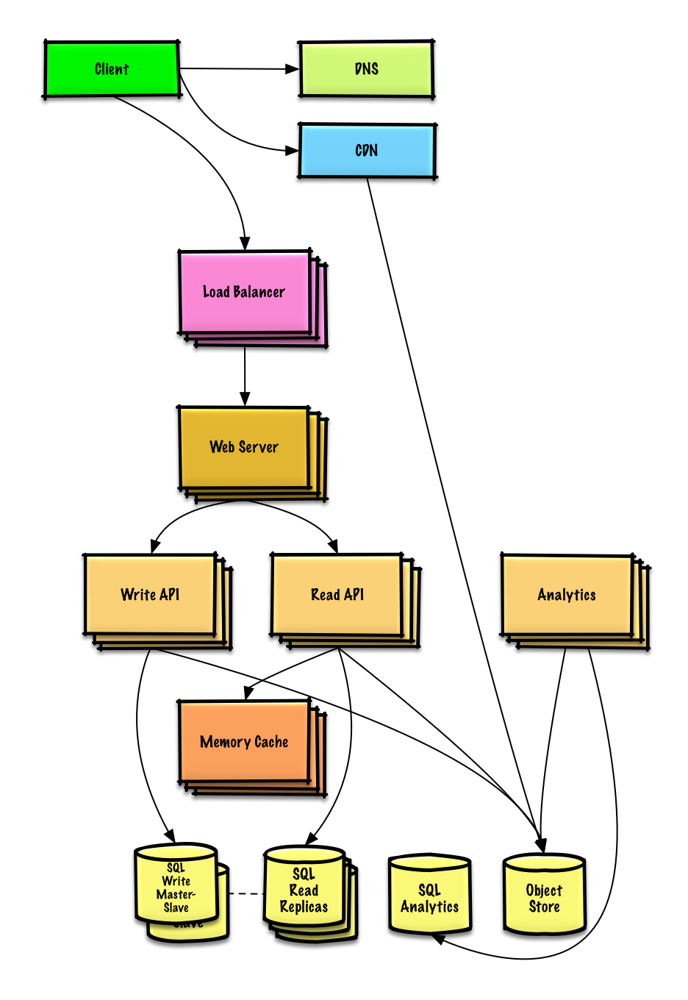
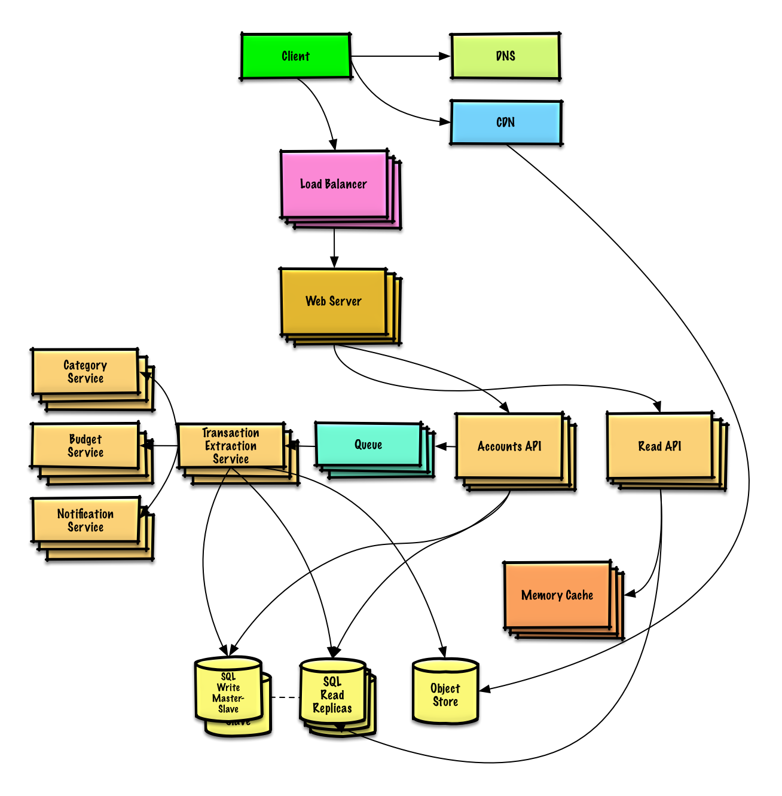

<p align="center">
  
  <br/>
</p>

<p align="center">
  
</p>

<p align="center">
  <a href="https://github.com/Safouene1/support-palestine-banner"></a>
</p>

<p><strong>
  هدف هذه الصفحة هو تعزيز المعرفة في مجال الذكاء الاصطناعي والتقدم التقني في العالم العربي. تبادل المعرفة وتطوير التكنولوجيا 
</strong></p>
<br>
<br>


<p align="center">
  
  <br/>
</p>

## الأهداف

> تعلم تصميم الأنظمة الضخمة
>
> التحضير لمقابلة تصميم الأنظمة.

### تعلم تصميم الأنظمة الضخمة

تعلم كيفية تصميم الأنظمة الضخمة يمكنك من أن تصبح مهندسا أفضل.

تصميم الأنظمة موضوع واسع. هناك **عدد هائل من المصادر المنتشرة على الانترنت** لمبادئ تصميم الأنظمة.

هذا المشروع هو **مجموعة منظمة** من المصادر التي تساعدك على تعلم كيفية بناء نظام ضخم.

### تعلم من مجتمع المصادر المفتوحة 

هذا مشروع مفتوح المصدر دائم التحديث.

[المساهمات](#المساهمة) مرحب بها!

### التحضير لمقابلة تصميم الأنظمة

بالإضافة لمقابلات البرمجة، تصميم الأنظمة **عنصر أساسي** من أي **مقابلة تقنية** في الكثير من شركات التكنولوجيا.

**تمرن على الأسئلة الشائعة لتصميم الأنظمة** و **قارن** إجاباتك **بالإجابات المقترحة**: نقاشات، شيفرات ومخططات.

مواضيع التحضير للمقابلة:

* [دليل الدراسة](#study-guide)
* [كيف تتعامل مع سؤال تصميم الأنظمة في المقابلات](#how-to-approach-a-system-design-interview-question)
* [أسئلة تصميم أنظمة في المقابلات، **مع الإجابات**](#system-design-interview-questions-with-solutions)
* [Object-oriented أسئلة مقابلات في الـ **مع الإجابات**](#object-oriented-design-interview-questions-with-solutions)
* [أسئلة إضافية لمقابلات تصميم الأنظمة](#additional-system-design-interview-questions)

## بطاقات استذكار Anki

<p align="center">
  
  <br/>
</p>

[بطاقات استذكار Anki] التالية تساعدك في حفظ مفاهيم أساسية في تصميم الأنظمة

* [تصميم الأنظمة](resources/flash_cards/System%20Design.apkg)
* [تدريبات تصميم الأنظمة](resources/flash_cards/System%20Design%20Exercises.apkg)
* [تدريبات تصميم الـ Object-oriented](resources/flash_cards/OO%20Design.apkg)

مفيدة للإستذكار السريع.


## المساهمة

> تعلم من المجتمع.

يمكنك المساعدة بـ:

* تصحيح الأخطاء
* تحسين الأقسام
* اضافة أقسام جديدة

المحتوى الذي يحتاج بعض المراجعة يوضع [قيد التطوير](#under-development).

انظر [إرشادات المساهمة](CONTRIBUTING.md).

## فهرسة مواضيع تصميم الأنظمة

> ملخص مواضيع متعددة في تصميم الأنظمة، تتضمن ايجابيات وسلبيات.  **تنازل عن ميزة من أجل الحصول على أخرى**.
>
> كل قسم يحتوي على روابط لمصادر متعمقة.

<p align="center">
  
  <br/>
</p>

* [مواضيع تصميم الأنظمة: ابدأ من هنا](#system-design-topics-start-here)
    * [خطوة 1: راجع مفهوم القدرة على التوسع في هذه المحاضرة](#step-1-review-the-scalability-video-lecture)
    * [خطوة 2: مقالة تشرح معنى القدرة على التوسع](#step-2-review-the-scalability-article)
    * [الخطوات التالية](#next-steps)
* [الأداء مقابل القدرة على التوسع](#performance-vs-scalability)
* [وقت الاستجابة مقابل الإنتاجية](#latency-vs-throughput)
* [التوفر مقابل التطابق](#availability-vs-consistency)
    * [نظرية CAP](#cap-theorem)
        * [مدى قبول المطابقة والتجزئة-CP](#cp---consistency-and-partition-tolerance)
        * [مدى قبول التوفر والتجزئة-AP](#ap---availability-and-partition-tolerance)
* [أنماط التطابق](#consistency-patterns)
    * [تطابق ضعيف](#weak-consistency)
    * [التطابق اللاحق](#eventual-consistency)
    * [التطابق القوي](#strong-consistency)
* [أنماط التوفر](#availability-patterns)
    * [الدعم الإحتياطي](#fail-over)
    * [التكرار](#replication)
* [نظام اسم النطاق](#domain-name-system)
* [شبكة توصيل المحتوى](#content-delivery-network)
    * [شبكة توفير المحتوى (CDN) المعتمدة تدفع بالتحديثات عند حدوث أي تغيير](#push-cdns)
    * [شبكة توفير المحتوى (CDN) تحدث المحتوى عند الطلب](#pull-cdns)
* [موازن الأحمال](#load-balancer)
    * [نشط-خامل](#active-passive)
    * [نشط-نشط](#active-active)
    * [موازنة أحمال الطبقة 4](#layer-4-load-balancing)
    * [موازنة أحمال الطبقة 7](#layer-7-load-balancing)
    * [التمدد الأفقي](#horizontal-scaling)
* [وكيل عكسي (خادوم الشبكة)](#reverse-proxy-web-server)
    * [موزع الأحمال مقابل وكيل عكسي](#load-balancer-vs-reverse-proxy)
* [طبقة التطبيق](#application-layer)
    * [ميكروسيرفس](#microservices)
    * [اكتشاف الخدمة](#service-discovery)
* [قواعد بيانات](#database)
    * [نظام إدارة قواعد البيانات العلائقية (RDBMS)](#relational-database-management-system-rdbms)
        * [مضاعفة الخادوم والتابع](#master-slave-replication)
        * [مضاعفة الخادوم](#master-master-replication)
        * [اتحاد](#federation)
        * [تجزئة](#sharding)
        * [التخلص من العلاقات المعقدة](#denormalization)
        * [ضبط وتحسين الإستعلامات](#sql-tuning)
    * [قاعدة بيانات غير علائقية](#nosql)
        * [التخزين بالمفتاح والقيمة](#key-value-store)
        * [تخزين المستندات](#document-store)
        * [تخزين عمود واسع](#wide-column-store)
        * [قاعدة بيانات رسومية](#graph-database)
    * [قاعدة بيانات علائقية أو غير علائقية](#sql-or-nosql)
* [تخزين مؤقت](#cache)
    * [تخزين مؤقت عند المستخدم](#client-caching)
    * [تخزين مؤقت في (CDN) شبكة توفير المحتوى](#cdn-caching)
    * [التخزين المؤقت في خادوم الشبكة](#web-server-caching)
    * [التخزين المؤقت في قواعد البيانات](#database-caching)
    * [التخزين المؤقت في التطبيق](#application-caching)
    * [التخزين المؤقت على مستوى الاستعلامات](#caching-at-the-database-query-level)
    * [التخزين المؤقت على مستوى الـ object](#caching-at-the-object-level)
    * [متى تحدث التخزين المؤقت](#when-to-update-the-cache)
        * [التخزين المؤقت الجانبي](#cache-aside)
        * [الكتابة المباشرة](#write-through)
        * [الكتابة في الخلفية](#write-behind-write-back)
        * [التحديث الإستباقي](#refresh-ahead)
* [التزامن](#asynchronism)
    * [صفوف الرسائل](#message-queues)
    * [صفوف المهام](#task-queues)
    * [الضغط الخلفي](#back-pressure)
* [التواصل](#communication)
    * [بروتوكول التحكم بالإرسال (TCP)](#transmission-control-protocol-tcp)
    * [بروتوكول مخطط المستخدم (UDP)](#user-datagram-protocol-udp)
    * [إجراء اتصال عن بعد (RPC)](#remote-procedure-call-rpc)
    * [نقل الحالة التمثيلي (REST)](#representational-state-transfer-rest)
* [الأمن](#security)
* [الملحق](#appendix)
    * [جدول مضاعفات ال2](#powers-of-two-table)
    * [أرقام لأوقات الاستجابة يجب على كل مبرمج معرفتها](#latency-numbers-every-programmer-should-know)
    * [أسئلة تصميم أنظمة إضافية](#additional-system-design-interview-questions)
    * [أمثلة تصاميم هيكلية واقعية](#real-world-architectures)
    * [هيكلة الشركات](#company-architectures)
    * [مدونات الشركات التقنية](#company-engineering-blogs)
* [تحت التطوير](#under-development)
* [شُكر وتقدير](#credits)
* [بيانات التواصل](#contact-info)
* [الترخيص](#license)

## إرشادات الدراسة

> مواضيع مقترحة للمراجعة بناء على الجدول الزمني للمقابلة (قصير، متوسط، طويل).


**س: هل يجب علي معرفة كل شيء هنا لاجتياز المقابلات ?**

**ج: لا، ليس عليك معرفة كل شيء هنا للتحضير لمقابلة**.

ما يتم سؤالك عنه في المقابلات يعتمد على:

* الخبرة التي لديك
* خلفيتك التقنية
* طبيعة الوظيفة 
* جهة العمل التي تقابلك
* الحظ

يتوقع من المرشحين الأكثر خبرة بشكل عام أن تكون لديهم دراية أكبر عن تصميم الأنظمة. ربما يكون متوقعا من المهندسين أو رؤساء الفرق أن تكون لديهم معرفة أكبر عن باقي أفراد الفريق. في الشركات التقنية الرائدة غالبا ما يكون هناك جولة أو أكثر من مقابلات تصميم النظام.

ابدأ بشكل موسع وعام ثم تعمق في بعض المواضيع. معرفة سطحية عن بعض المواضيع المتنوعة لتصميم الأنظمة قد تساعدك كثيرا. عدل الدليل الإرشادي التالي بما يتناسب مع جدولك الزمني وخبرتك والوظيفة التي تقدم عليها بالإضافة لجهة العمل التي تقابلك.

* **جدول زمني قصير** - التركيز على **التوسع** في مواضيع تصميم الأنظمة. بالتدريب على حل **بعض** أسئلة المقابلات.
* **جدول زمني متوسط** - التركيز على **التوسع** و**بعض التعمق** في مواضيع تصميم الأنظمة. والتدريب على حل **العديد** من أسئلة المقابلات.
* **جدول زمني طويل** - التركيز على **التوسع** و**تعمق أكثر** في مواضيع تصميم الأنظمة. تدرب على حل **معظم** أسئلة المقابلات.

| قصير | متوسط | طويل |              |
|------|------|-----|--------------|
| :+1: | :+1: | :+1: | اقرأ [مواضيع تصميم الأنظمة](#index-of-system-design-topics) لتأخذ نظرة عامة على كيفية عمل الأنظمة |
| :+1: | :+1: | :+1: | اقرأ بعض المقالات في [المدونة الهندسية للشركة](#company-engineering-blogs) التي ستجري لك المقابلة |
| :+1: | :+1: | :+1: | اقرأ بعض المقالات عن [تصاميم هندسية من الواقع](#real-world-architectures) |
| :+1: | :+1: | :+1: | استعرض [كيف تتعامل مع السؤال في مقابلة تصميم الأنظمة](#how-to-approach-a-system-design-interview-question) |
| البعض | العديد | معظم | ادرس [أسئلة مقابلات تصميم الأنظمة مع الحلول](#system-design-interview-questions-with-solutions) |
| البعض | العديد | معظم | ادرس [أسئلة مقابلات في تصميم Object-oriented مع الحلول](#object-oriented-design-interview-questions-with-solutions) |
| البعض | العديد | معظم | راجع [أسئلة مقابلات اضافية في تصميم الأنظمة](#additional-system-design-interview-questions) |

## كيف تتعامل مع سؤال في مقابلة تصميم الأنظمة

> كيفية معالجة السؤال

تكون مقابلة تصميم الأنظمة **محادثة مفتوحة**. يتوقع منك أن تقودها.

يمكنك اتخاذ الخطوات التالية لتوجيه النقاش. للمساعدة في ترسيخ هذه العملية، ادرس قسم [أسئلة مقابلة تصميم الأنظمة مع الحلول](#system-design-interview-questions-with-solutions) باستخدام الخطوات التالية.

### الخطوة 1: تحديد حالات الاستخدام، القيود والافتراضات

اجمع المتطلبات واحصر المشكلة. اسأل عن توضيح حالات الاستخدام والقيود وناقش الفرضيات.

* من سيستخدم النظام؟
* كيف سيتم استخدامه؟
* كم عدد المستخدمين؟
* ماذا يقدم النظام؟
* ماهي مدخلات ومخرجات النظام؟
* كم عدد البيانات المتوقع معالجتها؟
* كم عدد الطلبات المتوقع لكل ثانية؟
* ماهو معدل المتوقع للقراءة مقابل الكتابة؟

### خطوة 2: أنشئ تصميم عام

لخص التصميم العام مع كل المكونات الأساسية.

* ارسم مسودة للمكونات الأساسية والعلاقة فيما بينها
* برر أفكارك

### خطوة 3: صمم المكونات الأساسية

تعمق في تفاصيل كل مكون. مثلا، إذا طلب منك [تصميم خدمة اختصار روابط](solutions/system_design/pastebin/README.md), ناقش:

* انتاج وتخزين ترميز hash لرابط كامل
    * [MD5](solutions/system_design/pastebin/README.md) و [Base62](solutions/system_design/pastebin/README.md)
    * تصادم الترميز
    * قاعدة بيانات علائقية أو غير علائقية
    * مخطط قاعدة البيانات
* إعادة ترجمة رابط مرمز
    * البحث في قواعد البينات
* تصميم واجهة برمجة التطبيقات و object-oriented


### خطوة 4: اجعل النظام قابل للتوسع

قم بتحديد وتعريف مراكز عنق الزجاجة، مع أخذ القيود بعين الإعتبار. مثلا هل تحتاج أحد هذه الأمور لزيادة قابلية التوسع؟

* موزع أحمال
* توسع أفقي
* تخزين مؤقت
* تقسيم قاعدة البيانات

ادرس احتمالات الحلول وآثارها. كل شيء عبارة عن مقايضة. حدد مراكز عنق الزجاجة بواسطة [مبادئ تصميم الأنظمة القابلة للتوسع](#index-of-system-design-topics).

### حسابات تقريبية

ربما يطلب منك أن تقوم ببعض التقييمات اليدوية [ملحق](#appendix) لبعض هذه المصادر:

* [استخدام تقييمات تقريبية](http://highscalability.com/blog/2011/1/26/google-pro-tip-use-back-of-the-envelope-calculations-to-choo.html)
* [جدول مضاعفات ال2](#powers-of-two-table)
* [أرقام لأوقات الاستجابة يجب على كل مبرمج ان يعلمها](#latency-numbers-every-programmer-should-know)

### مصادر وقراءة أكثر


تحقق من الروابط التالية للحصول على فكرة أفضل عما يمكن توقعه:

* [كيف تحسم مقابلة تصميم الأنظكة](https://www.palantir.com/2011/10/how-to-rock-a-systems-design-interview/)
* [مقابلة تصميم الأنظمة](http://www.hiredintech.com/system-design)
* [مقدمة لمقابلات تصميم العمارة والنظم](https://www.youtube.com/watch?v=ZgdS0EUmn70)

## أسئلة مقابلة تصميم الأنظمة مع الحلول

> أسئلة مقابلة تصميم النظام الشائعة مع نماذج المناقشات ، والأكواد ، والمخططات.
>
> تجد الحلول مرتبطة بالمحتوى في مجلد `solutions/`.

| أسئلة | |
|---|---|
| صمم Pastebin.com (or Bit.ly) | [الحل](solutions/system_design/pastebin/README.md) |
| صمم حائط تويتر (او تحديثات فيسبوك)<br/>صمم بحث تويتر (أو بحث فيسبوك) | [الحل](solutions/system_design/twitter/README.md) |
| صمم عناكب الشبكة | [الحل](solutions/system_design/web_crawler/README.md) |
| صمم Mint.com | [الحل](solutions/system_design/mint/README.md) |
| صمم تراكيب بيانات منصة اجتماعية | [الحل](solutions/system_design/social_graph/README.md) |
| صمم مخزن مفتاح-قيمة لمحرك بحث | [الحل](solutions/system_design/query_cache/README.md) |
| تصميم ترتيب مبيعات أمازون حسب الفئة | [الحل](solutions/system_design/sales_rank/README.md) |
| صمم نظامًا يتسع لملايين المستخدمين على AWS | [الحل](solutions/system_design/scaling_aws/README.md) |
| أضف سؤال لتصميم نظام | [شارك](#contributing) |

### تصميم Pastebin.com (أو Bit.ly)

[عرض التمرين والحل](solutions/system_design/pastebin/README.md)



### تصميم الجدول الزمني Twitter والبحث (أو موجز Facebook والبحث)

[عرض التمرين والحل](solutions/system_design/twitter/README.md)


### تصميم زاحف الويب

[عرض التمرين والحل](solutions/system_design/web_crawler/README.md)


### صمم Mint.com

[عرض التمرين والحل](solutions/system_design/mint/README.md)



### صمم تراكيب البيانات لشبكة اجتماعية

[عرض التمرين والحل](solutions/system_design/social_graph/README.md)


### تصميم مخزن مفتاح-قيمة لمحرك بحث

[عرض التمرين والحل](solutions/system_design/query_cache/README.md)


### تصميم ترتيب مبيعات أمازون حسب الفئة

[عرض التمرين والحل](solutions/system_design/sales_rank/README.md)


### صمم نظامًا يتسع لملايين المستخدمين على AWS

[عرض التمرين والحل](solutions/system_design/scaling_aws/README.md)


## أسئلة مقابلة تصميم object-oriented مع الحلول

> أسئلة مقابة تصميم object-oriented مع نماذج مناقشات، أكواد، ومخططات.
>
> الحلول مرتبطة بالمحتوى في مجلد `solutions/`.

>**ملاحظة: هذا القسم قيد التطوير**

| الحل | سؤال |
|---|---|
| [الحل](solutions/object_oriented_design/hash_table/hash_map.ipynb) | تصميم hash map |
| [الحل](solutions/object_oriented_design/lru_cache/lru_cache.ipynb) | تصميم ذاكرة التخزين المؤقت الأقل استخدامًا مؤخرًا |
| [الحل](solutions/object_oriented_design/call_center/call_center.ipynb) | تصميم مركز اتصال |
| [الحل](solutions/object_oriented_design/deck_of_cards/deck_of_cards.ipynb) | صمم مجموعة من البطاقات |
| [الحل](solutions/object_oriented_design/parking_lot/parking_lot.ipynb) | تصميم موقف للسيارات |
| [الحل](solutions/object_oriented_design/online_chat/online_chat.ipynb) | صمم خادم دردشة |
| [شارك](#contributing) | تصميم مصفوفة دائرية |
| [شارك](#contributing) | أضف سؤال تصميم object-oriented |

## مواضيع تصميم الأنظمة:إبدا من هنا

هل انت جديد على تصميم الأنظمة?

أولاً ، ستحتاج إلى فهم أساسي للمبادئ المشتركة ، والتعرف على ماهيتها ، وكيفية استخدامها ، ومزاياها وعيوبها.

### الخطوة 1: راجع محاضرة فيديو قابلية التوسع

[محاضرة التوسع في جامعة هارفارد](https://www.youtube.com/watch?v=-W9F__D3oY4)

* المواضيع التي تمت تغطيتها:
    * التوسع العمودي
    * التوسع الأفقي
    * التخزين المؤقت
    * توزيع الأحمال
    * تكرار قواعد البيانات
    * تقسيم قواعد البيانات

### الخطوة 2: راجع مقالة قابلية التوسع

[قابلية التوسع](http://www.lecloud.net/tagged/scalability)

* المواضيع التي تمت تغطيتها:
    * [نسخ](http://www.lecloud.net/post/7295452622/scalability-for-dummies-part-1-clones)
    * [قواعد البيانات](http://www.lecloud.net/post/7994751381/scalability-for-dummies-part-2-database)
    * [تخزين مؤقت](http://www.lecloud.net/post/9246290032/scalability-for-dummies-part-3-cache)
    * [المزامنة](http://www.lecloud.net/post/9699762917/scalability-for-dummies-part-4-asynchronism)

### خطوات تالية

بعد ذلك ، سنلقي نظرة على المقايضات العامة:

* **الأداء** vs **التوسع**
* **وقت الإستجابة** vs **الإنتاجية**
* **التوافر** vs **التطابق والثبات**

تذكر **كل شيء مقايضة**.

ثم سنتعمق في مواضيع أكثر تحديدًا مثل DNS و CDNs وموازنة الأحمال.

## الأداء مقابل قابلية التوسع

تكون الخدمة **قابلة للتطوير** إذا أدت إلى زيادة **الأداء** بطريقة تتناسب مع الموارد المضافة. بشكل عام ، تعني زيادة الأداء خدمة المزيد من وحدات العمل ، ولكن يمكن أيضًا التعامل مع وحدات عمل أكبر ، كما هو الحال عندما تنمو مجموعات البيانات.<sup><a href=http://www.allthingsdistributed.com/2006/03/a_word_on_scalability.html>1</a></sup>

طريقة أخرى للنظر إلى الأداء مقابل قابلية التوسع:

* إذا كانت لديك مشكلة **في الأداء** ، فهذا يعني أن نظامك بطيء لمستخدم واحد.
* إذا كانت لديك مشكلة **قابلية التوسع** ، فإن نظامك سريع لمستخدم واحد ولكنه بطيء في ظل الحمل الثقيل.

### المصادر ومزيد من القراءة

* [كلمة عن قابلية التوسع](http://www.allthingsdistributed.com/2006/03/a_word_on_scalability.html)
* [قابلية التوسع والتوافر والاستقرار والأنماط](http://www.slideshare.net/jboner/scalability-availability-stability-patterns/)

## زمن الإستجابة مقابل الإنتاجية

**زمن الإستجابة** هو الوقت المناسب لأداء بعض الإجراءات أو لإنتاج بعض النتائج.

**الإنتاجية** هو عدد هذه الإجراءات أو النتائج لكل وحدة زمنية.

بشكل عام ، يجب أن تهدف إلى تحقيق **أقصى قدر من الإنتاجية** مع **زمن استجابة مقبول**.

### Source(s) and further reading

* [فهم الإنتاجية مقابل زمن الإستجابة](https://community.cadence.com/cadence_blogs_8/b/sd/archive/2010/09/13/understanding-latency-vs-throughput)

## التوافر مقابل ضبط التطابق

### CAP نظرية

<p align="center">
  
  <br/>
  <i><a href=http://robertgreiner.com/2014/08/cap-theorem-revisited>المصدر: إعادة النظر في نظرية CAP</a></i>
</p>

في نظام الكمبيوتر الموزع ، يمكنك فقط دعم اثنين من الضمانات التالية:

* **الثبات والتطابق** - كل قراءة تتلقى أحدث كتابة أو خطأ
* **التوافر** - يتلقى كل طلب ردًا ، دون ضمان احتوائه على أحدث نسخة من المعلومات
* **مسامحة التقسيم** - النظام يبقى متوفر على الرغم من التوزيعات العشوائية الحاصلة بسبب خطأ في الشبكة

*الشبكات ليست موثوقة ، لذا ستحتاج إلى دعم تسامح التقسيم. ستحتاج إلى إجراء مقايضة برمجية بين التطابق والتوافر.*

#### CP - تفاوت التطابق والتقسيم

قد يؤدي انتظار استجابة من العقدة المقسمة إلى حدوث خطأ انتهاء المهلة. CP خيار جيد إذا كانت احتياجات عملك تتطلب قراءة وكتابة محتّمة.

#### AP - تفاوت التوافر والتقسيم

تعرض الردود أحدث إصدار من البيانات المتاحة على العقدة ، والتي قد لا تكون الأحدث. قد تستغرق عمليات الكتابة بعض الوقت للنشر عند الإنتهاء من التجزئة.

AP يعد اختيارًا جيدًا إذا كانت احتياجات العمل تسمح [التطابق اللاحق] (#eventual-consistency) أو عندما يحتاج النظام إلى مواصلة العمل على الرغم من الأخطاء الخارجية.

### مصادر ومزيد من القراءة

* [CAP إعادة النظر في نظرية](http://robertgreiner.com/2014/08/cap-theorem-revisited/)
* [مقدمة بسيطة باللغة الإنجليزية لنظرية CAP](http://ksat.me/a-plain-english-introduction-to-cap-theorem/)
* [CAP اسئلة شائعة](https://github.com/henryr/cap-faq)

## أنماط التسلسل

مع وجود عدة نسخ من نفس البيانات، نواجه خيارات حول كيفية مزامنتها حتى يكون للعملاء رؤية ثابتة للبيانات. تذكر تعريف التسلسل من [نظرية CAP](#cap-theorem) - كل قراءة تستلم آخر كتابة أو خطأ.

### التسلسل الضعيف

بعد كتابة البيانات، قد تكون القراءات قادرة على رؤيتها أو لا. تُتبع نهج المحاولة الأفضل.

تُستخدم هذه النهج في أنظمة مثل memcached. يعمل التسلسل الضعيف بشكل جيد في حالات الاستخدام في الوقت الحقيقي مثل VoIP، والمكالمات الفيديو، وألعاب اللاعبين في الوقت الحقيقي. على سبيل المثال، إذا كنت في مكالمة هاتفية وفقدت الإشارة لبضع ثوانٍ، عندما تستعيد الاتصال لن تسمع ما تم قوله أثناء فقدان الاتصال.

### التسلسل النهائي

بعد كتابة البيانات، سترى القراءات تلك البيانات في نهاية المطاف (عادة خلال بضع جزيئات زمنية). يتم تكريب البيانات بشكل غير متزامن.

يتم استخدام هذا النهج في أنظمة مثل DNS والبريد الإلكتروني. يعمل التسلسل النهائي بشكل جيد في أنظمة ذات التوفرية العالية.

### التسلسل القوي

بعد كتابة البيانات، سترى القراءات هذه البيانات. يتم تكريب البيانات بشكل متزامن.

يتم استخدام هذا النهج في أنظمة ملفات ونظم إدارة قواعد البيانات العلائقية. يعمل التسلسل القوي بشكل جيد في الأنظمة التي تحتاج إلى المعاملات.

### المصادر والقراءة المستقبلية

* [المعاملات عبر مراكز البيانات](http://snarfed.org/transactions_across_datacenters_io.html)

## أنماط التوافر

هناك نمطان رئيسيان لدعم التوفر العالي: الفشل الزائد والتكرار.

### الفشل الزائد

#### النشط الغير نشط

في حالة الفشل الزائد النشط الغير نشط، يتم إرسال نبضات قلب بين الخادم النشط والخادم الغير نشط في الاستعداد. إذا تم قطع نبض القلب، يتولى الخادم الغير نشط عنوان IP النشط ويستأنف الخدمة.

يتم تحديد طول التوقف عن العمل عند ما إذا كان الخادم الغير نشط يعمل بالفعل في الاستعداد الساخن أم إذا كان يحتاج للبدء من الاستعداد البارد. يتعامل فقط الخادم النشط مع حركة المرور.

يمكن أيضًا الإشارة إلى الفشل الزائد النشط الغير نشط بالفشل الزائد الماستر الرقيق.

#### النشط النشط

في حالة الفشل الزائد النشط النشط، يدير كل من الخوادم حركة المرور ويقوم بتوزيع الحمل بينهما.

إذا كانت الخوادم تواجه الجمهور، يحتاج نظام DNS إلى معرفة عناوين IP العامة لكل من الخوادم. إذا كانت الخوادم تواجه النظام الداخلي، يحتاج منطق التطبيق إلى معرفة كل من الخوادم.

يمكن أيضًا الإشارة إلى الفشل الزائد النشط النشط بالفشل الزائد الماستر الماستر.

### عيوب الفشل الزائد:

- يزيد الفشل الزائد من الأجهزة والتعقيد الإضافي.
- يمكن أن يتسبب في فقدان البيانات إذا فشل النظام النشط قبل أن يتم تكرار أي بيانات مكتوبة حديثًا على النظام الغير نشط.

### التكرار

#### الماستر الرقيق والماستر الماستر

يتم مناقشة هذا الموضوع بالتفصيل في قسم [قاعدة البيانات](#قاعدة-البيانات):

- [التكرار الماستر الرقيق](#التكرار-الماستر-الرقيق)
- [التكرار الماستر الماستر](#التكرار-الماستر-الماستر)

## نظام اسم المجال (Domain Name System)

<p align="center">
  
  <br/>
  <i><a href=http://www.slideshare.net/srikrupa5/dns-security-presentation-issa>المصدر: عرض أمان نظام اسم المجال (DNS)</a></i>
</p>

يقوم نظام اسم المجال (DNS) بترجمة اسم المجال مثل www.example.com إلى عنوان IP.

يعتبر DNS هرميًا، حيث يحتوي على عدد قليل من الخوادم الأساسية على المستوى العلوي. يقدم جهاز التوجيه الخاص بك أو مزود خدمة الإنترنت معلومات حول الخادم(ات) DNS الذي يجب الاتصال به عند البحث. تحتوي خوادم DNS على مختصرات للتخزين المؤقت للتحويلات، والتي يمكن أن تصبح غير صحيحة بسبب تأخيرات انتشار DNS. يمكن أن تحتوي نتائج DNS أيضًا على تخزين مؤقت من قبل المستعرض أو نظام التشغيل الخاص بك لفترة زمنية معينة تُحدد بواسطة [وقت العيش (TTL)](https://en.wikipedia.org/wiki/Time_to_live).

* **سجل NS (خادم الاسم)** - يحدد خوادم DNS لنطاقك الرئيسي/الفرعي.
* **سجل MX (تبادل البريد)** - يحدد خوادم البريد لقبول الرسائل.
* **سجل A (عنوان)** - يعيد اسمًا إلى عنوان IP.
* **سجل CNAME (القيمة القياسية)** - يعيد اسمًا إلى اسم آخر أو سجل `CNAME` (مثال.com إلى www.مثال.com) أو إلى سجل `A`.

تقدم خدمات مثل [كلاود فلير](https://www.cloudflare.com/dns/) و [Route 53](https://aws.amazon.com/route53/) خدمات DNS المُدارة. يمكن لبعض خدمات DNS توجيه حركة المرور عبر طرق مختلفة:

* [Weighted round robin](http://g33kinfo.com/info/archives/2657)
    * منع حركة المرور من الذهاب إلى الخوادم قيد التنفيذ الصيانة
    * توازن بين أحجام المجموعة المتغيرة
    * اختبار A/B
* مُبني على الإمكانية
* مُبني على الجغرافيا

### العيب (العيوب): DNS

* الوصول إلى خادم DNS يتسبب في تأخير طفيف، على الرغم من التخفيف الذي يتم عبر التخزين المؤقت الوارد أعلاه.
* إدارة خادم DNS قد تكون معقدة وعادة ما تتم إدارتها من قِبَل [الحكومات ومزودي خدمة الإنترنت والشركات الكبيرة](http://superuser.com/questions/472695/who-controls-the-dns-servers/472729).
* خدمات DNS تعرضت مؤخرًا لهجمات [DDoS](http://dyn.com/blog/dyn-analysis-summary-of-friday-october-21-attack/)، مما يمنع المستخدمين من الوصول إلى مواقع الويب مثل Twitter دون معرفة عناوين IP الخاصة بها.

### المصدر (المصادر) والقراءة المستقبلية

* [هندسة DNS](https://technet.microsoft.com/en-us/library/dd197427(v=ws.10).aspx)
* [ويكيبيديا](https://en.wikipedia.org/wiki/Domain_Name_System)
* [مقالات DNS](https://support.dnsimple.com/categories/dns/)

## شبكة تسليم المحتوى (Content Delivery Network - CDN)

<p align="center">
  
  <br/>
  <i><a href=https://www.creative-artworks.eu/why-use-a-content-delivery-network-cdn/>المصدر: لماذا استخدام شبكة تسليم المحتوى (CDN)</a></i>
</p>

شبكة تسليم المحتوى (CDN) هي شبكة موزعة على نطاق عالمي تتألف من خوادم وكيل تخدم المحتوى من مواقع أقرب إلى المستخدم. بشكل عام، يتم تقديم الملفات الثابتة مثل HTML/CSS/JS والصور ومقاطع الفيديو من خلال شبكة CDN، على الرغم من أن بعض CDN مثل Amazon's CloudFront تدعم المحتوى الديناميكي أيضًا. يقوم قرار DNS للموقع بإخبار العملاء بالخادم الذي يجب عليهم التواصل معه.

تسليم المحتوى من خلال CDN يمكن أن يحسن الأداء بشكل كبير بطريقتين:

* يتلقى المستخدمون المحتوى من مراكز البيانات القريبة منهم.
* لا يتعين على خوادمك تلبية الطلبات التي يلبيها CDN.

### CDN الدفع

تتلقى CDN الدفع محتوى جديد كلما حدث تغيير على الخادم الخاص بك. أنت مسؤول تمامًا عن توفير المحتوى، حيث يتم تحميله مباشرة على CDN وإعادة كتابة عناوين URL لتشير إلى CDN. يمكنك تكوين انتهاء صلاحية المحتوى ومتى يتم تحديثه. يتم تحميل المحتوى فقط عندما يكون جديدًا أو تغير، مما يقلل من حركة المرور ولكن يزيد من التخزين.

تعمل CDN الدفع بشكل جيد مع المواقع التي تتمتع بحركة مرور قليلة أو المواقع التي لا يتم تحديث محتواها بانتظام. يتم وضع المحتوى على CDN مرة واحدة، بدلاً من استرجاعه بفترات منتظمة.

### CDN الاستحضار

تقوم CDN الاستحضار بجلب محتوى جديد من الخادم الخاص بك عندما يطلب المستخدم الأول المحتوى. تترك المحتوى على الخادم الخاص بك وتعيد كتابة عناوين URL لتشير إلى CDN. يؤدي ذلك إلى طلب أبطأ حتى يتم تخزين المحتوى على CDN.

يحدد [زمن العيش (TTL)](https://en.wikipedia.org/wiki/Time_to_live) مدة الاستحضار للمحتوى. تقلل CDN الاستحضار من مساحة التخزين على CDN، ولكن يمكن أن تسبب حركة مرور متكررة إذا انتهت صلاحية الملفات واستعيدت قبل أن تتغير فعليًا.

تعمل CDN الاستحضار بشكل جيد مع المواقع

 التي تتمتع بحركة مرور كثيفة، حيث يتم توزيع حركة المرور بشكل أكثر تناسبًا مع وجود المحتوى الذي طلب مؤخرًا فقط على CDN.

### سلبية(s): CDN

* يمكن أن تكون تكاليف CDN كبيرة اعتمادًا على حجم المرور، على الرغم من أنه يجب وزن ذلك مقابل التكاليف الإضافية التي قد تتكبدها في حالة عدم استخدام CDN.
* يمكن أن يكون المحتوى غير محدث إذا تم تحديثه قبل انتهاء صلاحية TTL.
* تتطلب CDN تغيير عناوين URL للمحتوى الثابت للإشارة إلى CDN.

### المصادر وقراءة إضافية

* [توزيع المحتوى على نطاق عالمي](http://repository.cmu.edu/cgi/viewcontent.cgi?article=2112&context=compsci)
* [الاختلافات بين CDN الدفع وCDN الاستحضار](http://www.travelblogadvice.com/technical/the-differences-between-push-and-pull-cdns/)
* [ويكيبيديا](https://en.wikipedia.org/wiki/Content_delivery_network)


## موازنة الحمولة (Load Balancer)

<p align="center">
  
  <br/>
  <i><a href=http://horicky.blogspot.com/2010/10/scalable-system-design-patterns.html>المصدر: أنماط تصميم الأنظمة القابلة للتوسع</a></i>
</p>

موازنة الحمولة (Load Balancer) هي نظام يقوم بتوزيع طلبات العملاء الواردة على مصادر الحوسبة مثل خوادم التطبيقات وقواعد البيانات. في كل حالة، تعيد موازنة الحمولة الاستجابة من مصدر الحوسبة المناسب إلى العميل المناسب. تكون موازنات الحمولة فعّالة في:

* منع الطلبات من الذهاب إلى خوادم غير صحيحة.
* منع تحميل المصادر بشكل زائد.
* المساعدة في القضاء على نقاط الفشل الفردية.

يمكن تنفيذ موازنات الحمولة بواسطة أجهزة (تكلفة عالية) أو ببرمجيات مثل HAProxy.

الفوائد الإضافية تشمل:

* **إنهاء SSL** - فك تشفير الطلبات الواردة وتشفير استجابات الخادم بحيث لا يتعين على خوادم النظام الخلفية إجراء هذه العمليات المكلفة بالطاقة
    * يزيل الحاجة إلى تثبيت شهادات X.509 على كل خادم
* **استمرارية الجلسة** - إصدار ملفات تعريف الارتباط وتوجيه طلبات العميل المحددة إلى نفس النسخة إذا لم تتتبع تطبيقات الويب الجلسات

لحماية النظام من الفشل، من المشترك إعداد عدة موازنات حمولة، سواء في الوضع النشط السلبي أو النشط النشط.

يمكن لموازنات الحمولة توجيه حركة المرور بناءً على مقاييس مختلفة، بما في ذلك:

* عشوائي
* الأقل تحميلًا
* الجلسات/الكوكيز
* [التوزيع التسلسلي أو التوزيع التسلسلي المزوَّد بأوزان](http://g33kinfo.com/info/archives/2657)
* [الطبقة 4](#توازن-حمولة-الطبقة-4)
* [الطبقة 7](#توازن-حمولة-الطبقة-7)

### توازن حمولة الطبقة 4

تتطلع موازنات حمولة الطبقة 4 إلى المعلومات في [الطبقة النقلية](#الاتصال) لتحديد كيفية توزيع الطلبات. يتضمن ذلك عادة المصدر وعناوين IP الوجهة والمنافذ في الهيدر، ولكن ليس محتويات الحزمة. تقوم موازنات حمولة الطبقة 4 بتوج

يه حزم الشبكة إلى الخادم الرئيسي والخادم العلوي، مع أداء [ترجمة عنوان الشبكة (NAT)](https://www.nginx.com/resources/glossary/layer-4-load-balancing/).

### توازن حمولة الطبقة 7

تنظر موازنات حمولة الطبقة 7 في [الطبقة التطبيقية](#الاتصال) لتحديد كيفية توزيع الطلبات. يمكن أن يتضمن ذلك محتويات الهيدر والرسالة والكوكيز. ينهي موازنات حمولة الطبقة 7 حركة المرور الشبكية، وتقرأ الرسالة، وتتخذ قرارًا بتوزيع الحمولة، ثم تفتح اتصالًا بالخادم المحدد. على سبيل المثال، يمكن لموازن حمولة الطبقة 7 توجيه حركة الفيديو إلى الخوادم التي تستضيف الفيديوهات بينما يتم توجيه حركة التسوية الأكثر حساسية لمستخدمي الفوتر المحمية أمانًا إلى الخوادم.

على حساب المرونة، يتطلب توازن حمولة الطبقة 4 وقتًا وموارد حساب أقل من الطبقة 7، على الرغم من أن التأثير على الأداء يمكن أن يكون ضئيلًا على الأجهزة القابلة للتداول الحديثة.

### التوسع الأفقي

يمكن لموازنات الحمولة أن تساعد أيضًا في التوسع الأفقي، وتحسين الأداء والتوافر. يعد التوسع الأفقي باستخدام أجهزة معيارية أكثر كفاءة من التوسع العمودي لخادم واحد على أجهزة أكثر تكلفة، والذي يُسمى التوسع الرأسي. من السهل أيضًا توظيف المواهب العاملة على أجهزة معيارية بدلاً من أنظمة المؤسسات المتخصصة.

#### سلبية(s): التوسع الأفقي

* يُضيف التوسع الأفقي تعقيدًا ويشمل استنساخ الخوادم
    * يجب أن تكون الخوادم بلا حالة: لا يجب أن تحتوي على أي بيانات مرتبطة بالمستخدم مثل الجلسات أو صور الملف الشخصي
    * يمكن تخزين الجلسات في مخزن بيانات مركزي مثل [قاعدة البيانات](#قاعدة-البيانات) (SQL، NoSQL) أو [الذاكرة المؤقتة الدائمة](#الذاكرة-المؤقتة) (Redis، Memcached)
* يحتاج الخوادم الأمامية مثل الذواكر المؤقتة وقواعد البيانات إلى التعامل مع المزيد من الاتصالات المتزامنة مع توسع الخوادم الخلفية

### سلبية(s): موازنة ال

حمولة

* يمكن أن تصبح موازنة الحمولة عبءًا على الأداء إذا لم تكن لديها موارد كافية أو إذا لم يتم تكوينها بشكل صحيح.
* يتسبب إدخال موازنة الحمولة للمساعدة في القضاء على نقاط الفشل الفردية في زيادة التعقيد.
* تعد موازنة الحمولة الفردية نقطة فشل واحدة، ويزيد تكوين موازنات الحمولة المتعددة من التعقيد بشكل أكبر.

### المصادر وقراءة إضافية

* [هندسة NGINX](https://www.nginx.com/blog/inside-nginx-how-we-designed-for-performance-scale/)
* [دليل هندسة HAProxy](http://www.haproxy.org/download/1.2/doc/architecture.txt)
* [القابلية للتوسع](http://www.lecloud.net/post/7295452622/scalability-for-dummies-part-1-clones)
* [ويكيبيديا](https://en.wikipedia.org/wiki/Load_balancing_(computing))
* [توازن حمولة الطبقة 4](https://www.nginx.com/resources/glossary/layer-4-load-balancing/)
* [توازن حمولة الطبقة 7](https://www.nginx.com/resources/glossary/layer-7-load-balancing/)
* [تكوين مستمع ELB](http://docs.aws.amazon.com/elasticloadbalancing/latest/classic/elb-listener-config.html)

## البروكسي العكسي (خادم الويب)

<p align="center">
  
  <br/>
  <i><a href=https://upload.wikimedia.org/wikipedia/commons/6/67/Reverse_proxy_h2g2bob.svg>المصدر: ويكيبيديا</a></i>
  <br/>
</p>

البروكسي العكسي هو خادم ويب يُركِّز الخدمات الداخلية ويوفر واجهات موحدة للجمهور. يتم تحويل طلبات العملاء إلى خادم يمكنه تنفيذها قبل أن يعيد البروكسي العكسي استجابة الخادم إلى العميل.

الفوائد الإضافية تشمل:

* **زيادة الأمان** - إخفاء معلومات الخوادم الخلفية، وإضافة عناوين IP إلى القائمة السوداء، وتحديد الحد الأقصى لعدد الاتصالات لكل عميل.
* **زيادة القابلية للتوسع والمرونة** - يرى العملاء فقط عنوان IP للبروكسي العكسي، مما يتيح لك توسيع الخوادم أو تغيير تكوينها.
* **إنهاء SSL** - فك تشفير الطلبات الواردة وتشفير استجابات الخادم بحيث لا يتعين على خوادم النظام الخلفية إجراء هذه العمليات المكلفة بالطاقة
    * يزيل الحاجة إلى تثبيت شهادات X.509 على كل خادم
* **الضغط** - ضغط استجابات الخادم
* **التخزين المؤقت** - إعادة الاستجابة للطلبات المخزنة مسبقًا
* **المحتوى الثابت** - تقديم المحتوى الثابت مباشرة
    * HTML/CSS/JS
    * الصور
    * مقاطع الفيديو
    * وغيرها

### الموازنة الحمل (Load Balancer) مقابل البروكسي العكسي

* إن نشر موازنة الحمل مفيد عندما يكون لديك خوادم متعددة. في كثير من الأحيان، تقوم موازنات الحمل بتوجيه حركة المرور إلى مجموعة من الخوادم التي تقدم نفس الوظيفة.
* يمكن أن يكون البروكسي العكسي مفيدًا حتى مع خادم واحد فقط أو خادم التطبيق واحد، مما يفتح الفوائد المذكورة في القسم السابق.
* يمكن أن تدعم حلول مثل NGINX و HAProxy كل من توجيه البروكسي العكسي في الطبقة 7 وموازنة الحمل.

### سلبية(s): البروكسي العكسي

* يتسبب إدخال البروكسي العكسي في زيادة التعقيد.
* يعتبر البروكسي العكسي الفردي نقطة فشل واحدة، ويزيد تكوين عدة بروكسيات عكسية (أي [التبديل التلقائي](https://en.wikipedia.org/wiki/Failover)) من زيادة التعقيد بشكل أكبر.

### المصادر وقراءة إضافية

* [البروكسي العكسي مقابل موازنة الحمل](https://www.nginx.com/resources/glossary/reverse-proxy-vs-load-balancer/)
* [هندسة NGINX](https://www.nginx.com/blog/inside-nginx-how-we-designed-for-performance-scale/)
* [دليل هندسة HAProxy](http://www.haproxy.org/download/1.2/doc/architecture.txt)
* [ويكيبيديا](https://en.wikipedia.org/wiki/Reverse_proxy)

## طبقة التطبيق

<p align="center">
  
  <br/>
  <i><a href=http://lethain.com/introduction-to-architecting-systems-for-scale/#platform_layer>المصدر: مقدمة لهندسة الأنظمة للتوسع</a></i>
</p>

تفصيل طبقة الويب عن طبقة التطبيق (المعروفة أيضًا بطبقة البنية) يُتيح لك توسيع وتكوين كلا الطبقتين بشكل مستقل. إضافة واجهة برمجة التطبيق الجديدة يؤدي إلى إضافة خوادم التطبيق دون ضرورة إضافة خوادم الويب الإضافية. يدعم "مبدأ المسئولية الفردية" الخدمات الصغيرة والمستقلة التي تعمل معًا. يمكن للفرق الصغيرة التي تعتمد على الخدمات الصغيرة التخطيط للنمو السريع بشكل أكثر جرأة.

العمال في طبقة التطبيق يساعدون أيضًا على تمكين [الأزمنة](#الأزمنة).

### الخدمات الصغيرة (Microservices)

يتصل الخدمات الصغيرة المتعلقة بهذا النقاش بـ [الخدمات الصغيرة](https://en.wikipedia.org/wiki/Microservices)، والتي يمكن وصفها بأنها مجموعة من الخدمات الصغيرة والقابلة للنشر بشكل مستقل. كل خدمة تدير عملية فريدة وتتواصل من خلال آلية خفيفة ومحددة بوضوح لخدمة هدف تجاري. <sup><a href=https://smartbear.com/learn/api-design/what-are-microservices>1</a></sup>

على سبيل المثال، يمكن أن تحتوي بينتيرست على الخدمات الصغيرة التالية: ملف المستخدم، المتابع، الخلاصة، البحث، تحميل الصور، وغيرها.

### اكتشاف الخدمة (Service Discovery)

يمكن أن تساعد النظم مثل [Consul](https://www.consul.io/docs/index.html)، [Etcd](https://coreos.com/etcd/docs/latest)، و [Zookeeper](http://www.slideshare.net/sauravhaloi/introduction-to-apache-zookeeper) الخدمات على العثور على بعضها البعض عن طريق تتبع الأسماء والعناوين والمنافذ المُسجَّلة. تساعد [فحوصات الصحة](https://www.consul.io/intro/getting-started/checks.html) في التحقق من سلامة الخدمة ويتم ذلك غالبًا باستخدام [نقطة النهاية HTTP](#بروتوكول-نقل-النصوص-http). يحتوي كلا من Consul و Etcd على [مخزن القيمة المفتاحية](#مخزن-القيمة-المفتاحية) المدمج الذي يمكن أن يكون مفيدًا لتخزين قيم التكوين والبيانات المشتركة الأخرى.

### سلبية(s): طبقة التطبيق

* يتطلب إضافة طبقة التطبيق بخدمات مرتبطة بضمان مختلف من منظور المعمار والعمليات والعملية (مقارنة بنظام أحادي القطعة).
* يمكن أن تضيف الخدمات الصغيرة تعقيدًا من حيث عمليات النشر والت

شغيل.

### المصادر وقراءة إضافية

* [مقدمة لهندسة الأنظمة للتوسع](http://lethain.com/introduction-to-architecting-systems-for-scale)
* [كيفية اجتياز مقابلة تصميم الأنظمة](http://www.puncsky.com/blog/2016/02/14/crack-the-system-design-interview/)
* [هندسة النظام الموجه الخدمات](https://en.wikipedia.org/wiki/Service-oriented_architecture)
* [مقدمة لـ زووكيبر](http://www.slideshare.net/sauravhaloi/introduction-to-apache-zookeeper)
* [ما تحتاج إلى معرفته حول بناء الخدمات الصغيرة](https://cloudncode.wordpress.com/2016/07/22/msa-getting-started/)

## قاعدة البيانات

<p align="center">
  
  <br/>
  <i><a href=https://www.youtube.com/watch?v=w95murBkYmU>المصدر: التوسع حتى أول 10 ملايين مستخدم</a></i>
</p>

### نظام إدارة قواعد البيانات العلاقية (RDBMS)

تُعتبر قاعدة البيانات العلاقية مثل SQL مجموعة من عناصر البيانات المنظمة في جداول.

**ACID** هي مجموعة من الخصائص المتعلقة بـ [المعاملات](https://en.wikipedia.org/wiki/Database_transaction) في قاعدة البيانات العلاقية.

* **الذرية (Atomicity)** - كل معاملة هي الكل أو لا شيء.
* **الاتساق (Consistency)** - أي معاملة ستقوم بتحويل قاعدة البيانات من حالة صالحة إلى حالة أخرى.
* **العزل (Isolation)** - تنفيذ المعاملات بتوازي له نفس النتائج كما لو أن المعاملات تم تنفيذها بشكل متسلسل.
* **الاستدامة (Durability)** - بمجرد التأكد من المعاملة، ستظل كذلك.

هناك العديد من التقنيات لتوسيع قاعدة البيانات العلاقية: **تكرار الماستر-السلايف (Master-Slave Replication)**، **تكرار الماستر-الماستر (Master-Master Replication)**، **التحالف (Federation)**، **التجزئة (Sharding)**، **التبسيط (Denormalization)**، و **تنقيح SQL (SQL Tuning)**.

#### تكرار الماستر-السلايف (Master-Slave Replication)

يخدم الماستر القراءات والكتابات، ويقوم بتكرار الكتابات إلى واحد أو أكثر من السلايف (العبيد) الذين يُقدِّمون فقط القراءات. يمكن أن يقوم السلايف أيضًا بتكرار البيانات إلى سلايفات إضافية بشكل هرمي. إذا خرج الماستر عن الخدمة، يمكن للنظام أن يستمر في وضع القراءة فقط حتى يتم ترقية أحد السلايف ليصبح ماستر أو تخصيص ماستر جديد.

<p align="center">
  
  <br/>
  <i><a href=http://www.slideshare.net/jboner/scalability-availability-stability-patterns/>المصدر: نمط القابلية للتوسع والتوافر والاستقرار</a></i>
</p>

##### السلبيات: تكرار الماستر-السلايف (Master-Slave Replication)

* يُحتاج إلى منطق إضافي لترقية السلايف ليصبح ماستر.
* انظر [سلبيات: التكرار (Replication)](#سلبيات-التكرار-replication) للنقاط المتعلقة بكل من تكرار الماستر-السلايف وتكرار الماستر-الماستر.
#### تكرار الماستر-الماستر (Master-Master Replication)

يُخدِّم كل من الماسترين القراءات والكتابات ويتنسقان مع بعضهما فيما يتعلق بالكتابات. إذا خرج أي من الماسترين عن الخدمة، يمكن للنظام أن يستمر في العمل مع القراءات والكتابات من كلا الماسترين.

<p align="center">
  
  <br/>
  <i><a href=http://www.slideshare.net/jboner/scalability-availability-stability-patterns/>المصدر: نمط القابلية للتوسع والتوافر والاستقرار</a></i>
</p>

##### سلبية(s): تكرار الماستر-الماستر (Master-Master Replication)

* ستحتاج إلى جهاز توزيع الحمل (Load Balancer) أو ستحتاج إلى إجراء تغييرات على منطق تطبيقك لتحديد مكان الكتابة.
* يتميز معظم أنظمة الماستر-الماستر إما بالاستقراء الضعيف (مُخالفة لـ ACID) أو بارتفاع تأخير الكتابة بسبب المزامنة.
* تزداد مشكلة تحليل التضارب عندما يتم إضافة مزيد من عقد الكتابة وعندما يزداد التأخير.
* انظر [سلبية(s): التكرار (Replication)](#سلبيةs-التكرار-replication) للنقاط المتعلقة بكل من تكرار الماستر-السلايف وتكرار الماستر-الماستر.

##### سلبية(s): التكرار (Replication)

* يوجد احتمالية فقدان البيانات إذا فشل الماستر قبل أن يتم نسخ البيانات الجديدة التي تمت كتابتها على عقدات أخرى.
* يتم إعادة تشغيل الكتابات على النُّسخ القرائية. إذا كان هناك الكثير من الكتابات، فإن النُّسخ القرائية يمكن أن تصبح ثقيلة مع إعادة تشغيل الكتابات ولن تتمكن من إجراء القراءات بكمية كبيرة.
* كلما زادت عدد النُّسخ القرائية، زاد عدد العقد التي يتعين عليك تكرارها، مما يؤدي إلى زيادة تأخير التكرار.
* في بعض الأنظمة، يمكن أن تؤدي الكتابة إلى الماستر إلى إنشاء عدة مواضيع للكتابة بشكل متوازٍ، بينما تدعم النُّسخ القرائية فقط الكتابة بتسلسل مع موضوع واحد.
* يُضيف التكرار المزيد من الأجهزة والتعقيدات الإضافية.

##### المصادر وقراءة إضافية: التكرار

* [نمط القابلية للتوسع والتوافر والاستقرار](http://www.slideshare.net/jboner/scalability-availability-stability-patterns/)
* [تكرار الماستر-الماستر (Multi-master replication)](https://en.wikipedia.org/wiki/Multi-master_replication)

#### التوحيد (Federation)

<p align="center">
  
  <br/>
  <i><a href=https://www.youtube.com/watch?v=w95murBkYmU>المصدر: القابلية للتوسع حتى أول 10 مليون مستخدم</a></i>
</p>

يقوم التوحيد (أو التجزئة الوظيفية) بتجزئة قواعد البيانات حسب الوظيفة. على سبيل المثال، بدلاً من قاعدة بيانات واحدة ضخمة، يمكن أن يكون لديك ثلاث قواعد بيانات: **المنتديات (forums)**، **المستخدمون (users)**، و **المنتجات (products)**، مما يؤدي إلى تقليل حركة القراءة والكتابة على كل قاعدة بيانات وبالتالي تقليل تأخير التكرار. تؤدي القواعد البيانات الأصغر حجمًا إلى زيادة كمية البيانات التي يمكن أن تتناسب في الذاكرة، مما يؤدي بدوره إلى زيادة نجاحات التخزين المؤقت (الكاش) بسبب تحسين المواقع المؤقتة. بدون ماستر مركزي واحد يقوم بتسلسل الكتابات، يمكنك الكتابة بشكل متوازٍ، مما يزيد من الإنتاجية.

##### سلبية(s): التوحيد (Federation)

* التوحيد غير فعال إذا كانت هناك وظائف أو جداول ضخمة تحتاج إلى مخطط كبير.
* ستحتاج إلى تحديث منطق التطبيق الخاص بك لتحديد أي قاعدة بيانات للقراءة والكتابة.
* التحاق البيانات من قاعدتي بيانات مختلفتين يتطلب تعقيدًا أكثر باستخدام رابط الخادم ([server link](http://stackoverflow.com/questions/5145637/querying-data-by-joining-two-tables-in-two-database-on-different-servers)).
* التوحيد يضيف المزيد من الأجهزة والتعقيدات الإضافية.

##### المصادر وقراءة إضافية: التوحيد

* [القابلية للتوسع حتى أول 10 مليون مستخدم](https://www.youtube.com/watch?v=w95murBkYmU)

#### التجزئة (Sharding)

<p align="center">
  
  <br/>
  <i><a href=http://www.slideshare.net/jboner/scalability-availability-stability-patterns/>المصدر: القابلية للتوسع، الاستقرار، الثبات</a></i>
</p>

تقوم التجزئة بتوزيع البيانات عبر قواعد بيانات مختلفة بحيث يمكن لكل قاعدة بيانات إدارة مجموعة فرعية من البيانات فقط. عندما يزداد عدد المستخدمين، يتم إضافة مزيد من الشرائح (Shards) إلى المجموعة.

على غرار مزايا [التوحيد (Federation)](#التوحيد-federation)، تؤدي التجزئة إلى تقليل حركة القراءة والكتابة، والتكرار، وتزيد من نجاحات التخزين المؤقت (الكاش). يتم أيضًا تقليل حجم الفهرس، مما يحسن عمليات الاستعلام بشكل عام بتسريعها. إذا توقفت إحدى الشرائح، فإن الشرائح الأخرى مازالت تعمل بشكل طبيعي، على الرغم من أنك سترغب في إضافة بعض نمط التكرار (التكرار الزائد) لتجنب فقدان البيانات. مثل التوحيد (Federation)، لا يوجد ماستر مركزي واحد يقوم بتسلسل الكتابات، مما يسمح لك بالكتابة بشكل متوازٍ مع زيادة الإنتاجية.

الطرق المشتركة لتجزئة جدول المستخدمين هي إما استخدام الحرف الأول من اسم العائلة للمستخدم أو موقعه الجغرافي.

##### سلبية(s): التجزئة (Sharding)

* ستحتاج إلى تحديث منطق التطبيق الخاص بك للعمل مع الشرائح، مما قد يؤدي إلى استعلامات SQL معقدة.
* يمكن أن يصبح توزيع البيانات غير متوازنٍ في الشريحة. على سبيل المثال، مجموعة من المستخدمين ذوي الاستخدام المتكرر على شريحة قد يؤدي إلى زيادة العبء على تلك الشريحة مقارنةً بالأخرى.
    * التوازن يضيف تعقيدًا إضافيًا. يمكن أن يقلل الاعتماد على نمط التجزئة الذي يستند إلى تجزئة ثابتة ([consistent hashing](http://www.paperplanes.de/2011/12/9/the-magic-of-consistent-hashing.html)) من كمية البيانات المنقولة.
* التحاق البيانات من عدة شرائح يتطلب تعقيدًا أكثر.
* التجزئة تضيف المزيد من الأجهزة والتعقيدات الإضافية.

##### المصادر وقراءة إضافية: التجزئة

* [القادم للتصدر (The coming of the shard)](http://highscalability.com/blog/2009/8/6/an-unorthodox-approach-to-database-design-the-coming-of-the.html)
* [هندسة معمارية قاعدة البيانات بنمط التجزئة (Shard database architecture)](https://en.wikipedia.org/wiki/Shard_(database_architecture))
* [التجزئة الثابتة (Consistent hashing)](http://www.paperplanes.de/2011/12/9/the-magic-of-consistent-hashing.html)

#### التجاوز عن التطابق الاعتيادي (Denormalization)

يهدف التجاوز عن التطابق الاعتيادي إلى تحسين أداء القراءة على حساب أداء الكتابة بعض الشيء. يتم كتابة نسخ مكررة من البيانات في جداول متعددة لتجنب الانضمامات المكلفة. تدعم بعض أنظمة إدارة قواعد البيانات العلائقية مثل [PostgreSQL](https://en.wikipedia.org/wiki/PostgreSQL) و Oracle [مشاهد مادية](https://en.wikipedia.org/wiki/Materialized_view) التي تتولى عمل تخزين المعلومات المكررة والحفاظ على نسخ مكررة متسقة.

عندما يصبح البيانات منتشرة باستخدام تقنيات مثل [التوحيد (Federation)](#التوحيد-federation) و [التجزئة (Sharding)](#التجزئة-sharding)، يزيد التحكم في الانضمامات عبر مراكز البيانات من التعقيد. يمكن أن يتجاوز التجاوز عن التطابق الاعتيادي الحاجة إلى الانضمامات المعقدة مثل هذه.

في معظم الأنظمة، تتجاوز القراءات بشكل كبير عدد الكتابات بمعدل 100:1 أو حتى 1000:1. يمكن أن تكون القراءة التي تؤدي إلى انضمام معقد لقاعدة البيانات مكلفة جدًا، حيث تستغرق مبالغ كبيرة من الوقت في عمليات القرص.

##### سلبية(s): التجاوز عن التطابق الاعتيادي (Denormalization)

* تتم تكرار البيانات.
* يمكن أن تساعد القيود على الحفاظ على نسخ مكررة من المعلومات في التزامن، مما يزيد من تعقيد تصميم قاعدة البيانات.
* قد يكون أداء قاعدة البيانات المجاوزة للتطابق الاعتيادي أسوأ من نظيرتها المعتادة تحت أحمال الكتابة الشديدة.

###### المصادر وقراءة إضافية: التجاوز عن التطابق الاعتيادي (Denormalization)

* [التجاوز عن التطابق الاعتيادي (Denormalization)](https://en.wikipedia.org/wiki/Denormalization)

#### ضبط SQL (SQL tuning)

ضبط SQL هو موضوع واسع وكُتبت العديد من [الكتب](https://www.amazon.com/s/ref=nb_sb_noss_2?url=search-alias%3Daps&field-keywords=sql+tuning) كمرجع.

من المهم القيام بـ **اختبار الأداء** و **التحليل الشامل** لمحاكاة واكتشاف نقاط التوقف.

* **اختبار الأداء** - محاكاة الحمولات العالية باستخدام أدوات مثل [ab](http://httpd.apache.org/docs/2.2/programs/ab.html).
* **التحليل الشامل** - تمكين أدوات مثل [سجل الاستعلام البطيء (slow query log)](http://dev.mysql.com/doc/refman/5.7/en/slow-query-log.html) للمساعدة في تتبع مشكلات الأداء.

قد يشير اختبار الأداء والتحليل الشامل إلى الأمثلة التالية.

##### تحسين المخطط البياني

* تقوم MySQL بتفريغ البيانات على القرص في كتل متجاورة للوصول السريع.
* استخدم `CHAR` بدلاً من `VARCHAR` للحقول ذات الطول الثابت.
    * يُسمح `CHAR` بشكل فعال بالوصول السريع والعشوائي، بينما يجب أن تجد نهاية السلسلة قبل التحرك إلى السلسلة التالية عند استخدام `VARCHAR`.
* استخدم `TEXT` للكتل الكبيرة من النصوص مثل المقالات في المدونة. يسمح `TEXT` أيضًا بالبحث الثنائي. عند استخدام حقل `TEXT`، يتم تخزين مؤشر على القرص يُستخدم لتحديد موقع الكتلة النصية.
* استخدم `INT` للأرقام الأكبر حتى 2^32 أو 4 مليار.
* استخدم `DECIMAL` للعملات لتجنب أخطاء التمثيل العشري العائمة.
* تجنب تخزين `BLOBS` الكبيرة، واحتفظ بمكان الحصول على الكائن بدلاً من ذلك.
* `VARCHAR(255)` هو أكبر عدد من الأحرف التي يمكن حسابها في رقم 8 بت، ويقوم غالبًا بأقصى استخدام للبايت في بعض أنظمة إدارة قواعد البيانات العلائقية.
* قم بتعيين قيد "ليس فارغًا (NOT NULL)" حيثما ينطبق ذلك لتحسين أداء البحث.

##### استخدام مؤشرات جيدة

* يمكن أن تكون الأعمدة التي تجري استعلاماتها (`SELECT`، `GROUP BY`، `ORDER BY`، `JOIN`) أسرع مع المؤشرات.
* تُمثل المؤشرات عادة كـ [B-Tree](https://en.wikipedia.org/wiki/B-tree) تعتاد على ترتيب البيانات وتسمح بالبحث،

 الوصول التسلسلي، الإدخال والحذف في وقت لوغاريتمي.
* وضع مؤشر يمكن أن يبقي البيانات في الذاكرة، مما يتطلب مزيدًا من المساحة.
* قد تكون الكتابات أبطأ أيضًا حيث يجب تحديث المؤشر أيضًا.
* عند تحميل كميات كبيرة من البيانات، قد يكون من الأسرع تعطيل المؤشرات، تحميل البيانات، ثم إعادة بناء المؤشرات.

##### تجنب الانضمامات المكلفة

* [اجعل النمط غير الاعتيادي (Denormalize)](#التجاوز-عن-التطابق-الاعتيادي-denormalization) عندما يكون الأداء يطلب ذلك.

##### جداول التقسيم

* قم بتقسيم الجداول عن طريق وضع النقاط الساخنة في جدول منفصل للمساعدة في الاحتفاظ بها في الذاكرة.

##### ضبط ذاكرة التخزين المؤقت للاستعلام

* في بعض الحالات، يمكن أن يؤدي [ذاكرة التخزين المؤقت للاستعلام](https://dev.mysql.com/doc/refman/5.7/en/query-cache.html) إلى [مشكلات الأداء](https://www.percona.com/blog/2016/10/12/mysql-5-7-performance-tuning-immediately-after-installation/).

##### المصادر وقراءة إضافية: ضبط SQL

* [نصائح لتحسين استعلامات MySQL](http://aiddroid.com/10-tips-optimizing-mysql-queries-dont-suck/)
* [هل هناك سبب جيد يجعلني أرى VARCHAR(255) يُستخدم كثيرًا؟](http://stackoverflow.com/questions/1217466/is-there-a-good-reason-i-see-varchar255-used-so-often-as-opposed-to-another-l)
* [كيف تؤثر القيم الفارغة على الأداء؟](http://stackoverflow.com/questions/1017239/how-do-null-values-affect-performance-in-a-database-search)
* [سجل الاستعلام البطيء (slow query log)](http://dev.mysql.com/doc/refman/5.7/en/slow-query-log.html)

### قاعدة البيانات غير العلائقية (NoSQL)

NoSQL هي مجموعة من عناصر البيانات الممثلة في "مخزن مفاتيح قيمة"، "مخزن الوثائق"، "مخزن الأعمدة الواسعة" أو "قاعدة بيانات الرسوم البيانية". يتم تجنيد البيانات، وعمليات الانضمام عادة تتم في كود التطبيق. معظم مخازن NoSQL لا تحتوي على معاملات ACID الصحيحة وتفضل التحكم المستقبلي.

تُستخدم "BASE" في كثير من الأحيان لوصف خصائص قواعد بيانات NoSQL. في المقارنة مع [نظرية CAP (CAP Theorem)](#نظرية-cap-cap-theorem)، يختار BASE التوفر فوق التسلسل.

* **متوفر بشكل أساسي (Basically available)** - يضمن النظام التوفر.
* **الحالة اللينة (Soft state)** - يمكن أن تتغير حالة النظام مع مرور الوقت، حتى بدون إدخال.
* **التسوية المستقبلية (Eventual consistency)** - سيصبح النظام متسقًا على مدى فترة زمنية ما، بشرط ألا يتلقى النظام إدخالًا خلال تلك الفترة.

بالإضافة إلى اختيار بين [SQL أو NoSQL](#SQL-أو-NoSQL)، فمن المفيد أن تفهم أي نوع من قواعد بيانات NoSQL يناسب أفضل حالتك (أو حالاتك) الاستخدامية. سنستعرض **مخازن المفاتيح القيمة**، **مخازن الوثائق**، **مخازن الأعمدة الواسعة**، و**قواعد بيانات الرسوم** في القسم التالي.

#### مخزن المفاتيح القيمة

> التجريد: جدول تجزئة

يسمح مخزن المفاتيح القيمة عمومًا بالقراءة والكتابة O(1) وعادة ما يدعم ذلك الذاكرة أو وحدات التخزين ذات الحالة الصلبة (SSD). يمكن أن يحتفظ مخازن البيانات بالمفاتيح بترتيب [الترتيب الألفبائي](https://en.wikipedia.org/wiki/Lexicographical_order)، مما يسمح بالحصول الفعال على نطاقات مفاتيح. يمكن لمخازن المفاتيح القيمة أن تسمح بتخزين البيانات الوصفية مع قيمة.

يوفر مخزن المفاتيح القيمة أداءً عاليًا وغالبًا ما يُستخدم لنماذج بيانات بسيطة أو للبيانات القابلة للتغيير بسرعة، مثل طبقة التخزين المحلية للذاكرة. نظرًا لأنها تقدم مجموعة محدودة من العمليات فقط، يتحول التعقيد إلى طبقة التطبيق إذا احتجت إلى عمليات إضافية.

مخزن المفاتيح القيمة هو أساس للأنظمة الأكثر تعقيدًا مثل مخزن الوثائق، وفي بعض الحالات، قاعدة بيانات الرسم.

##### المصادر والقراءة الإضافية: مخزن المفاتيح القيمة

* [قاعدة بيانات المفاتيح القيمة](https://en.wikipedia.org/wiki/Key-value_database)
* [عيوب مخازن المفاتيح القيمة](http://stackoverflow.com/questions/4056093/what-are-the-disadvantages-of-using-a-key-value-table-over-nullable-columns-or)
* [هندسة Redis](http://qnimate.com/overview-of-redis-architecture/)
* [هندسة Memcached](https://www.adayinthelifeof.nl/2011/02/06/memcache-internals/)

#### مخزن الوثائق

> التجريد: مخزن مفاتيح قيمة حيث تُخزن الوثائق كقيم

يتمحور مخزن الوثائق حول الوثائق (XML، JSON، ثنائي، إلخ)، حيث تحتوي الوثيقة على جميع المعلومات لكائن معين. يوفر مخزن الوثائق واجهات برمجة التطبيقات أو لغة استعلام للاستعلام استنادًا إلى الهيكل ال

داخلي للوثيقة نفسها. *ملاحظة: تشمل العديد من مخازن المفاتيح القيمة ميزات للعمل مع بيانات التعريف، مما يجعل الحدود بين هذين النوعين من أنواع التخزين غير واضحة.*

بناءً على التنفيذ الأساسي، يتم تنظيم الوثائق في مجموعات أو علامات أو بيانات تعريفية أو دلائل. على الرغم من أن الوثائق يمكن أن تُنظم أو تُجمع معًا، قد تحتوي الوثائق على حقول مختلفة تمامًا عن بعضها البعض.

بعض مخازن الوثائق مثل [MongoDB](https://www.mongodb.com/mongodb-architecture) و [CouchDB](https://blog.couchdb.org/2016/08/01/couchdb-2-0-architecture/) توفر أيضًا لغة تشبه SQL لأداء الاستعلامات المعقدة. يدعم [DynamoDB](http://www.read.seas.harvard.edu/~kohler/class/cs239-w08/decandia07dynamo.pdf) كل من المفاتيح والوثائق.

مخازن الوثائق توفر مرونةً عاليةً وغالبًا ما يُستخدم للعمل مع البيانات التي تتغير بين الحين والآخر.

#### مصادر وقراءات إضافية: قاعدة بيانات الوثيقة

* [قاعدة بيانات الوثيقة الموجهة](https://en.wikipedia.org/wiki/Document-oriented_database)
* [هندسة برمجيات MongoDB](https://www.mongodb.com/mongodb-architecture)
* [هندسة برمجيات CouchDB](https://blog.couchdb.org/2016/08/01/couchdb-2-0-architecture/)
* [هندسة برمجيات Elasticsearch](https://www.elastic.co/blog/found-elasticsearch-from-the-bottom-up)

#### قاعدة الأعمدة العريضة

<p align="center">
  
  <br/>
  <i><a href=http://blog.grio.com/2015/11/sql-nosql-a-brief-history.html>المصدر: قاعدة البيانات العلائقية وغير العلائقية، نظرة تاريخية موجزة</a></i>
</p>

> تجريد: خريطة مدمجة `ColumnFamily<RowKey, Columns<ColKey, Value, Timestamp>>`

وحدة بيانات قاعدة الأعمدة العريضة هي عمود (زوج اسم/قيمة). يمكن تجميع الأعمدة في أسر (شبيهة بجدول SQL). تجمع أسر الأعمدة الفائقة أسر الأعمدة أكثر. يمكنك الوصول إلى كل عمود بشكل مستقل باستخدام مفتاح الصف، وتشكل الأعمدة بنفس مفتاح الصف صفًا. تحتوي كل قيمة على طابع زمني لإصدار النسخة وحل النزاع.

قدمت Google [Bigtable](http://www.read.seas.harvard.edu/~kohler/class/cs239-w08/chang06bigtable.pdf) كأول قاعدة أعمدة عريضة، والتي أثرت على [HBase](https://www.mapr.com/blog/in-depth-look-hbase-architecture) ذي المصدر المفتوح والمستخدم في بيئة Hadoop، و[كاساندرا](http://docs.datastax.com/en/archived/cassandra/2.0/cassandra/architecture/architectureIntro_c.html) من Facebook. تحتفظ المخازن مثل BigTable وHBase وCassandra بالمفاتيح في ترتيب لغوي، مما يتيح استرجاعًا فعالًا لنطاقات المفاتيح الانتقائية.

تقدم قواعد الأعمدة العريضة توفر الكثافة والتوفر العالي. غالبًا ما تستخدم لمجموعات بيانات ضخمة جدًا.

##### مصادر وقراءات إضافية: قاعدة الأعمدة العريضة

* [قاعدة البيانات العلائقية وغير العلائقية، نظرة تاريخية موجزة](http://blog.grio.com/2015/11/sql-nosql-a-brief-history.html)
* [هندسة برمجيات Bigtable](http://www.read.seas.harvard.edu/~kohler/class/cs239-w08/chang06bigtable.pdf)
* [هندسة برمجيات HBase](https://www.mapr.com/blog/in-depth-look-hbase-architecture)
* [هندسة برمجيات Cassandra](http://docs.datastax.com/en/archived/cassandra/2.0/cassandra/architecture/architectureIntro_c.html)

#### قاعدة بيانات الرسوم البيانية

<p align="center">
  
  <br/>#### قاعدة بيانات الرسوم البيانية

<p align="center">
  
  <br/>
  <i><a href=https://en.wikipedia.org/wiki/File:GraphDatabase_PropertyGraph.png>المصدر: قاعدة بيانات الرسوم البيانية</a></i>
</p>

> التجريد: الرسم البياني

في قاعدة بيانات الرسم البياني، كل عقدة هي سجل وكل قوس هو علاقة بين عقدتين. تم تحسين قواعد بيانات الرسم البياني لتمثيل العلاقات المعقدة مع العديد من المفاتيح الخارجية أو العلاقات الكثير إلى الكثير.

تقدم قواعد بيانات الرسم البياني أداءً عاليًا لنماذج البيانات ذات العلاقات المعقدة، مثل الشبكات الاجتماعية. إنها جديدة نسبيًا ولم يتم استخدامها على نطاق واسع حتى الآن؛ قد يكون من الأصعب العثور على أدوات التطوير والموارد. يمكن الوصول إلى العديد من الرسوم البيانية فقط باستخدام [واجهات برمجة التطبيقات باستخدام بروتوكول نقل الحالة التمثيلية (REST)](#rest).

##### المصدر(ات) والقراءة الإضافية: الرسم البياني

* [قاعدة بيانات الرسم البياني](https://en.wikipedia.org/wiki/Graph_database)
* [نيوفورج](https://neo4j.com/)
* [فلوك دي بي](https://blog.twitter.com/2010/introducing-flockdb)

#### المصدر(ات) والقراءة الإضافية: بدون SQL

* [تفسير المصطلحات الأساسية](http://stackoverflow.com/questions/3342497/explanation-of-base-terminology)
* [قواعد بيانات بدون SQL - مسح وإرشادات القرار](https://medium.com/baqend-blog/nosql-databases-a-survey-and-decision-guidance-ea7823a822d#.wskogqenq)
* [قابلية التوسعية](http://www.lecloud.net/post/7994751381/scalability-for-dummies-part-2-database)
* [مقدمة إلى بدون SQL](https://www.youtube.com/watch?v=qI_g07C_Q5I)
* [أنماط بدون SQL](http://horicky.blogspot.com/2009/11/nosql-patterns.html)

### SQL أو بدون SQL

<p align="center">
  
  <br/>
  <i><a href=https://www.infoq.com/articles/Transition-RDBMS-NoSQL/>المصدر: الانتقال من RDBMS إلى بدون SQL</a></i>
</p>

أسباب استخدام **SQL**:

* بيانات منظمة
* مخطط صارم
* بيانات ذات علاقة
* الحاجة إلى الانضمامات المعقدة
* المعاملات
* أنماط واضحة للتوسع
* أكثر استقرارًا: المطورين والمجتمع والشيفرة والأد

وات، إلخ.
* البحث بالفهرس سريع جدًا

أسباب استخدام **بدون SQL**:

* بيانات شبه منظمة
* مخطط مرن أو ديناميكي
* بيانات غير ذات علاقة
* لا حاجة للانضمامات المعقدة
* تخزين العديد من تيرابايت (أو بيتابايت) من البيانات
* عبء عمل مكثف للبيانات
* طاقة عالية جدًا لإجراءات الإدخال/الإخراج

البيانات العينية المناسبة جيدًا لـ بدون SQL:

* انخراط سريع لبيانات التصفح وسجلات البيانات
* بيانات جداول الصدارة أو النتيجة
* البيانات المؤقتة، مثل سلة التسوق
* الجداول المستخدمة بشكل متكرر (نشطة)
* جداول البيانات/البحث

##### المصدر(ات) والقراءة الإضافية: SQL أو بدون SQL

* [التوسع لتصل إلى أول 10 مليون مستخدم](https://www.youtube.com/watch?v=w95murBkYmU)
* [اختلافات SQL مقابل بدون SQL](https://www.sitepoint.com/sql-vs-nosql-differences/)

## الذاكرة المخبأة (الكاش)

<p align="center">
  
  <br/>
  <i><a href=http://horicky.blogspot.com/2010/10/scalable-system-design-patterns.html>المصدر: أنماط تصميم الأنظمة القابلة للتوسع</a></i>
</p>

يُحسّن الكاش وقت تحميل الصفحات ويُمكن أن يُقلّل من العبء على الخوادم وقواعد البيانات الخاصة بك. في هذا النموذج، سيقوم المرسِل أولاً بالتحقق مما إذا كان قد تمت المطالبة من قبل ويحاول العثور على النتيجة السابقة لإعادة الاستجابة بها، وذلك لحفظ التنفيذ الفعلي.

غالبًا ما تستفيد قواعد البيانات من توزيع متساوٍ للقراءات والكتابات عبر أجزائها. يمكن أن تُفاقِم العناصر الشائعة التوزيع، مما يتسبب في تكون الازدحامات. يمكن أن يساعد وضع ذاكرة مخبأة أمام قاعدة بيانات في استيعاب الأحمال غير المتساوية والذروات في حركة المرور.

### الكاش على جانب العميل

يمكن أن تكون الكاشات موجودة على جانب العميل (نظام التشغيل أو المتصفح)، [جانب الخادم](#الوكيل-العكسي)، أو في طبقة كاش متميزة.

### الكاش على الشبكة العالمية

يُعتبر [شبكات توزيع المحتوى (CDNs)](#شبكة-توزيع-المحتوى) نوعًا من الكاش.

### الكاش على خادم الويب

[الوكلاء العكسيون](#الوكيل-العكسي-لخادم-الويب) والكاشات مثل [فارنيش](https://www.varnish-cache.org/) يمكن أن يقدموا المحتوى الثابت والديناميكي مباشرةً. يمكن لخوادم الويب أيضًا كاش الطلبات، وإعادة الاستجابات دون الحاجة للاتصال بخوادم التطبيق.

### الكاش على قاعدة البيانات

عادةً ما تتضمن قاعدة البيانات الخاصة بك بعض مستوى من الكاش في التكوين الافتراضي، مُحسّنًة لحالة استخدام عامة. يمكن ضبط هذه الإعدادات لأنماط الاستخدام المحددة لزيادة الأداء بشكل أكبر.

### الكاش في التطبيق

توجد الكاشات في الذاكرة مثل Memcached و Redis ومخازن المفاتيح والقيم بين تطبيقك وتخزين البيانات الخاص بك. نظرًا لأن البيانات مُحتفظ بها في الذاكرة العشوائية (RAM)، فهي أسرع بكثير من قواعد البيانات التقليدية حيث يتم تخزين البيانات على القرص. يكون الذاكرة العشوائية أكثر قيودًا من القرص، لذلك يمكن أن تساعد خوارزميات إبطال الكاش مثل (LRU) [الاستخدام الأقل للمرة الأخيرة](https://en.wikipedia.org/wiki/Cache_algorithms#Least_Recently_Used) على إبطال الإدخالات 'الباردة' والاحتفاظ بالبيانات 'الساخنة' في الذاكرة العشوائية.

يحتوي Redis على الميزات الإضافية التالية:

* خيار الاستمرارية
* هياكل البيانات المدمجة مثل المجموعات المرتبة والقوائم

يمكنك تخزين عدة مستويات من الكاش تندرج تحت فئتين عامتين: **استعلامات قاعدة البيانات** و**الكائنات**:

* مستوى الصف
* مستوى الاستعلام
* الكائنات المتسلسلة بالكامل
* صفحات HTML المُجهّزة بالكامل

عمومًا، يجب أن تحاول تجنب الكاش المعتمد على الملفات،

 حيث يجعل استنساخ التطبيق والتوسع التلقائي أكثر صعوبة.

### الكاش على مستوى استعلام قاعدة البيانات

كلما قمت بالاستعلام عن قاعدة البيانات، قُم بتجزئة الاستعلام كمفتاح وقم بتخزين النتيجة في الكاش. هذا النهج يعاني من مشكلات انتهاء الصلاحية:

* من الصعب حذف نتيجة مخزنة في الكاش عندما يكون لديك استعلامات معقدة
* إذا تغيرت قطعة واحدة من البيانات مثل خلية الجدول، فإنه يتعين عليك حذف جميع الاستعلامات المخزنة في الكاش التي قد تتضمن الخلية المتغيرة

### الكاش على مستوى الكائنات

انظر إلى بياناتك على أنها كائن، بشكل مماثل لما تفعله مع كود التطبيق الخاص بك. ليقوم التطبيق بتجميع مجموعة البيانات من قاعدة البيانات إلى مثيل فئة أو هيكل بيانات:

* قُم بإزالة الكائن من الكاش إذا تغيرت بياناته الأساسية
* يتيح لك القدرة على المعالجة الغير متزامنة: تجميع الكائنات من خلال استهلاك الكائن المُحفوظ الأحدث

اقتراحات للعناصر التي يُمكن تخزينها في الكاش:

* جلسات المستخدم
* صفحات الويب المجهزة بالكامل
* تيارات النشاط
* بيانات رسم بياني للمستخدمين

### متى تحديث الكاش

نظرًا لأنه يمكنك تخزين كمية محدودة من البيانات في الكاش، ستحتاج إلى تحديد أفضل استراتيجية لتحديث الكاش وفقًا لحالتك الاستخدامية.

## الكاش جانبي

<p align="center">
  
  <br/>
  <i><a href=http://www.slideshare.net/tmatyashovsky/from-cache-to-in-memory-data-grid-introduction-to-hazelcast>المصدر: من الكاش إلى الشبكة البيانات في الذاكرة</a></i>
</p>

تكون التطبيق مسؤولة عن القراءة والكتابة من وإلى التخزين. الكاش لا يتفاعل مباشرةً مع التخزين. يقوم التطبيق بما يلي:

* البحث عن الإدخال في الكاش، مما يؤدي إلى عدم وجود الإدخال في الكاش
* تحميل الإدخال من قاعدة البيانات
* إضافة الإدخال إلى الكاش
* إرجاع الإدخال

```python
def get_user(self, user_id):
    user = cache.get("user.{0}", user_id)
    if user is None:
        user = db.query("SELECT * FROM users WHERE user_id = {0}", user_id)
        if user is not None:
            key = "user.{0}".format(user_id)
            cache.set(key, json.dumps(user))
    return user
```

عادةً ما يتم استخدام [Memcached](https://memcached.org/) بهذه الطريقة.

القراءات التالية للبيانات المضافة إلى الكاش سريعة. يُشار أيضًا إلى الكاش الجانبي باسم التحميل الكسول. يتم تخزين البيانات المطلوبة فقط في الكاش، مما يتجنب ملء الكاش بالبيانات التي لم يتم طلبها.

##### عيب (عيوب) الكاش الجانبي

* كل عدم وجود في الكاش يؤدي إلى ثلاث جولات، مما يمكن أن يتسبب في تأخير واضح.
* يمكن أن تصبح البيانات غير حديثة إذا تم تحديثها في قاعدة البيانات. يتم التخفيف من هذه المشكلة من خلال تعيين وقت الحياة (TTL) الذي يجبر تحديث إدخال الكاش، أو باستخدام الكتابة مباشرةً.
* عند فشل العقدة، يتم استبدالها بعقدة جديدة وفارغة، مما يزيد من التأخير.

### الكتابة مباشرة

<p align="center">
  
  <br/>
  <i><a href=http://www.slideshare.net/jboner/scalability-availability-stability-patterns/>المصدر: قابلية التوسع والتوفر والاستقرار، أنماط</a></i>
</p>

يستخدم التطبيق الكاش كمخزن رئيسي للبيانات، حيث يقوم بقراءة وكتابة البيانات فيه، في حين يكون الكاش مسؤولًا عن القراءة والكتابة إلى قاعدة البيانات:

* يضيف / يحدث التطبيق الإدخال في الكاش
* يكتب الكاش الإدخال بشكل متزامن إلى مخزن البيانات
* العودة

كود التطبيق:

```python
set_user(12345, {"foo":"bar"})
```

كود الكاش:

```python
def set_user(user_id, values):
    user = db.query("UPDATE Users WHERE id = {0}", user_id, values)
    cache.set(user_id, user)
```

الكتابة المباشرة هي عملية بطيئة بشكل عام بسبب العملية الكتابة، ولكن القراءات التالية للبيانات التي تم كتابتها للتو سريعة. يكون المستخدمون عمومًا أكثر تسامحًا تجاه التأخير عند تحديث البيانات من قراءة البيانات. البيانات في الكاش ليست غير حديثة.

##### عيب (عيوب) الكتابة المباشرة

* عند إنشاء عقدة جديدة بسبب الفشل أو التوسع، لن تقوم العقدة الجديدة بتخزين الإدخالات حتى يتم تحديث الإدخال في قاعدة البيانات. يمكن أن يُخفف الكاش الجانبي بالتزامن مع الكتابة المباشرة هذه المشكلة.
* قد يتم كتابة معظم البيانات التي لا يتم قراءتها أبدًا، والتي يمكن تقليلها بواسطة TTL.

#### الكتابة الخلفية (الكتابة العاودة)

<p align="center">
  
  <br/>
  <i><a href=http://www.slideshare.net/jboner/scalability-availability-stability-patterns/>المصدر: قابلية التوسع والتوفر والاستقرار، أنماط</a></i>
</p>

في الكتابة الخلفية، يقوم التطبيق بما يلي:

* إضافة / تحديث الإدخال في الكاش
* كتابة الإدخال إلى مخزن البيانات بشكل غير متزامن، مما يحسن أداء الكتابة

##### عيب (عيوب) الكتابة الخلفية

* قد يكون هناك فقدان للبيانات إذا تعطل الكاش قبل وصول محتوياته إلى مخزن البيانات.
* من الأكثر تعقيدًا تنفيذ الكتابة الخلفية من تنفيذ الكاش الجانبي أو الكتابة المباشرة.

#### التحديث المسبق

<p align="center">
  
  <br/>
  <i><a href=http://www.slideshare.net/tmatyashovsky/from-cache-to-in-memory-data-grid-introduction-to-hazelcast>المصدر: من الكاش إلى الشبكة البيانات في الذاكرة</a></i>
</p>

يمكنك تكوين الكاش لتحديث تلقائيًا أي إدخال مخزن في الكاش تم الوصول إليه حديثًا قبل انتهاء صلاحيته.

قد يؤدي التحديث المسبق إلى تقليل التأخير مقارنة بالقراءة المباشرة إذا كان يمكن للكاش توقع العناصر التي من المحتمل أن تكون مطلوبة في المستقبل.

##### عيب (عيوب) التحديث المسبق

* عدم التنبؤ الدقيق بالعناصر التي من المحتمل أن تكون مطلوبة في المستقبل يمكن أن يؤدي إلى تقليل الأداء مقارنة بدون التحديث المسبق.

### عيب (عيوب) الكاش

* الحاجة إلى الحفاظ على التناسق بين الكاشات ومصدر الحقيقة مثل قاعدة البيانات من خلال إبطال الكاش.
* إبطال الكاش هو مشكلة صعبة، وهناك تعقيدات إضافية مرتبطة بمتى يتم تحديث الكاش.
* الحاجة إلى إجراء تغييرات في التطبيق مثل إضافة Redis أو memcached.

### المصادر وقراءة إضافية

* [من الكاش إلى الشبكة البيانات في الذاكرة](http://www.slideshare.net/tmatyashovsky/from-cache-to-in-memory-data-grid-introduction-to-hazelcast)
* [أنماط تصميم الأنظمة القابلة للتوسع](http://horicky.blogspot.com/2010/10/scalable-system-design-patterns.html)
* [مقدمة لتصميم الأنظمة المعمارية للتوسع](http://lethain.com/introduction-to-architecting-systems-for-scale/)
* [قابلية التوسع والتوفر والاستقرار، أنماط](http://www.slideshare.net/jboner/scalability-availability-stability-patterns/)
* [قابلية التوسع](http://www.lecloud.net/post/9246290032/scalability-for-dummies-part-3-cache)
* [استراتيجيات AWS ElastiCache](http://docs.aws.amazon.com/AmazonElastiCache/latest/UserGuide/Strategies.html)
* [ويكيبيديا](https://en.wikipedia.org/wiki/Cache_(computing))

## عدم التزامن

<p align="center">
  
  <br/>
  <i><a href=http://lethain.com/introduction-to-architecting-systems-for-scale/#platform_layer>المصدر: مقدمة إلى تصميم أنظمة مقیسة</a></i>
</p>

تساعد سيناريوهات عدم التزامن في تقليل أوقات الطلب للعملیات المكلفة التي سيتم تنفیذها على التوالي. يمكن أن تساعد أيضًا من خلال أداء الأعمال التي تستغرق وقتًا طويلاً مسبقًا، مثل تجميع البيانات بشكل دوري.

### طوابير الرسائل (Message queues)

طوابير الرسائل يستقبل ويحتفظ ويسلم الرسائل. إذا كانت العملیة بطیئة جدًا للتنفیذ بشكل تسلسلي، فيمكنك استخدام طوابير الرسائل بالسير في العملية التالية:

* تقوم التطبیق بنشر وظیفة إلى الطوابير، ثم یُخطر المستخدم بحالة الوظیفة
* یقوم العامل بالتقاط الوظیفة من الطوابير، ويقوم بتنفیذها ثم يُشعر بإکمال الوظیفة

المستخدم لا یتم حجبه وتتم معالجة الوظیفة في الخلفیة. خلال هذا الوقت، قد یقوم العمیل بعملیة معالجة صغیرة اختیاریة ليبدو أن المهمة قد اكتملت. على سبیل المثال، إذا قمت بنشر تغریدة، یمکن أن تظهر التغریدة على الفور في الجدول الزمني، ولكن قد یستغرق بعض الوقت حتى یتم توصیل التغریدة إلى جمیع المتابعین الخاصین بك.

**Redis** مفید كوسيط رسائل بسیط ولكن الرسائل قد تتضاءل.

**RabbitMQ** شائع ولكنه يتطلب التكيف مع بروتوكول 'AMQP' وإدارة العقد الخاصة بك.

**Amazon SQS** مستضاف ولكن قد تكون لديه زمن استجابة عالي ويحتمل أن ترسل الرسائل مرتين.

### طوابير المهام (Task queues)

طوابير المهام يستقبل المهام والبيانات المتعلقة بها، وينفذها، ثم يُسلم نتائجها. يمكن أن يدعم جداول المهام الجدولة ويمكن استخدامها لتنفيذ وظائف محتوية على عمليات حسابية في الخلفية.

**Celery** يدعم الجدولة وله دعم أساسي للغة البرمجة بايثون.

### الضغط الخلفي (Back pressure)

إذا بدأت الطوابير في النمو بشكل كبير، فقد يصبح حجم الطوابير أكبر من الذاكرة، مما يؤدي إلى فقدان الذاكرة المخبأة وقراءات القرص وحتى الأداء الأبطأ. الضغط الخلفي يمكن أن يساعد عن طريق تحديد حجم الطوابير بحيث يتم الحفاظ على معدل الإنتاج العالي وأوقات الاستجابة الجيدة للمهام الموجودة بالفعل في الط

وابور. بمجرد ملء الطوابير، يحصل العملاء على رمز حالة 503 لإظهار أن الخادم مشغول ويجب المحاولة مرة أخرى في وقت لاحق. يمكن للعملاء أن يعيدوا المحاولة للطلب في وقت لاحق، ربما بزمن انقطاع تصاعدي.

### سلبيات العدم التزامن

* بعض الحالات الاستخدام مثل الحسابات الرخيصة وسير العمل في الوقت الفعلي قد تكون أكثر مناسبة للعمليات المتزامنة، حيث أن إدخال الطوابير يمكن أن يضيف تأخيرات وتعقيدات.

### المصدر والقراءة الإضافية

* [إنها كلها لعبة أرقام](https://www.youtube.com/watch?v=1KRYH75wgy4)
* [تطبيق الضغط الخلفي عند التحميل الزائد](http://mechanical-sympathy.blogspot.com/2012/05/apply-back-pressure-when-overloaded.html)
* [قانون ليتل](https://en.wikipedia.org/wiki/Little%27s_law)
* [ما هو الفرق بين طوابير الرسائل وطوابير المهام؟](https://www.quora.com/What-is-the-difference-between-a-message-queue-and-a-task-queue-Why-would-a-task-queue-require-a-message-broker-like-RabbitMQ-Redis-Celery-or-IronMQ-to-function)

## التواصل

<p align="center">
  
  <br/>
  <i><a href=http://www.escotal.com/osilayer.html>المصدر: نموذج OSI للطبقات السبع</a></i>
</p>

### بروتوكول نقل نصوص فائق (HTTP)

HTTP هو طريقة لترميز ونقل البيانات بين العميل والخادم. إنه بروتوكول طلب / استجابة: يصدر العملاء الطلبات ويصدر الخوادم الاستجابات مع المحتوى ذي الصلة ومعلومات حالة الاكتمال بشأن الطلب. HTTP مكتمل بذاته، مما يسمح بمرور الطلبات والاستجابات من خلال العديد من موجهات الوسيط والخوادم التي تقوم بتوزيع الأحمال، والتخزين المؤقت، والتشفير، والضغط.

يتكون طلب HTTP الأساسي من فعل (طريقة) ومورد (نقطة النهاية). أدناه أفعال HTTP الشائعة:

| الفعل | الوصف | قابل للتماثل* | آمن | قابل للتخزين المؤقت |
|---|---|---|---|---|
| GET | يقرأ موردًا | نعم | نعم | نعم |
| POST | ينشئ موردًا أو يشغل عملية تتعامل مع البيانات | لا | لا | نعم إذا كانت الاستجابة تحتوي على معلومات جديدة |
| PUT | ينشئ أو يستبدل موردًا | نعم | لا | لا |
| PATCH | يحدث جزئيًا موردًا | لا | لا | نعم إذا كانت الاستجابة تحتوي على معلومات جديدة |
| DELETE | يحذف موردًا | نعم | لا | لا |

*يمكن استدعاؤها عدة مرات دون أوضاع مختلفة.

HTTP هو بروتوكول طبقة التطبيق يعتمد على بروتوكولات طبقات أدنى مثل **TCP** و **UDP**.

#### المصدر والقراءة الإضافية: HTTP

* [ما هو بروتوكول HTTP؟](https://www.nginx.com/resources/glossary/http/)
* [الفرق بين بروتوكول HTTP وبروتوكول TCP](https://www.quora.com/What-is-the-difference-between-HTTP-protocol-and-TCP-protocol)
* [الفرق بين PUT و PATCH](https://laracasts.com/discuss/channels/general-discussion/whats-the-differences-between-put-and-patch?page=1)

### بروتوكول التحكم بالنقل (TCP)

<p align="center">
  
  <br/>
  <i><a href=http://www.wildbunny.co.uk/blog/2012/10/09/how-to-make-a-multi-player-game-part-1/>المصدر: كيفية صنع لعبة متعددة اللاعبين</a></i>
</p>

TCP هو بروتوكول متكامل الاتصال على شبكة [IP](https://en.wikipedia.org/wiki/Internet_Protocol). يتم إنشاء الاتصال وإنهاؤه باستخدام [المصافحة (handshake)](https://en.wikipedia.org/wiki/Handshaking). يتم ضمان وصول جميع الحزم التي تم إرسالها إلى الوجهة في الترتيب الأصلي وبدون تلف من خلال:

* أرقام التسلسل و[حقول التحقق](https://en.wikipedia.org/wiki/Transmission_Control_Protocol#Checksum_computation) لكل حزمة
* حزم الاعتراف وإعادة الإرسال التلقائي

إذا لم يتلق المرسل استجابة صحيحة، فسيقوم بإعادة إرسال الحزم. في حالة حدوث عدة مهلات متأخرة، يتم إسقاط الاتصال. ينفذ TCP أيضًا [التحكم في التدفق](https://en.wikipedia.org/wiki/Flow_control_(data)) و[التحكم في الازدحام](https://en.wikipedia.org/wiki/Network_congestion#Congestion_control). هذه الضمانات تتسبب في التأخير وعمومًا تؤدي إلى نقل أقل كفاءة من UDP.

لضمان النفاذية العالية، يمكن لخوادم الويب الاحتفاظ بعدد كبير من اتصالات TCP المفتوحة، مما يؤدي إلى استخدام ذاكرة عالي. يمكن أن تكون كبيرة التكلفة وجود عدد كبير من الاتصالات المفتوحة بين خيوط خادم

 الويب وخادم [Memcached](#Memcached) على سبيل المثال. يمكن أن يساعد [تجميع الاتصالات](https://en.wikipedia.org/wiki/Connection_pool) بالإضافة إلى التبديل إلى UDP حيثما ينطبق ذلك.

يكون TCP مفيدًا للتطبيقات التي تتطلب موثوقية عالية ولكن أقل حاجة للوقت. بعض الأمثلة تشمل خوادم الويب ومعلومات قواعد البيانات وSMTP وFTP و SSH.

استخدم TCP عبر UDP عندما:

* تحتاج إلى وصول جميع البيانات بشكل سليم
* ترغب في استخدام تقدير أفضل تلقائي لإجمالي النفاذية على الشبكة

### بروتوكول تحكم مستخدم (UDP)

<p align="center">
  
  <br/>
  <i><a href=http://www.wildbunny.co.uk/blog/2012/10/09/how-to-make-a-multi-player-game-part-1/>المصدر: كيفية صنع لعبة متعددة اللاعبين</a></i>
</p>

UDP هو بروتوكول بدون اتصال. يتم ضمان الحزم (مشابهة للحزم) فقط على مستوى الحزمة. قد تصل الحزم إلى وجهتها بترتيب غير صحيح أو قد لا تصل على الإطلاق. لا يدعم UDP التحكم في الازدحام. بدون الضمانات التي يوفرها TCP، يكون UDP عمومًا أكثر كفاءة.

يمكن لـ UDP البث، حيث يمكن أن ترسل حزم إلى جميع الأجهزة على الشبكة الفرعية. يكون هذا مفيدًا مع [DHCP](https://en.wikipedia.org/wiki/Dynamic_Host_Configuration_Protocol) لأن العميل لم يحصل بعد على عنوان IP، وبالتالي يمنع طريقة لـ TCP للتدفق بدون عنوان IP.

يعمل UDP بشكل أقل موثوقية ولكنه يعمل بشكل جيد في حالات الاستخدام في الوقت الفعلي مثل VoIP والمحادثات الفيديو، والبث المباشر، وألعاب اللاعبين في الوقت الفعلي.

استخدم UDP عبر TCP عندما:

* تحتاج إلى أقل وقت استجابة
* البيانات المتأخرة أسوأ من فقدان البيانات
* ترغب في تنفيذ تصحيح الأخطاء الخاص بك

#### المصدر والقراءة الإضافية: TCP و UDP

* [الشبكات لبرمجة الألعاب](http://gafferongames.com/networking-for-game-programmers/udp-vs-tcp/)
* [الفروق الرئيسية بين بروتوكولات TCP و UDP](http://www.cyberciti.biz/faq/key-differences-between-tcp-and-udp-protocols/)
* [الفرق بين بروتوكولات TCP و UDP](http://stackoverflow.com/questions/5970383/difference-between-tcp-and-udp)
* [بروتوكول تحكم نقل](https://en.wikipedia.org/wiki/Transmission_Control_Protocol)
* [بروتوكول تحكم مستخدم](https://en.wikipedia.org/wiki/User_Datagram_Protocol)
* [توسيع ذاكرة التخزين المؤقت في فيسبوك](http://www.cs.bu.edu/~jappavoo/jappavoo.github.com/451/papers/memcache-fb.pdf)

### استدعاء الإجراء عن بُعد (RPC)

<p align="center">
  
  <br/>
  <i><a href=http://www.puncsky.com/blog/2016/02/14/crack-the-system-design-interview/>المصدر: اختراق مقابلة تصميم النظام</a></i>
</p>

في استدعاء الإجراء عن بُعد (RPC)، يُحدث العميل إجراءً لتنفيذه في مساحة عناوين مختلفة، عادةً خادم بعيد. يتم تشفير الإجراء كما لو كان استدعاءً محليًا، مستترًا عن تفاصيل كيفية التواصل مع الخادم من برنامج العميل. تكون الاستدعاءات البعيدة عادةً أبطأ وأقل موثوقية من الاستدعاءات المحلية، لذا يكون من المفيد تمييز استدعاءات RPC عن الاستدعاءات المحلية. تتضمن أشهر أطر عمل RPC [Protobuf](https://developers.google.com/protocol-buffers/) و[Thrift](https://thrift.apache.org/) و[Avro](https://avro.apache.org/docs/current/).

RPC هو بروتوكول طلب واستجابة:

* **برنامج العميل** - يستدعي إجراء برنامج العميل. يتم دفع المعلمات على الرأس كاستدعاء للإجراء المحلي.
* **إجراء برنامج العميل** - يحزم (يرزم) معرف الإجراء والوسائط إلى رسالة طلب.
* **وحدة التواصل للعميل** - يقوم نظام التشغيل بإرسال الرسالة من العميل إلى الخادم.
* **وحدة التواصل للخادم** - يمر نظام التشغيل بالحزم الواردة إلى إجراء برنامج الخادم.
* **إجراء برنامج الخادم** - يقوم بإلغاء تجميع النتائج، ويستدعي إجراء الخادم الذي يطابق معرف الإجراء ويمر بالوسائط المعطاة.
* تكرار الاستجابة الخادم تكرار الخطوات أعلاه بالترتيب العكسي.

أمثلة على استدعاءات RPC:

```
GET /someoperation?data=anId

POST /anotheroperation
{
  "data":"anId";
  "anotherdata": "another value"
}
```

يتركز RPC على تعريض السلوكيات. غالبًا ما يتم استخدام الاستدعاءات RPC لأسباب الأداء في الاتصالات الداخلية، حيث يمكنك إنشاء استدعاءات أصلية يدويًا لتناسب حالات الاستخدام الخاصة بك بشكل أفضل.

اختر مكتبة محلية (المعروفة أيضًا باسم مجموعة تطبيقات البرمجة) عندما:

* تعرف هدفك الأساسي.
* ترغب في التحكم في كيفية الوصول إلى "المنطق" الخاص بك.
* ترغب في التحكم في كيفية حدوث الأخطاء خارج مكتبتك.
* الأداء وتجربة المستخدم النهائي هي اهتمامك الأساسي.

واجهات برمجة التطبيقات التي تتبع **REST** عادةً ما تُستخدم بشكل أكثر شيوعًا للواجهات العامة.

#### سلبيات استدعاء الإجراء عن بُعد (RPC)

* يصبح عملاء RPC مرتبطين بشدة بتنفيذ الخدمة.
* يجب تحديد واجهة برمجة التطبيقات الجديدة لكل عملية أو حالة استخدام جديدة.
* يمكن أن يكون أمرًا صعبًا استكشاف الأخطاء في استدعاء الإجراء عن بُعد.
* قد لا تتمكن من الاستفادة من التقنيات الموجودة بالفعل في المربع. على سبيل المثال، قد يتطلب جهدًا إضافيًا لضمان [تخزين استدعاءات RPC بشكل صحيح](http://etherealbits.com/2012/12/debunking-the-myths-of-rpc-rest/) على خوادم التخزين المؤقت مثل [Squid](http://www.squid-cache.org/).

### نقل حالة التمثيل (REST)

REST هو نمط معماري يفرض نموذج عميل/خادم

 حيث يتفاعل العميل مع مجموعة من الموارد المُدارة بواسطة الخادم. يوفر الخادم تمثيلًا للموارد والإجراءات التي يمكنها إما التلاعب بالموارد أو الحصول على تمثيل جديد للموارد. يجب أن يكون كل التواصل بدون حالة وقابلًا للتخزين.

هناك أربعة سمات لواجهة RESTful:

* **تحديد الموارد (URI في HTTP)** - استخدم نفس URI بغض النظر عن أي عملية.
* **تغيير مع التمثيلات (الأفعال في HTTP)** - استخدم الأفعال والترويسات والجسم.
* **رسالة خطأ واضحة الوصف (استجابة الحالة في HTTP)** - استخدم أكواد الحالة، لا تعيد اختراع العجلة.
* **[HATEOAS](http://restcookbook.com/Basics/hateoas/) (واجهة HTML للHTTP)** - يجب أن يكون خدمة الويب الخاصة بك مُمكنة بالكامل في المتصفح.

أمثلة على استدعاءات REST:

```
GET /someresources/anId

PUT /someresources/anId
{"anotherdata": "another value"}
```

يتركز REST على تعريض البيانات. يُقلل من الارتباط بين العميل والخادم ويُستخدم غالبًا لواجهات برمجة التطبيقات العامة عبر HTTP. يستخدم REST طريقة أكثر عمومية وانتظامية لتعريض الموارد من خلال URI والتمثيل من خلال الرؤوس والإجراءات باستخدام الأفعال مثل GET وPOST وPUT وDELETE وPATCH. بفضل خلوه من الحالة، يُعد REST مناسبًا للتوسع الأفقي والتجزئة.

#### سلبيات نقل حالة التمثيل (REST)

* يُمكن أن لا يكون مناسبًا للبيانات التي لا يتم تنظيمها بشكل طبيعي أو الوصول إليها بشكل بسيط في تسلسل هرمي. على سبيل المثال، قد لا يكون من السهل توصيل جميع السجلات المُحدّثة خلال الساعة الماضية والتي تطابق مجموعة محددة من الأحداث كمسار. في حالة REST، من المرجح أن يتم تنفيذ هذا باستخدام تركيبة من مسار URI ومعلمات الاستعلام، وقد تتطلب الأمر جهدًا إضافيًا.
* غالبًا ما يعتمد REST على عدد قليل من الأفعال (GET وPOST وPUT وDELETE وPATCH) والتي قد لا تناسب حالتك الاستخدام. على سبيل المثال، قد لا يكون تحريك الوثائق المنتهية الصلاحية إلى مجلد الأرشيف يندرج ضمن هذه الأفعال بشكل واضح.
* يتطلب الحصول على موارد معقدة ذات تسلسلات مدمجة عدة جولات بين العميل والخادم لتقديم عرض واحد، على سبيل المثال، جلب محتوى مدخل المدونة والتعليقات على هذا المدخل. بالنسبة لتطبيقات الجوال التي تعمل في ظروف شبكة متغيرة، فإن هذه الجولات المتعددة غير المرغوب فيها.
* مع مرور الوقت، قد

 يتم إضافة المزيد من الحقول إلى استجابة واجهة برمجة التطبيقات وسيتلقى العملاء القدامى جميع الحقول الجديدة، حتى تلك التي لا تحتاج إليها، وبالتالي، يؤدي ذلك إلى زيادة حجم الحمولة وتأخيرات أكبر.

مقارنة استدعاءات RPC وREST

| العملية | RPC | REST |
|---|---|---|
| التسجيل | **POST** /التسجيل | **POST** /أشخاص |
| الاستقالة | **POST** /الاستقالة<br/>{<br/>"personid": "1234"<br/>} | **DELETE** /persons/1234 |
| قراءة شخص | **GET** /قراءةالشخص؟personid=1234 | **GET** /persons/1234 |
| قراءة قائمة العناصر الخاصة بشخص | **GET** /قراءةقائمةعناصرالمستخدمين؟personid=1234 | **GET** /persons/1234/items |
| إضافة عنصر إلى قائمة العناصر الخاصة بشخص | **POST** /إضافةعنصرإلىقائمةعناصرالمستخدمين<br/>{<br/>"personid": "1234";<br/>"itemid": "456"<br/>} | **POST** /persons/1234/items<br/>{<br/>"itemid": "456"<br/>} |
| تحديث عنصر | **POST** /تعديلعنصر<br/>{<br/>"itemid": "456";<br/>"key": "value"<br/>} | **PUT** /items/456<br/>{<br/>"key": "value"<br/>} |
| حذف عنصر | **POST** /حذفعنصر<br/>{<br/>"itemid": "456"<br/>} | **DELETE** /items/456 |

<p align="center">
  <i><a href=https://apihandyman.io/do-you-really-know-why-you-prefer-rest-over-rpc/>المصدر: هل تعرف حقًا لماذا تفضل REST على RPC</a></i>
</p>

#### المصدر والقراءة الإضافية: REST وRPC

* [هل تعرف حقًا لماذا تفضل REST على RPC](https://apihandyman.io/do-you-really-know-why-you-prefer-rest-over-rpc/)
* [متى تكون الطرق الشبيهة بـ RPC مناسبة أكثر من REST؟](http://programmers.stackexchange.com/a/181186)
* [REST مقابل JSON-RPC](http://stackoverflow.com/questions/15056878/rest-vs-json-rpc)
* [تفنيد الأساطير حول RPC وREST](http://etherealbits.com/2012/12/debunking-the-myths-of-rpc-rest/)
* [ما هي العيوب في استخدام REST](https://www.quora.com/What-are-the-drawbacks-of-using-RESTful-APIs)
* [كيف تحطم مقابلة تصميم النظام](http://www.puncsky.com/blog/2016/02/14/crack-the-system-design-interview/)
* [Thrift](https://code.facebook.com/posts/1468950976659943/)
* [لماذا يُفضل REST للاستخدام الداخلي وليس RPC](http://arstechnica.com/civis/viewtopic.php?t=1190508)

## الأمان

قد تحتاج هذا القسم إلى بعض التحديثات. اعتبر [المساهمة](#contributing)!

الأمان موضوع واسع. ما لم يكن لديك خبرة كبيرة أو خلفية في الأمان، أو تقدم لمنصب يتطلب معرفة الأمان، فمن المرجح أنك لن تحتاج إلى معرفة أكثر من الأساسيات:

* يجب تشفير البيانات أثناء النقل وفي حالة التخزين.
* يجب تنظيف جميع إدخالات المستخدم أو أي معاملات الإدخال المكشوفة للمستخدم لمنع [Cross-site scripting (XSS)](https://en.wikipedia.org/wiki/Cross-site_scripting) و[SQL injection](https://en.wikipedia.org/wiki/SQL_injection).
* يجب استخدام استعلامات معلمة لمنع حقن SQL.
* يجب استخدام مبدأ [أدنى صلاحية (Principle of least privilege)](https://en.wikipedia.org/wiki/Principle_of_least_privilege).

### المصدر والقراءة الإضافية

* [دليل الأمان للمطورين](https://github.com/FallibleInc/security-guide-for-developers)
* [أعلى عشرة ثغرات في OWASP](https://www.owasp.org/index.php/OWASP_Top_Ten_Cheat_Sheet)

## الملحق

قد يُطلب منك أحيانًا عمل تقديرات "خلف الظهر". على سبيل المثال، قد تحتاج إلى تحديد مدة توليد 100 صورة مُصغرة من القرص أو مقدار الذاكرة اللازم لهيكل البيانات. تعتبر "جدول قوى الرقم 2" و"أرقام الكفاءة التي يجب أن يعرفها كل مبرمج" مراجع مفيدة.

### جدول قوى الرقم 2

```
القوة        القيمة الدقيقة       القيمة التقريبية     البايتات
--------------------------------------------------------------
7                        128
8                        256
10                     1024     1 ألف               1 كيلوبايت
16                    65,536                       64 كيلوبايت
20                 1,048,576   1 مليون               1 ميجابايت
30             1,073,741,824   1 مليار               1 جيجابايت
32             4,294,967,296                       4 جيجابايت
40         1,099,511,627,776   1 ترليون               1 تيرابايت
```

#### المصدر والقراءة الإضافية

* [قوى الرقم 2](https://en.wikipedia.org/wiki/Power_of_two)

### أرقام الكفاءة التي يجب أن يعرفها كل مبرمج

```
أرقام مقارنة الكفاءة
--------------------------
مرجع ذاكرة L1                            0.5 نانوثانية
توجيه خاطئ لفرع                          5   نانوثانية
مرجع ذاكرة L2                            7   نانوثانية                  14 مرة ذاكرة L1
قفل/فتح Mutex                           100 نانوثانية
مرجع ذاكرة رئيسية                     100 نانوثانية                  20 مرة ذاكرة L2، 200 مرة ذاكرة L1
ضغط 1 كيلوبايت بـ Zippy            10,000 نانوثانية       10 ميكروثانية
إرسال 1 كيلوبايت عبر شبكة 1 جيجابت  10,000 نانوثانية       10 ميكروثانية
قراءة 4 كيلوبايت عشوائيًا من وحدة التخزين الصلبة*       150,000 نانوثانية      150 ميكروثانية    ~1 غيغابايت/ثانية وحدة التخزين الصلبة
قراءة 1 ميجابايت بتسلسل من الذاكرة الرئيسية        250,000 نانوثانية      250 ميكروثانية
رحلة ذهاب وإياب داخل نفس مركز البيانات       500,000 نانوثانية      500 ميكروثانية
قراءة 1 ميجابايت بتسلسل من وحدة التخزين الصلبة*   1,000,000 نانوثانية    1 ميكروثانية    1 ميليثانية   ~1 غيغابايت/ثانية وحدة التخزين الصلبة، 4 مرات الذاكرة الرئيسية
البحث في القرص الصلب                        10,000,000 نانوثانية   10 ميكروثانية   10 ميليثانية   20 مرة رحلة داخل مركز البيانات
قراءة 1 ميجابايت بتسلسل من شبكة 1 جيجابت    10,000,000 نانوثانية   10 ميكروثانية   10 ميليثانية   40 مرات الذاكرة الرئيسية، 10 مرات وحدة التخزين الصلبة
قراءة 1 ميجابايت بتسلسل من القرص الصلب         30,000,000 نانوثانية   30 ميكروثانية   30 ميليثانية   120 مرة الذاكرة الرئيسية، 30 مرة وحدة التخزين الصلبة
إرسال حزمة من كاليفورنيا إلى هولندا ثم إلى كاليفورنيا    150,000,000 نانوثانية  150 ميكروثانية  150 ميليثانية

ملاحظات
-----
1 نانوثانية = 10^-9 ثانية
1 ميكروثانية = 10^-6 ثانية = 1,000 نانوثانية
1 ميليثانية = 10^-3 ثانية = 1,000 ميكروثانية = 1,000,000 نانوثانية
```

مقاييس مفيدة بناءً على الأرقام أعلاه:

* قراءة بتسلسل

 من القرص الصلب بسرعة 30 ميجابايت في الثانية.
* قراءة بتسلسل من Ethernet بسرعة 100 ميجابايت في الثانية.
* قراءة بتسلسل من وحدة التخزين الصلبة بسرعة 1 غيغابايت في الثانية.
* قراءة بتسلسل من الذاكرة الرئيسية بسرعة 4 غيغابايت في الثانية.
* 6-7 رحلات حول العالم في الثانية.
* 2,000 رحلة داخل مركز البيانات في الثانية.

#### تصور أرقام الكفاءة


#### المصدر والقراءة الإضافية

* [أرقام الكفاءة التي يجب أن يعرفها كل مبرمج - 1](https://gist.github.com/jboner/2841832)
* [أرقام الكفاءة التي يجب أن يعرفها كل مبرمج - 2](https://gist.github.com/hellerbarde/2843375)
* [تصميمات ودروس ونصائح من بناء الأنظمة الموزعة الكبيرة](http://www.cs.cornell.edu/projects/ladis2009/talks/dean-keynote-ladis2009.pdf)
* [نصائح هندسة البرمجيات من بناء الأنظمة الموزعة الكبيرة](https://static.googleusercontent.com/media/research.google.com/en//people/jeff/stanford-295-talk.pdf)

### أسئلة إضافية لمقابلة تصميم النظام

> أسئلة شائعة لمقابلة تصميم النظام، مع روابط للمصادر التي تساعد في حل كل سؤال.

| السؤال | المرجع |
|---|---|
| تصميم خدمة مزامنة الملفات مثل Dropbox | [youtube.com](https://www.youtube.com/watch?v=PE4gwstWhmc) |
| تصميم محرك بحث مثل Google | [queue.acm.org](http://queue.acm.org/detail.cfm?id=988407)<br/>[stackexchange.com](http://programmers.stackexchange.com/questions/38324/interview-question-how-would-you-implement-google-search)<br/>[ardendertat.com](http://www.ardendertat.com/2012/01/11/implementing-search-engines/)<br>[stanford.edu](http://infolab.stanford.edu/~backrub/google.html) |
| تصميم نظام جرّاف الويب المنطلق مثل Google | [quora.com](https://www.quora.com/How-can-I-build-a-web-crawler-from-scratch) |
| تصميم Google docs | [code.google.com](https://code.google.com/p/google-mobwrite/)<br/>[neil.fraser.name](https://neil.fraser.name/writing/sync/) |
| تصميم مخزن مفاتيح-قيمة مثل Redis | [slideshare.net](http://www.slideshare.net/dvirsky/introduction-to-redis) |
| تصميم نظام ذاكرة تخزين مؤقتة مثل Memcached | [slideshare.net](http://www.slideshare.net/oemebamo/introduction-to-memcached) |
| تصميم نظام توصيات مثل تلك المستخدمة في Amazon | [hulu.com](http://tech.hulu.com/blog/2011/09/19/recommendation-system.html)<br/>[ijcai13.org](http://ijcai13.org/files/tutorial_slides/td3.pdf) |
| تصميم نظام TinyURL مثل Bitly | [n00tc0d3r.blogspot.com](http://n00tc0d3r.blogspot.com/) |
| تصميم تطبيق دردشة مثل WhatsApp | [highscalability.com](http://highscalability.com/blog/2014/2/26/the-whatsapp-architecture-facebook-bought-for-19-billion.html)
| تصميم نظام مشاركة الصور مثل Instagram | [highscalability.com](http://highscalability.com/flickr-architecture)<br/>[highscalability.com](http://highscalability.com/blog/2011/12/6/instagram-architecture-14-million-users-terabytes-of-photos.html) |
| تصميم وظيفة أخبار Facebook | [quora.com](http://www.quora.com/What-are-best-practices-for-building-something-like-a-News-Feed)<br/>[quora.com](http://www.quora.com/Activity-Streams/What-are-the-scaling-issues-to-keep-in-mind-while-developing-a-social-network-feed)<br/>[slideshare.net](http://www.slideshare.net/danmckinley/etsy-activity-feeds-architecture) |
| تصميم وظيفة Timeline في Facebook | [facebook.com](https://www.facebook.com/note.php?note_id=10150468255628920)<br/>[highscalability.com](http://highscalability.com/blog/2012/1/23/facebook-timeline-brought-to-you-by-the-power-of-denormaliza.html) |
| تصميم وظيفة الدردشة في Facebook | [erlang-factory.com](http://www.erlang-factory.com/upload/presentations/31/EugeneLetuchy-ErlangatFacebook.pdf)<br/>[facebook.com](https://www.facebook.com/note.php?note_id=14218138919&id=9445547199&index=0) |
| تصميم نظام البحث في الرسوم البيانية مثل تلك في Facebook | [facebook.com](https://www.facebook.com/notes/facebook-engineering/under-the-hood-building-out-the-infrastructure-for-graph-search/10151347573598920)<br/>[facebook.com](https://www.facebook.com/notes/facebook-engineering/under-the-hood-indexing-and-ranking-in-graph-search/10151361720763920)<br/>[facebook.com](https://www.facebook.com/notes/facebook-engineering/under-the-hood-the-natural-language-interface-of-graph-search/10151432733048920) |
| تصميم شبكة توصيل المحتوى مثل CloudFlare | [cmu.edu](http://repository.cmu.edu/cgi/viewcontent.cgi?article=2112&context=compsci) |
| تصميم نظام موضوعات الاتجاه مثل تلك في Twitter | [michael-noll.com](http://www.michael-noll.com/blog/2013/01/18/implementing-real-time-trending-topics-in-storm/)<br/>[snikolov .wordpress.com](http://snikolov.wordpress.com/2012/11/14/early-detection-of-twitter-trends/) |
| تصميم نظام توليد هوية عشوائية | [blog.twitter.com](https://blog.twitter.com/2010/announcing-snowflake)<br/>[github.com](https://github.com/twitter/s

nowflake/) |
| إرجاع أفضل k طلبات خلال فاصل زمني | [ucsb.edu](https://icmi.cs.ucsb.edu/research/tech_reports/reports/2005-23.pdf)<br/>[wpi.edu](http://davis.wpi.edu/xmdv/docs/EDBT11-diyang.pdf) |
| تصميم نظام يخدم البيانات من مراكز بيانات متعددة | [highscalability.com](http://highscalability.com/blog/2009/8/24/how-google-serves-data-from-multiple-datacenters.html) |
| تصميم لعبة ورق متعددة اللاعبين عبر الإنترنت | [indieflashblog.com](http://www.indieflashblog.com/how-to-create-an-asynchronous-multiplayer-game.html)<br/>[buildnewgames.com](http://buildnewgames.com/real-time-multiplayer/) |
| تصميم نظام جمع القمامة | [stuffwithstuff.com](http://journal.stuffwithstuff.com/2013/12/08/babys-first-garbage-collector/)<br/>[washington.edu](http://courses.cs.washington.edu/courses/csep521/07wi/prj/rick.pdf) |
| تصميم نظام حد الاستجابة للواجهة البرمجية | [https://stripe.com/blog/](https://stripe.com/blog/rate-limiters) |
| إضافة سؤال لتصميم النظام | [Contribute](#contributing) |
### الهندسة المعمارية في العالم الحقيقي

> مقالات حول كيفية تصميم الأنظمة في العالم الحقيقي.

<p align="center">
  
  <br/>
  <i><a href=https://www.infoq.com/presentations/Twitter-Timeline-Scalability>المصدر: جداول زمنية تويتر على نطاق واسع</a></i>
</p>

**لا تركز على التفاصيل الدقيقة في المقالات التالية، بدلاً من ذلك:**

* حدد المبادئ المشتركة والتقنيات الشائعة والأنماط ضمن هذه المقالات
* دراسة المشاكل التي يتم حلها بواسطة كل مكون، وأين يعمل، وأين لا يعمل
* استعراض الدروس المستفادة

| النوع | النظام | المرجع |
|---|---|---|
| معالجة البيانات | **MapReduce** - معالجة بيانات موزعة من Google | [research.google.com](http://static.googleusercontent.com/media/research.google.com/zh-CN/us/archive/mapreduce-osdi04.pdf) |
| معالجة البيانات | **Spark** - معالجة بيانات موزعة من Databricks | [slideshare.net](http://www.slideshare.net/AGrishchenko/apache-spark-architecture) |
| معالجة البيانات | **Storm** - معالجة بيانات موزعة من Twitter | [slideshare.net](http://www.slideshare.net/previa/storm-16094009) |
| | | |
| مخزن البيانات | **Bigtable** - قاعدة بيانات موزعة ذات توجه الأعمدة من Google | [harvard.edu](http://www.read.seas.harvard.edu/~kohler/class/cs239-w08/chang06bigtable.pdf) |
| مخزن البيانات | **HBase** - تنفيذ مفتوح المصدر لـ Bigtable | [slideshare.net](http://www.slideshare.net/alexbaranau/intro-to-hbase) |
| مخزن البيانات | **Cassandra** - قاعدة بيانات موزعة ذات توجه الأعمدة من Facebook | [slideshare.net](http://www.slideshare.net/planetcassandra/cassandra-introduction-features-30103666)
| مخزن البيانات | **DynamoDB** - قاعدة بيانات توثيق موزعة من Amazon | [harvard.edu](http://www.read.seas.harvard.edu/~kohler/class/cs239-w08/decandia07dynamo.pdf) |
| مخزن البيانات | **MongoDB** - قاعدة بيانات توثيق | [slideshare.net](http://www.slideshare.net/mdirolf/introduction-to-mongodb) |
| مخزن البيانات | **Spanner** - قاعدة بيانات موزعة عالميًا من Google | [research.google.com](http://research.google.com/archive/spanner-osdi2012.pdf) |
| مخزن البيانات | **Memcached** - نظام ذاكرة تخزين مؤقتة موزعة | [slideshare.net](http://www.slideshare.net/oemebamo/introduction-to-memcached) |
| مخزن البيانات | **Redis** - نظام ذاكرة تخزين مؤقتة موزعة مع الاستمرارية وأنواع القيم | [slideshare.net](http://www.slideshare.net/dvirsky/introduction-to-redis) |
| | | |
| نظام الملفات | **نظام الملفات في Google (GFS)** - نظام الملفات الموزع | [research.google.com](http://static.googleusercontent.com/media/research.google.com/zh-CN/us/archive/gfs-sosp2003.pdf) |
| نظام الملفات | **Hadoop File System (HDFS)** - التنفيذ مفتوح المصدر لـ GFS | [apache.org](https://hadoop.apache.org/docs/r1.2.1/hdfs_design.html) |
| | | |
| متفرقات | **Chubby** - خدمة قفل لأنظمة التوزيع المتصلة بربطة من Google | [research.google.com](http://static.googleusercontent.com/external_content/untrusted_dlcp/research.google.com/en/us/archive/chubby-osdi06.pdf) |
| متفرقات | **Dapper** - بنية تتبع أنظمة موزعة | [research.google.com](http://static.googleusercontent.com/media/research.google.com/en//pubs/archive/36356.pdf)
| متفرقات | **Kafka** - طابور الرسائل المنشرة/المشتركة من LinkedIn | [slideshare.net](http://www.slideshare.net/mumrah/kafka-talk-tri-hug) |
| متفرقات | **Zookeeper** - بنية البنية التحتية المركزية والخدمات الممكنة للتزامن | [slideshare.net](http://www.slideshare.net/sauravhaloi/introduction-to-apache-zookeeper) |
| | أضف بنية معمارية | [Contribute](#contributing) |

### الهندسة المعمارية للشركات

| الشركة | المرجع |
|---|---|
| Amazon | [Amazon architecture](http://highscalability.com/amazon-architecture) |
| Cinchcast | [إنتاج 150

0 ساعة من الصوت كل يوم](http://highscalability.com/blog/2012/7/16/cinchcast-architecture-producing-1500-hours-of-audio-every-d.html) |
| DataSift | [Datamining في الوقت الحقيقي بمعدل 120000 تغريدة في الثانية](http://highscalability.com/blog/2011/11/29/datasift-architecture-realtime-datamining-at-120000-tweets-p.html) |
| DropBox | [كيف نوسع Dropbox](https://www.youtube.com/watch?v=PE4gwstWhmc) |
| ESPN | [العمل بمعدل 100000 عرض دهن دهن دهن في الثانية](http://highscalability.com/blog/2013/11/4/espns-architecture-at-scale-operating-at-100000-duh-nuh-nuhs.html) |
| Google | [Google architecture](http://highscalability.com/google-architecture) |
| Instagram | [14 مليون مستخدم، تيرابايت من الصور](http://highscalability.com/blog/2011/12/6/instagram-architecture-14-million-users-terabytes-of-photos.html)<br/>[ما يشغل Instagram](http://instagram-engineering.tumblr.com/post/13649370142/what-powers-instagram-hundreds-of-instances) |
| Justin.tv | [جاستن.تي في - معمارية البث المباشر للفيديو](http://highscalability.com/blog/2010/3/16/justintvs-live-video-broadcasting-architecture.html) |
| Facebook | [توزيع memcached في Facebook](https://cs.uwaterloo.ca/~brecht/courses/854-Emerging-2014/readings/key-value/fb-memcached-nsdi-2013.pdf)<br/>[TAO: مخزن البيانات الموزع للرسم الاجتماعي](https://cs.uwaterloo.ca/~brecht/courses/854-Emerging-2014/readings/data-store/tao-facebook-distributed-datastore-atc-2013.pdf)<br/>[تخزين الصور في Facebook](https://www.usenix.org/legacy/event/osdi10/tech/full_papers/Beaver.pdf)<br/>[كيفية بث Facebook المباشر لـ 800,000 مشاهد متزامن](http://highscalability.com/blog/2016/6/27/how-facebook-live-streams-to-800000-simultaneous-viewers.html) |
| Flickr | [معمارية Flickr](http://highscalability.com/flickr-architecture) |
| Mailbox | [من 0 إلى مليون مستخدم في 6 أسابيع](http://highscalability.com/blog/2013/6/18/scaling-mailbox-from-0-to-one-million-users-in-6-weeks-and-1.html) |
| Netflix | [Netflix: ماذا يحدث عندما تضغط على تشغيل؟](http://highscalability.com/blog/2017/12/11/netflix-what-happens-when-you-press-play.html) |
| Pinterest | [من 0 إلى 10 مليارات مشاهدة صفحة شهريًا](http://highscalability.com/blog/2013/4/15/scaling-pinterest-from-0-to-10s-of-billions-of-page-views-a.html)<br/>[18 مليون زائر، نمو 10 أضعاف، 12 موظفًا](http://highscalability.com/blog/2012/5/21/pinterest-architecture-update-18-million-visitors-10x-growth.html) |
| Playfish | [50 مليون مستخدم شهريًا ونمو](http://highscalability.com/blog/2010/9/21/playfishs-social-gaming-architecture-50-million-monthly-user.html) |
| PlentyOfFish | [معمارية PlentyOfFish](http://highscalability.com/plentyoffish-architecture) |
| Salesforce | [كيفية التعامل مع 1.3 مليار عملية يوميًا](http://highscalability.com/blog/2013/9/23/salesforce-architecture-how-they-handle-13-billion-transacti.html) |
| Stack Overflow | [معمارية Stack Overflow](http://highscalability.com/blog/2009/8/5/stack-overflow-architecture.html) |
| TripAdvisor | [40 مليون زائر، 200 مليون مشاهدة صفحة ديناميكية، 30 تيرابايت من البيانات](http://highscalability.com/blog/2011/6/27/tripadvisor-architecture-40m-visitors-200m-dynamic-page-view.html) |
| Tumblr | [15 مليار مشاهدة صفحة شهريًا](http://highscalability.com/blog/2012/2/13/tumblr-architecture-15-billion-page-views-a-month-and-harder.html) |
| Twitter | [جعل Twitter أسرع بنسبة 10000 في المائة](http://highscalability.com/scaling-twitter-making-twitter-10000-percent-faster)<br/>[تخزين 250 مليون تغريدة يوميًا باستخدام MySQL](http://highscalability.com/blog/2011/12/19/how-twitter-stores-250-million-tweets-a-day-using-mysql.html)<br/>[150 مليون مستخدم نشط، 300 ألف طلب في الثانية، نافذة لهبة 22 ميجابايت/ثانية](http://highscalability.com/blog/2013/7/8/the-architecture-twitter-uses-to-deal-with-150m-active-users.html)<br/>[جداول زمنية على نطاق واسع](https://www.infoq.com/presentations/Twitter-Timeline-Scalability)<br/>[بيانات كبيرة وصغيرة في Twitter](https://www.youtube.com/watch?v=5cKTP36HVgI)<br/>[العمليات في Twitter: التوس

ع ما بعد 100 مليون مستخدم](https://www.youtube.com/watch?v=z8LU0Cj6BOU) |
| Uber | [كيفية توسيع منصة السوق الحية في الوقت الحقيقي لشركة Uber](http://highscalability.com/blog/2015/9/14/how-uber-scales-their-real-time-market-platform.html)<br/>[الدروس المستفادة من توسيع Uber إلى 2000 مهندس، 1000 خدمة، و8000 مستودع Git](http://highscalability.com/blog/2016/10/12/lessons-learned-from-scaling-uber-to-2000-engineers-1000-ser.html) |
| WhatsApp | [الهندسة المعمارية لـ WhatsApp التي اشترتها Facebook بقيمة 19 مليار دولار](http://highscalability.com/blog/2014/2/26/the-whatsapp-architecture-facebook-bought-for-19-billion.html) |
| YouTube | [توسيع قابلية التطبيق للتحكم في 15000 بالمائة لـ YouTube](https://www.youtube.com/watch?v=w5WVu624fY8)<br/>[معمارية YouTube](http://highscalability.com/youtube-architecture) |

هذه هي مدونات الهندسة للشركات التي تتم مقابلتها:

* [Airbnb Engineering](http://nerds.airbnb.com/)
* [Atlassian Developers](https://developer.atlassian.com/blog/)
* [Autodesk Engineering](http://cloudengineering.autodesk.com/blog/)
* [AWS Blog](https://aws.amazon.com/blogs/aws/)
* [Bitly Engineering Blog](http://word.bitly.com/)
* [Box Blogs](https://www.box.com/blog/engineering/)
* [Cloudera Developer Blog](http://blog.cloudera.com/blog/)
* [Dropbox Tech Blog](https://tech.dropbox.com/)
* [Engineering at Quora](http://engineering.quora.com/)
* [Ebay Tech Blog](http://www.ebaytechblog.com/)
* [Evernote Tech Blog](https://blog.evernote.com/tech/)
* [Etsy Code as Craft](http://codeascraft.com/)
* [Facebook Engineering](https://www.facebook.com/Engineering)
* [Flickr Code](http://code.flickr.net/)
* [Foursquare Engineering Blog](http://engineering.foursquare.com/)
* [GitHub Engineering Blog](http://githubengineering.com/)
* [Google Research Blog](http://googleresearch.blogspot.com/)
* [Groupon Engineering Blog](https://engineering.groupon.com/)
* [Heroku Engineering Blog](https://engineering.heroku.com/)
* [Hubspot Engineering Blog](http://product.hubspot.com/blog/topic/engineering)
* [High Scalability](http://highscalability.com/)
* [Instagram Engineering](http://instagram-engineering.tumblr.com/)
* [Intel Software Blog](https://software.intel.com/en-us/blogs/)
* [Jane Street Tech Blog](https://blogs.janestreet.com/category/ocaml/)
* [LinkedIn Engineering](http://engineering.linkedin.com/blog)
* [Microsoft Engineering](https://engineering.microsoft.com/)
* [Microsoft Python Engineering](https://blogs.msdn.microsoft.com/pythonengineering/)
* [Netflix Tech Blog](http://techblog.netflix.com/)
* [Paypal Developer Blog](https://devblog.paypal.com/category/engineering/)
* [Pinterest Engineering Blog](http://engineering.pinterest.com/)
* [Quora Engineering](https://engineering.quora.com/)
* [Reddit Blog](http://www.redditblog.com/)
* [Salesforce Engineering Blog](https://developer.salesforce.com/blogs/engineering/)
* [Slack Engineering Blog](https://slack.engineering/)
* [Spotify Labs](https://labs.spotify.com/)
* [Twilio Engineering Blog](http://www.twilio.com/engineering)
* [Twitter Engineering](https://engineering.twitter.com/)
* [Uber Engineering Blog](http://eng.uber.com/)
* [Yahoo Engineering Blog](http://yahooeng.tumblr.com/)
* [Yelp Engineering Blog](http://engineeringblog.yelp.com/)
* [Zynga Engineering Blog](https://www.zynga.com/blogs/engineering)

#### المصدر والمزيد من القراءة

إذا كنت ترغب في إضافة مدونة، يُفضل تحميل مدونتك الخاصة إلى المستودع التالي لتجنب تكرار العمل:

* [kilimchoi/engineering-blogs](https://github.com/kilimchoi/engineering-blogs)

## قيد التطوير

إذا كنت ترغب في إضافة قسم أو مساعدة في استكمال قسم قيد التطوير، يُمكنك [المساهمة](#contributing)!

* الحوسبة الموزعة بتقنية MapReduce
* تجزئة وتجميع البيانات
* [المساهمة](#contributing)

## الإقراض

تم توفير الإقراض والمصادر في هذا المستودع.

شكر خاص لـ:

* [Hired in tech](http://www.hiredintech.com/system-design/the-system-design-process/)
* [Cracking the coding interview](https://www.amazon.com/dp/0984782850/)
* [High scalability](http://highscalability.com/)
* [checkcheckzz/system-design-interview](https://github.com/checkcheckzz/system-design-interview)
* [shashank88/system_design](https://github.com/shashank88/system_design)
* [mmcgrana/services-engineering](https://github.com/mmcgrana/services-engineering)
* [System design cheat sheet](https://gist.github.com/vasanthk/485d1c25737e8e72759f)
* [A distributed systems reading list](http://dancres.github.io/Pages/)
* [Cracking the system design interview](http://www.puncsky.com/blog/2016/02/14/crack-the-system-design-interview/)

## معلومات الاتصال

لا تتردد في التواصل معي لمناقشة أي مشاكل أو استفسارات أو تعليقات.

يمكنك العثور على معلومات الاتصال الخاصة بي على [صفحتي على GitHub](https://github.com/mohammedouahman).

## الترخيص

*أنا أقدم الكود والموارد في هذا المستودع لك تحت رخصة مفتوحة المصدر. ونظراً لأن هذا المستودع هو مستودعي الشخصي، فإن الترخيص الذي تحصل عليه للكود والموارد هو مني وليس من صاحب العمل (فيسبوك).* 

    حقوق النشر © 2017 دون مارتن

    ترخيص المشاع الإبداعي المشترك النسبة-الترخيص بالمثل 4.0 الدولي (CC BY 4.0)

    http://creativecommons.org/licenses/by/4.0/
